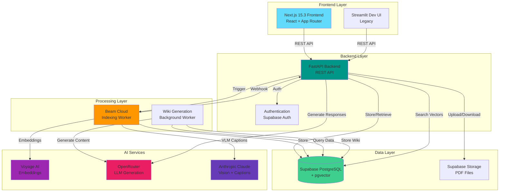
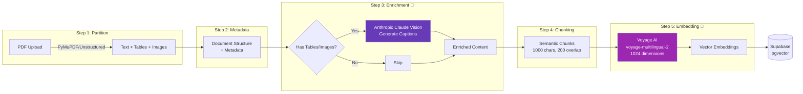
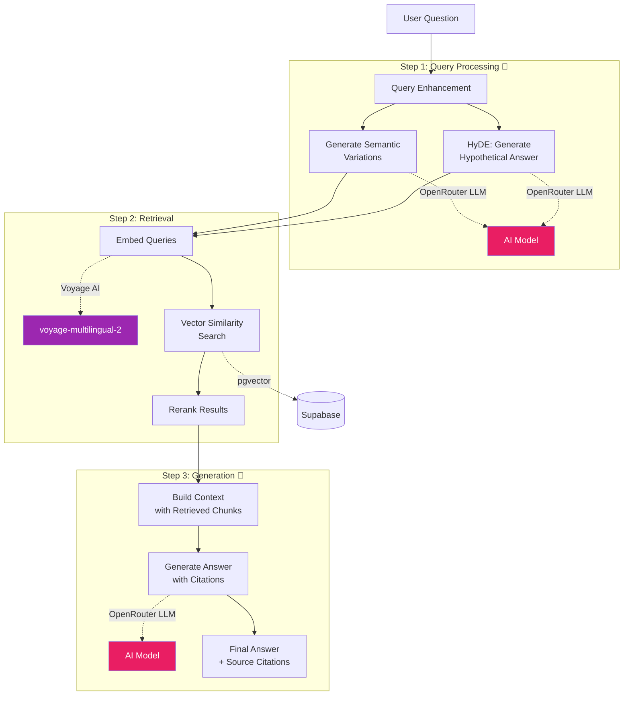
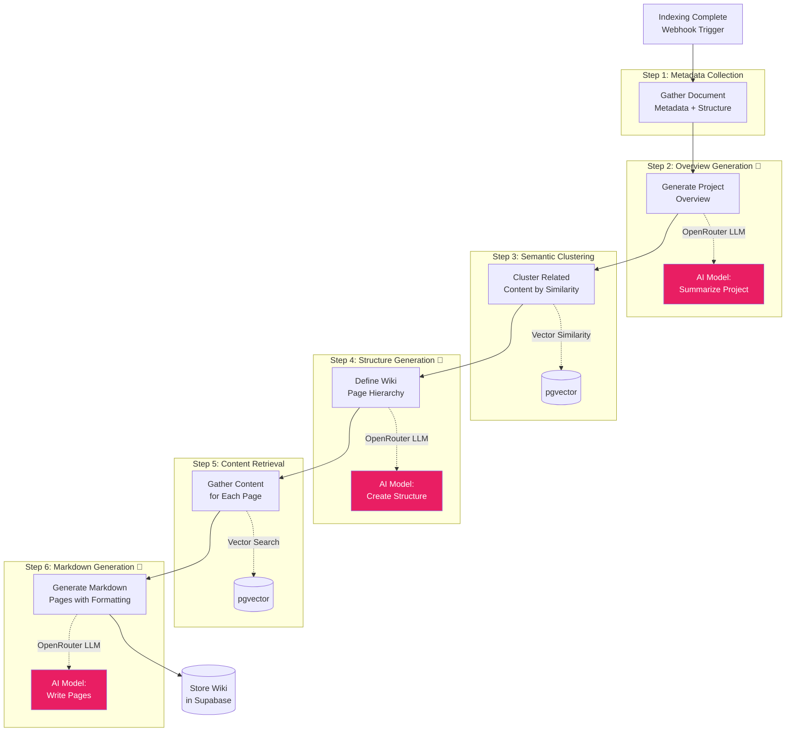
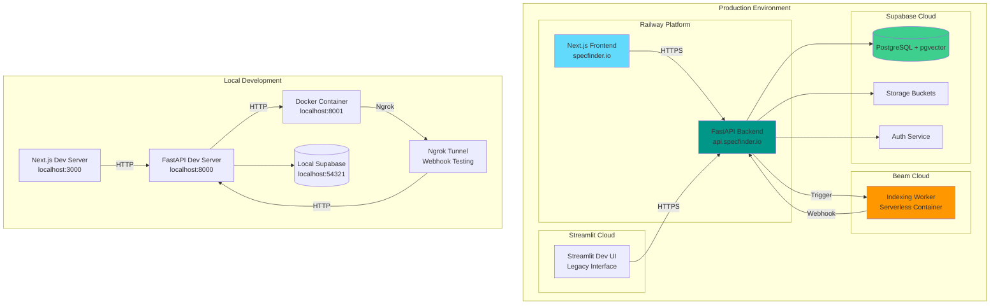
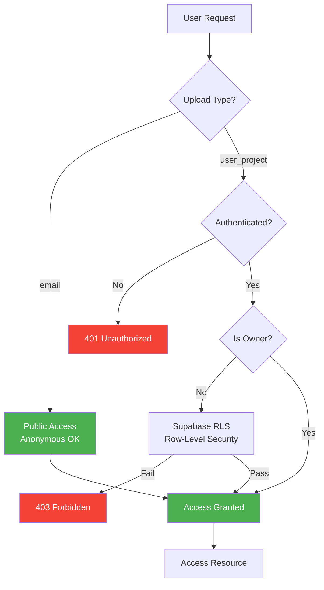

# Specfinder Architecture Documentation

## Overview

Specfinder is an AI-powered construction document processing and Q&A system - a "DeepWiki for Construction Sites" that automatically processes construction documents and enables intelligent Q&A about project requirements, timelines, and specifications.

## High-Level System Architecture

## Indexing Pipeline - AI Integration

The indexing pipeline transforms raw PDF documents into searchable, AI-enhanced knowledge:

### AI Usage in Indexing:
1. **Anthropic Claude Vision** - Generates natural language captions for tables and images, making visual content searchable
2. **Voyage AI Embeddings** - Creates semantic vector representations of all text chunks for similarity search

## Query Pipeline - AI-Powered Q&A

The query pipeline uses AI at multiple stages to provide accurate, context-aware answers:

### AI Usage in Querying:
1. **Query Enhancement (OpenRouter)** - Generates semantic variations and hypothetical answers to improve retrieval
2. **Voyage AI Embeddings** - Converts queries to vectors for similarity search
3. **Response Generation (OpenRouter)** - Generates accurate, contextual answers with citations

## Wiki Generation Pipeline - AI-Structured Knowledge

The wiki generation pipeline creates structured, navigable documentation from indexed content:

### AI Usage in Wiki Generation:
1. **Overview Generation (OpenRouter)** - Summarizes entire project into coherent overview
2. **Structure Generation (OpenRouter)** - Analyzes content clusters to create logical wiki hierarchy
3. **Content Generation (OpenRouter)** - Writes formatted markdown pages with proper sectioning and citations

## Deployment Architecture

## Access Control Flow

## Key Technology Choices

### AI Services
- **Voyage AI (voyage-multilingual-2)**: Best-in-class multilingual embeddings, optimized for Danish content
- **OpenRouter**: Flexible LLM routing, supports multiple models for different use cases
- **Anthropic Claude Vision**: Superior vision capabilities for table/image understanding

### Infrastructure
- **Railway**: Simple deployment, automatic scaling, great DX
- **Beam Cloud**: Serverless containers for heavy processing, pay-per-use
- **Supabase**: PostgreSQL + pgvector + auth + storage in one platform

### Framework Choices
- **FastAPI**: High performance, automatic API docs, excellent type safety
- **Next.js 15.3**: Server-side rendering, App Router for modern React patterns
- **Pydantic**: Runtime validation, settings management, type safety
