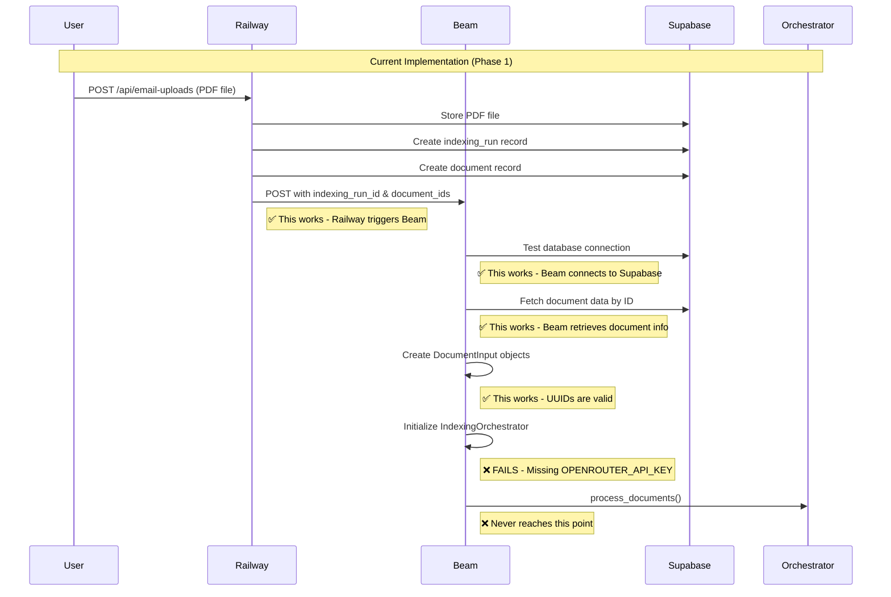
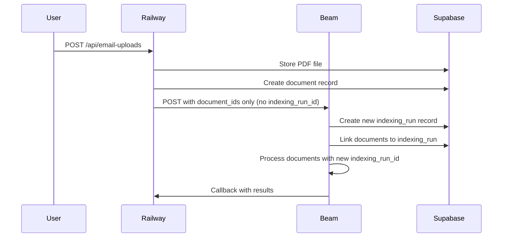

# Current Beam Implementation Analysis

## Current Process Flow



## What We Have Implemented ✅

### 1. Railway → Beam Integration
- **Email upload endpoint** modified to call Beam instead of background tasks
- **BeamService** created to handle HTTP communication with Beam
- **Task triggering** works - Railway successfully creates Beam tasks

### 2. Beam Infrastructure
- **Beam app deployed** with GPU resources (T4, 8Gi memory)
- **Database connection** established and tested
- **Document data fetching** from Supabase works
- **UUID validation** and DocumentInput creation works
- **Comprehensive logging** implemented with print() statements

### 3. Pipeline Integration
- **IndexingOrchestrator** imported and initialized
- **Existing pipeline code** reused (no duplication)
- **Unified processing** approach maintained

## What's Missing ❌

### 1. Environment Variables
```
OPENROUTER_API_KEY - Missing in Beam environment
VOYAGE_API_KEY - Likely missing
SUPABASE_URL - Likely missing  
SUPABASE_SERVICE_ROLE_KEY - Likely missing
```

### 2. Automatic Indexing Run Creation
**Current Problem:** We're manually passing `indexing_run_id` to Beam, but it should create its own.

**What should happen:**


### 3. Callback Mechanism
- **Railway webhook endpoint** not implemented
- **Beam → Railway communication** not set up
- **Progress updates** not implemented

### 4. Error Handling & Recovery
- **Retry logic** not implemented
- **Graceful failure handling** incomplete
- **Status updates** to Railway missing

## Recommended Next Steps

### Phase 2A: Fix Environment Variables
1. Add missing API keys to Beam secrets
2. Test basic pipeline execution
3. Verify all steps work end-to-end

### Phase 2B: Implement Automatic Indexing Run Creation
1. Modify Beam to create its own indexing runs
2. Update Railway to not create indexing runs
3. Test the full flow

### Phase 2C: Add Callback Mechanism
1. Create Railway webhook endpoint
2. Implement Beam → Railway callbacks
3. Add progress tracking

### Phase 2D: Production Hardening
1. Add retry logic
2. Implement comprehensive error handling
3. Add monitoring and alerting

## Current Architecture

```
┌─────────────┐    ┌─────────────┐    ┌─────────────┐
│   Railway   │    │    Beam     │    │  Supabase   │
│  (FastAPI)  │    │ (GPU Tasks) │    │ (Database)  │
└─────────────┘    └─────────────┘    └─────────────┘
       │                   │                   │
       │ 1. Upload PDF     │                   │
       │───────────────────│                   │
       │                   │                   │
       │ 2. Store file     │                   │
       │───────────────────────────────────────│
       │                   │                   │
       │ 3. Create doc     │                   │
       │───────────────────────────────────────│
       │                   │                   │
       │ 4. Trigger Beam   │                   │
       │───────────────────│                   │
       │                   │ 5. Connect DB     │
       │                   │───────────────────│
       │                   │                   │
       │                   │ 6. Fetch docs     │
       │                   │───────────────────│
       │                   │                   │
       │                   │ 7. Process docs   │
       │                   │ ❌ FAILS - API keys│
       │                   │                   │
```

## Success Metrics

- ✅ **Railway → Beam communication** - Working
- ✅ **Database connectivity** - Working  
- ✅ **Document data retrieval** - Working
- ✅ **UUID handling** - Working
- ❌ **Pipeline execution** - Blocked by missing API keys
- ❌ **Automatic indexing run creation** - Not implemented
- ❌ **Callback mechanism** - Not implemented
- ❌ **Error recovery** - Not implemented 