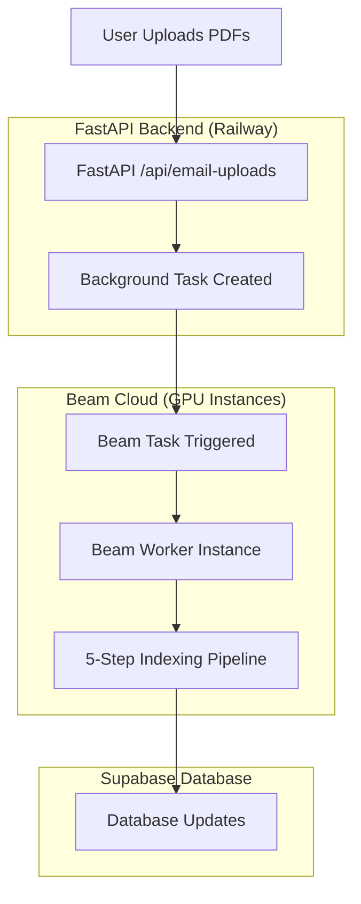
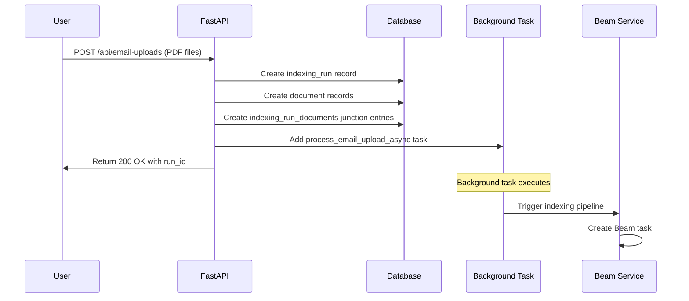
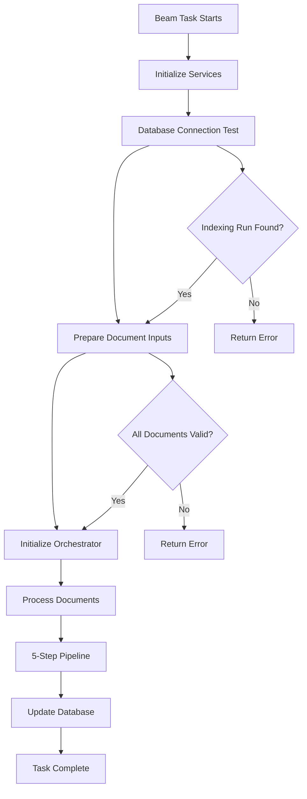
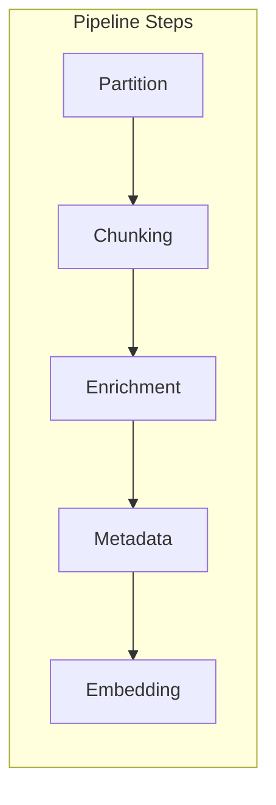
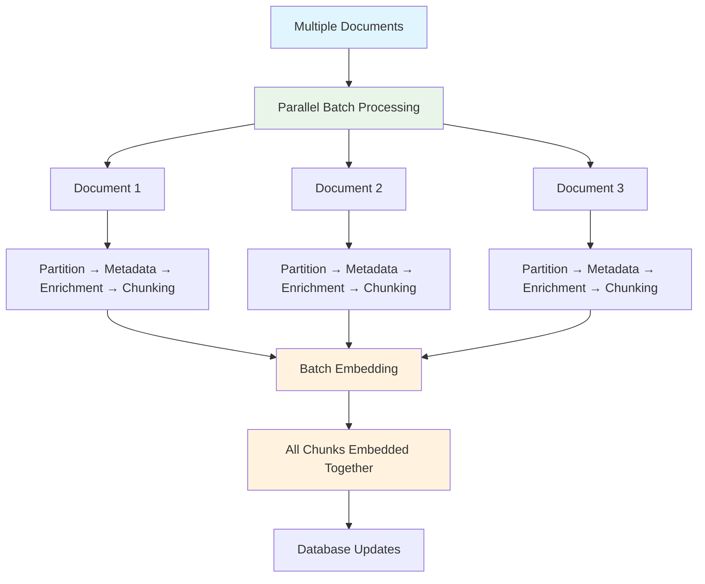
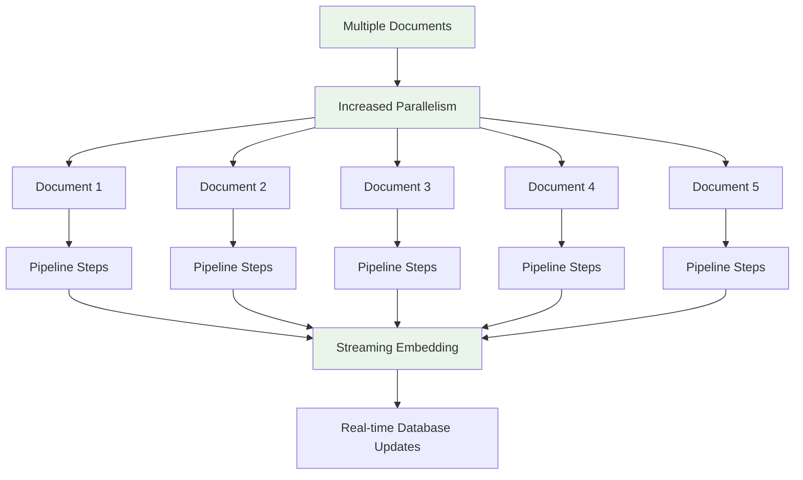
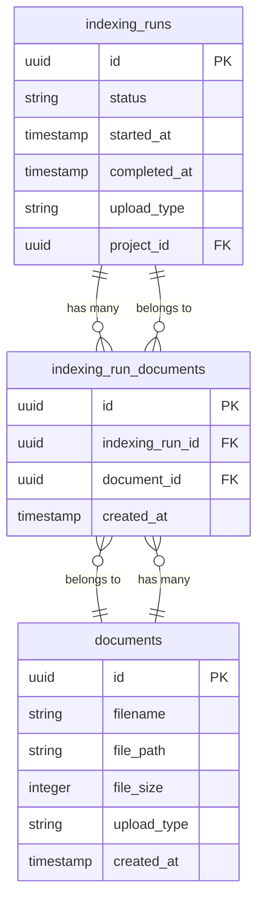

# Email Upload & Beam Processing System

## Overview

This document explains how the email upload system works with Beam cloud processing for document indexing. The system allows users to upload PDF documents via email, which are then processed through a 5-step indexing pipeline on GPU-accelerated Beam instances.

## System Architecture



## Step-by-Step Flow

### 1. Email Upload Request

**Endpoint**: `POST /api/email-uploads`

**Critical Method**: `process_email_upload()` in `backend/src/api/documents.py`



### 2. Background Task Processing

**Critical Method**: `process_email_upload_async()` in `backend/src/api/documents.py`

```python
async def process_email_upload_async(
    document_ids: List[str],
    index_run_id: str,
    email: str
):
    # Initialize Beam service
    beam_service = BeamService()
    
    # Trigger Beam task
    await beam_service.trigger_indexing_pipeline(
        indexing_run_id=index_run_id,
        document_ids=document_ids,
        user_id=None,  # Email uploads don't have user_id
        project_id=None  # Email uploads don't have project_id
    )
```

### 3. Beam Task Creation

**Critical Method**: `trigger_indexing_pipeline()` in `backend/src/services/beam_service.py`


### 4. Beam Worker Execution

**Critical Method**: `run_indexing_pipeline_on_beam()` in `backend/beam-app.py`



## Critical Methods & Components

### API Layer (`backend/src/api/documents.py`)

1. **`process_email_upload()`** - Main endpoint handler
   - Validates uploaded files
   - Creates database records
   - Triggers background task

2. **`process_email_upload_async()`** - Background task
   - Calls Beam service to trigger processing
   - Handles email upload specific logic

### Database Layer

1. **`indexing_runs`** table - Tracks processing runs
2. **`documents`** table - Stores document metadata
3. **`indexing_run_documents`** table - Junction table linking documents to runs

### Beam Service (`backend/src/services/beam_service.py`)

1. **`trigger_indexing_pipeline()`** - Creates Beam tasks
   - Sends HTTP request to Beam API
   - Passes document IDs and run ID

### Beam Worker (`backend/beam-app.py`)

1. **`run_indexing_pipeline_on_beam()`** - Main worker function
   - Initializes services
   - Prepares document inputs
   - Calls orchestrator

2. **`process_documents()`** - Beam task queue entry point
   - Handles async execution
   - Manages local vs remote execution

### Pipeline Orchestrator (`backend/src/pipeline/indexing/orchestrator.py`)

1. **`process_documents()`** - Orchestrates 5-step pipeline
   - Manages document processing flow
   - Handles step transitions

## 5-Step Indexing Pipeline



### Pipeline Steps

1. **Partition** - Splits PDF into pages/sections
2. **Chunking** - Breaks content into smaller chunks
3. **Enrichment** - Adds context and metadata
4. **Metadata** - Extracts document metadata
5. **Embedding** - Creates vector embeddings

## Parallel vs Sequential Processing Analysis

### Current Implementation: **Hybrid Parallel Processing**

The current system uses a **hybrid approach** with both parallel and sequential elements:

#### Evidence from Code Analysis:

1. **Single Orchestrator Instance**: One `IndexingOrchestrator` manages all documents
2. **Parallel Document Processing**: Documents are processed in parallel batches (max 3 concurrent)
3. **Sequential Pipeline Steps**: Each document goes through pipeline steps sequentially
4. **Batch Embedding**: All chunks from all documents are embedded together at the end

#### Code Evidence:

```python
# In orchestrator.py - Parallel document processing
async def _process_documents_individual_steps(self, document_inputs, ...):
    # Conservative parallel processing - process documents in small batches
    max_concurrent = min(3, len(document_inputs))  # Max 3 concurrent documents
    
    for i in range(0, len(document_inputs), max_concurrent):
        batch = document_inputs[i : i + max_concurrent]
        
        # Process batch in parallel
        tasks = []
        for doc_input in batch:
            task = asyncio.create_task(
                self._process_single_document_steps(doc_input, ...)
            )
            tasks.append((doc_input.document_id, task))
        
        # Wait for batch to complete
        for doc_id, task in tasks:
            result = await task
            results[doc_id] = result
```

#### Pipeline Processing Flow:



### Performance Characteristics:

- **Document Processing**: Parallel (up to 3 documents simultaneously)
- **Pipeline Steps**: Sequential per document (partition → chunking → enrichment → metadata)
- **Embedding**: Batch operation (all chunks from all documents together)
- **Resource Utilization**: Optimized for GPU efficiency during embedding

### Advantages of Current Approach:

1. **Controlled Parallelism**: Prevents resource exhaustion with max 3 concurrent documents
2. **Efficient Embedding**: Batch embedding is more GPU-efficient than individual embeddings
3. **Memory Management**: Processes documents in manageable batches
4. **Error Isolation**: Individual document failures don't affect others

### Potential Optimizations:



## Database Schema Relationships



## Environment Variables

### Required for Beam Integration:

- `BEAM_WEBHOOK_URL` - Beam API endpoint
- `BEAM_AUTH_TOKEN` - Authentication token
- `SUPABASE_URL` - Database connection
- `SUPABASE_SERVICE_ROLE_KEY` - Admin access

## Deployment Process

### Railway (API Backend):
```bash
git push origin main  # Automatic deployment
```

### Beam (Worker):
```bash
beam deploy beam-app.py:process_documents
```

## Monitoring & Debugging

### Key Log Points:

1. **API Level**: Request processing and background task creation
2. **Beam Level**: Task execution and pipeline progress
3. **Database Level**: Record creation and updates

### Debug Endpoints:

- `GET /api/debug/env` - Check environment variables
- `GET /pipeline/indexing/runs/{run_id}/status` - Check processing status

## Error Handling

### Common Failure Points:

1. **Database Connection**: Beam worker can't access Supabase
2. **Document Not Found**: Document ID doesn't exist in database
3. **Pipeline Step Failure**: Individual pipeline steps may fail
4. **Memory/GPU Issues**: Large documents may exceed resource limits

### Recovery Mechanisms:

- Automatic retries for transient failures
- Database transaction rollback on errors
- Status tracking for failed runs
- Error logging and monitoring

## Performance Considerations

### Current Optimizations:

- **Parallel Document Processing**: Up to 3 documents processed simultaneously
- **Batch Embedding**: All chunks embedded together for GPU efficiency
- **Controlled Resource Usage**: Prevents memory/GPU exhaustion
- **Error Isolation**: Individual document failures don't affect others

### Current Limitations:

- **Limited Parallelism**: Max 3 concurrent documents (could be increased)
- **Sequential Pipeline Steps**: Each document's pipeline steps run sequentially
- **Single GPU Instance**: One GPU per Beam task (could use multiple)
- **No Streaming**: All processing happens before database updates

### Optimization Opportunities:

- **Increased Parallelism**: Process more documents simultaneously (5-10 concurrent)
- **Pipeline Step Parallelization**: Run pipeline steps in parallel where possible
- **Streaming Processing**: Real-time database updates during processing
- **Multi-GPU Support**: Distribute processing across multiple GPU instances
- **Caching Mechanisms**: Cache intermediate results for repeated processing
- **Document Preprocessing**: Optimize document size and format before processing 