# Specfinder - DeepWiki for Construction Sites

An AI-powered construction document processing and Q&A system that automatically processes construction documents and enables intelligent Q&A about every aspect of construction projects. Think of it as a **DeepWiki for Construction Sites** - just like DeepWiki analyzes code repositories, we analyze construction documentation to create comprehensive project knowledge bases.

## 🏗️ What is Specfinder?

Specfinder is a production-ready RAG (Retrieval-Augmented Generation) system specifically designed for construction projects. It:

1. **Processes Construction Documents**: Automatically extracts text, tables, and images from PDFs (plans, specifications, permits)
2. **Generates Intelligent Wiki Pages**: Creates structured, navigable documentation from indexed content
3. **Answers Complex Questions**: Provides accurate, contextual answers with citations to source documents
4. **Supports Danish Language**: Optimized for Danish construction documents with multilingual AI models

## Currently working on
- Restructuring project urls & backend API to mimic Github style REST API structure with specfinder.io/username/projectname across the entire application. 
- Setting up a comprehensive local development environment that mimics Beam calls in a separate Docker container, that uses a local supabase db throughout and with a proper staging environment before deploying to prod. 


### Key Features
- **Complete Document Pipeline**: Partition → Metadata → Enrichment → Chunking → Embedding
- **Advanced Query Processing**: Semantic variations, HyDE queries, and vector similarity search
- **Automatic Wiki Generation**: AI-powered structured documentation from indexed content
- **Dual Access Model**: Public projects (anonymous) + authenticated user projects
- **Production Deployment**: Live on Railway (frontend & backend), Beam Cloud (indexing), Supabase (database)
- **Construction-Specific**: Optimized for technical construction content and Danish language

## 🏛️ System Architecture

Specfinder is built as a modern, cloud-native application with clear separation between presentation, business logic, processing, and data layers.


### How the Backend Works

The FastAPI backend serves as the central orchestrator for all system operations:

1. **Document Upload & Management**: Handles PDF uploads, validates files, stores metadata in Supabase
2. **Pipeline Orchestration**: Triggers indexing jobs on Beam Cloud, manages indexing run lifecycle
3. **Query Processing**: Executes RAG queries with vector search and LLM generation
4. **Wiki Generation**: Automatically generates structured documentation after indexing completes
5. **Access Control**: Enforces authentication and authorization using Supabase RLS policies

**Key Components:**
- **REST API** (`/api/*`): RESTful endpoints for all operations
- **Pipeline Services**: Indexing, querying, and wiki generation orchestration
- **Database Layer**: Supabase client with connection pooling
- **Background Tasks**: Async processing for wiki generation
- **Webhook Handler**: Receives completion notifications from Beam Cloud

### How the Frontend Works

The Next.js 15.3 frontend provides two distinct user experiences:

**Public Projects** (`/projects/{indexingRunId}`):
- Anonymous access, no authentication required
- Server-side rendered for SEO and performance
- Read-only wiki viewing and querying
- Shareable URLs for project documentation

**Private Projects** (`/dashboard/projects/{projectSlug}/{runId}`):
- Authentication required via Supabase Auth
- Full project management capabilities
- Multiple indexing runs per project
- Settings, collaboration, and advanced features

**Key Technologies:**
- **App Router**: File-based routing with server and client components
- **React Server Components**: Optimized server-side rendering
- **Supabase Auth**: Seamless authentication flow
- **TailwindCSS + shadcn/ui**: Modern, accessible UI components
- **React Query**: Efficient data fetching and caching

## 🔄 Processing Pipelines

Specfinder uses three AI-powered pipelines to transform construction documents into searchable, structured knowledge:

### 1. Indexing Pipeline - Document Processing

Transforms raw PDF documents into searchable, AI-enhanced knowledge:


**AI Integration:**
- **Anthropic Claude Vision**: Generates natural language captions for tables and images, making visual content searchable
- **Voyage AI Embeddings**: Creates semantic vector representations of all text chunks for similarity search

### 2. Query Pipeline - AI-Powered Q&A

Uses AI at multiple stages to provide accurate, context-aware answers:

```mermaid
graph TB
    Query[User Question] --> Process

    subgraph "Step 1: Query Processing 🤖"
        Process[Query Enhancement]
        Process --> Variations[Generate Semantic<br/>Variations]
        Process --> HyDE[HyDE: Generate<br/>Hypothetical Answer]

        Variations -.->|OpenRouter LLM| LLM1[AI Model]
        HyDE -.->|OpenRouter LLM| LLM1
    end

    subgraph "Step 2: Retrieval"
        Variations --> Embed[Embed Queries]
        HyDE --> Embed
        Embed -.->|Voyage AI| VoyageAPI[voyage-multilingual-2]
        Embed --> Search[Vector Similarity<br/>Search]
        Search --> Rerank[Rerank Results]
    end

    subgraph "Step 3: Generation 🤖"
        Rerank --> Context[Build Context<br/>with Retrieved Chunks]
        Context --> Generate[Generate Answer<br/>with Citations]
        Generate -.->|OpenRouter LLM| LLM2[AI Model]
        Generate --> Answer[Final Answer<br/>+ Source Citations]
    end

    Search -.->|pgvector| DB[(Supabase)]

    style LLM1 fill:#e91e63,color:#fff
    style VoyageAPI fill:#9c27b0,color:#fff
    style LLM2 fill:#e91e63,color:#fff
```



**AI Integration:**
- **Query Enhancement (OpenRouter)**: Generates semantic variations and hypothetical answers to improve retrieval
- **Voyage AI Embeddings**: Converts queries to vectors for similarity search
- **Response Generation (OpenRouter)**: Generates accurate, contextual answers with citations

### 3. Wiki Generation Pipeline - Structured Knowledge

Creates structured, navigable documentation from indexed content:


**AI Integration:**
- **Overview Generation (OpenRouter)**: Summarizes entire project into coherent overview
- **Structure Generation (OpenRouter)**: Analyzes content clusters to create logical wiki hierarchy
- **Content Generation (OpenRouter)**: Writes formatted markdown pages with proper sectioning and citations

## 🌐 Deployment Architecture

Specfinder runs on multiple cloud platforms for optimal performance and cost:


### Production URLs
- **Frontend**: https://specfinder.io
- **Backend API**: https://api.specfinder.io
- **API Documentation**: https://api.specfinder.io/docs

### Deployment Process

**Backend (Railway)**:
1. Push to GitHub → Railway auto-deploys
2. Uses `backend/Dockerfile` for containerized deployment
3. Environment variables managed via Railway dashboard
4. Automatic health checks on `/health` endpoint

**Frontend (Railway)**:
1. Push to GitHub → Railway auto-deploys
2. Uses `frontend/Dockerfile` for optimized Next.js build
3. Environment variables configured for production API
4. Custom domain with automatic HTTPS

**Indexing Worker (Beam Cloud)**:
1. Deploy via `cd backend && beam deploy beam-app.py:process_documents`
2. Serverless containers scale automatically
3. Triggered via API from backend
4. Sends webhook to backend on completion

**Database (Supabase)**:
1. Managed PostgreSQL with pgvector extension
2. Row-Level Security (RLS) policies for access control
3. Automatic backups and point-in-time recovery
4. Storage buckets for PDF files

## 🚀 Quick Start

### Prerequisites
- Python 3.12+
- Node.js 18+ and npm
- Docker and Docker Compose
- Supabase CLI (`brew install supabase/tap/supabase`)
- API keys for:
  - Voyage AI (embeddings - voyage-multilingual-2)
  - OpenRouter (query processing and generation)
  - Anthropic (VLM captioning)

### Local Development

**IMPORTANT**: Local development uses a **local Supabase database** for complete isolation from production data.

#### Option A: Backend + Frontend Only (Fast Startup)

```bash
# 1. Start local Supabase (if not running)
supabase start

# 2. Set up environment variables
cp backend/.env.example backend/.env
cp frontend/.env.local.example frontend/.env.local
# Edit .env files with your API keys

# 3. Start backend with webhook support
./start-local-dev.sh

# 4. In separate terminal: Start frontend
cd frontend && npm install && npm run dev
```

**Access URLs:**
- Frontend: http://localhost:3000
- Backend API: http://localhost:8000
- API Documentation: http://localhost:8000/docs
- Supabase Studio: http://127.0.0.1:54323

#### Option B: Full Stack with Local Indexing (Complete Testing)

```bash
# 1. Start local Supabase (if not running)
supabase start

# 2. Set up environment variables
cp backend/.env.example backend/.env
cp frontend/.env.local.example frontend/.env.local
# Edit .env files with your API keys

# 3. Start complete stack (backend + indexing container + ngrok)
./start-local-dev-with-indexing.sh

# 4. In separate terminal: Start frontend
cd frontend && npm install && npm run dev
```

**Additional URLs (Option B):**
- Indexing API: http://localhost:8001
- Ngrok Public URL: Displayed in startup script output (for webhook testing)

**Docker Rebuild Guidelines:**
- **Rebuild required**: Dependencies change, Dockerfile changes
- **No rebuild needed**: Code changes (volume mounted), environment variables
- **Command**: `docker-compose build indexing`

### Running Tests

```bash
# Activate virtual environment
cd backend
python -m venv venv
source venv/bin/activate  # On Windows: venv\Scripts\activate

# Install dependencies
pip install -r requirements.txt

# Run all tests
pytest tests/

# Run specific test suites
pytest tests/integration/  # Integration tests
pytest tests/unit/v2/      # Unit tests
```

## 📁 Project Structure

```
Specfinder/
├── backend/                    # FastAPI Backend (Railway)
│   ├── src/
│   │   ├── main.py            # FastAPI application entry point
│   │   ├── api/               # REST API endpoints
│   │   │   ├── auth/          # Authentication endpoints
│   │   │   ├── documents/     # Document management
│   │   │   ├── projects/      # Project management
│   │   │   ├── queries/       # Query execution
│   │   │   └── wiki/          # Wiki generation
│   │   ├── pipeline/          # Processing pipelines
│   │   │   ├── indexing/      # 5-step indexing pipeline
│   │   │   ├── querying/      # 3-step query pipeline
│   │   │   └── wiki_generation/ # 6-step wiki pipeline
│   │   ├── services/          # Business logic
│   │   ├── models/            # Pydantic data models
│   │   └── config/            # Configuration management
│   ├── tests/                 # Integration and unit tests
│   ├── beam-app.py            # Beam Cloud indexing worker
│   └── Dockerfile             # Production deployment
│
├── frontend/                   # Next.js Frontend (Railway)
│   ├── src/
│   │   ├── app/               # Next.js App Router
│   │   │   ├── projects/      # Public projects (/projects/{runId})
│   │   │   └── dashboard/     # Private projects (authenticated)
│   │   │       └── projects/  # /dashboard/projects/{slug}/{runId}
│   │   ├── components/        # UI components
│   │   │   └── features/      # Feature-specific components
│   │   └── lib/               # Utilities and API clients
│   └── Dockerfile             # Production deployment
│
├── supabase/                   # Database & Auth
│   ├── migrations/            # Database schema migrations
│   └── config.toml            # Local Supabase configuration
│
├── ARCHITECTURE.md            # System architecture documentation
├── CLAUDE.md                  # Development guidelines for AI assistance
└── docker-compose.yml         # Local development with indexing
```

## 🔧 Configuration

### Pipeline Configuration
All pipeline settings are managed in a single JSON source of truth:

- `backend/src/config/pipeline/pipeline_config.json` - Unified pipeline configuration
  - Indexing pipeline parameters (chunking, embedding models)
  - Query pipeline settings (retrieval, generation)
  - Wiki generation configuration

**Features:**
- **Hot Reloading**: Changes take effect immediately for new jobs
- **Environment Variables**: Support for `${ENV_VAR}` substitution
- **Validation**: Automatic validation via Pydantic models

### Environment Variables

#### Backend (`backend/.env`)
```bash
# Supabase Database & Auth
SUPABASE_URL=your_supabase_url
SUPABASE_ANON_KEY=your_supabase_anon_key
SUPABASE_SERVICE_ROLE_KEY=your_service_role_key

# AI Services
VOYAGE_API_KEY=your_voyage_api_key          # Embeddings
OPENROUTER_API_KEY=your_openrouter_api_key  # LLM generation
ANTHROPIC_API_KEY=your_anthropic_api_key    # Vision/captions

# Beam Cloud (Indexing Worker)
BEAM_API_KEY=your_beam_api_key
BEAM_API_URL=https://api.beam.cloud
BACKEND_API_URL=https://api.specfinder.io   # For webhooks

# Application
ENVIRONMENT=development
LOG_LEVEL=INFO
```

#### Frontend (`frontend/.env.local`)
```bash
# Backend API
NEXT_PUBLIC_API_URL=http://localhost:8000

# Supabase (Frontend Auth)
NEXT_PUBLIC_SUPABASE_URL=your_supabase_url
NEXT_PUBLIC_SUPABASE_ANON_KEY=your_supabase_anon_key

# Application
NODE_ENV=development
```

## 🧪 Testing

All tests use local Supabase database with proper isolation:

```bash
# Activate virtual environment
cd backend
source venv/bin/activate  # Or: venv\Scripts\activate on Windows

# Run all tests
pytest tests/

# Run specific test suites
pytest tests/integration/        # Full pipeline tests
pytest tests/unit/v2/            # Service/component tests

# Run with coverage
pytest tests/ --cov=src --cov-report=html
```

**Test Organization:**
- `tests/integration/`: Full pipeline integration tests
- `tests/unit/v2/`: Service and component unit tests
- All tests use production database with proper cleanup

## 📊 Key Technologies

### AI Services
- **Voyage AI (voyage-multilingual-2)**: Best-in-class multilingual embeddings, optimized for Danish content
- **OpenRouter**: Flexible LLM routing, supports multiple models for different use cases
- **Anthropic Claude Vision**: Superior vision capabilities for table/image understanding

### Infrastructure
- **Railway**: Simple deployment, automatic scaling, great DX
- **Beam Cloud**: Serverless containers for heavy processing, pay-per-use
- **Supabase**: PostgreSQL + pgvector + auth + storage in one platform

### Framework Choices
- **FastAPI**: High performance, automatic API docs, excellent type safety
- **Next.js 15.3**: Server-side rendering, App Router for modern React patterns
- **Pydantic**: Runtime validation, settings management, type safety

## 📚 Additional Documentation

- **[ARCHITECTURE.md](./ARCHITECTURE.md)**: Detailed system architecture with comprehensive diagrams
- **[CLAUDE.md](./CLAUDE.md)**: Development guidelines and coding standards
- **API Documentation**: Available at `/docs` endpoint (Swagger UI)

## 🤝 Contributing

This is a production application. For development:

1. Follow the coding principles in CLAUDE.md (KISS, YAGNI, Single Responsibility)
2. Write tests for new features
3. Use the existing architecture patterns
4. Keep files under 500 lines, functions under 50 lines
5. Add type hints to all Python functions

## 📝 License

Copyright © 2025 Specfinder. All rights reserved.

---

**Live at**: [specfinder.io](https://specfinder.io) | **API**: [api.specfinder.io](https://api.specfinder.io)