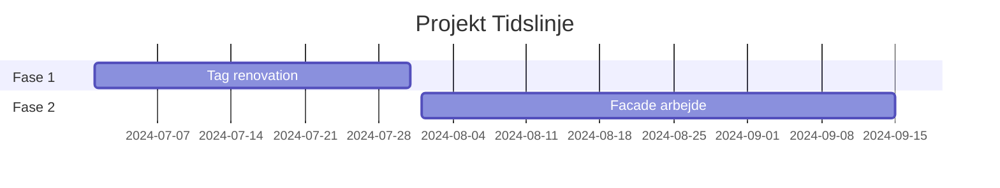

# ConstructionRAG Overview Generation Guide

This guide explains how to use the automatic overview generation script that creates DeepWiki-style project summaries from indexed construction documents.

## Quick Start

```bash
# Set your OpenRouter API key
export OPENROUTER_API_KEY="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"

# Run with specific index run ID
cd backend
python overview_generation.py --index-run-id fb335387-d2ff-4b93-a730-7ce55eb2fe03

# Run with English output
python overview_generation.py --index-run-id fb335387-d2ff-4b93-a730-7ce55eb2fe03 --language english

# Run with different model
python overview_generation.py --index-run-id fb335387-d2ff-4b93-a730-7ce55eb2fe03 --model "anthropic/claude-3.5-sonnet"

# Test semantic sampling without LLM call (no API key needed)
python overview_generation.py --index-run-id fb335387-d2ff-4b93-a730-7ce55eb2fe03 --test-sampling
```

## How It Works

### Step 1: Data Extraction
The script connects to your Supabase production database and extracts:
- **Indexing run metadata** (status, timing, configuration)
- **Associated documents** via `indexing_run_documents` junction table
- **Document chunks** with embeddings from `document_chunks.embedding_1024`

```sql
-- What's being queried
SELECT * FROM indexing_runs WHERE id = 'your-id';
SELECT document_id, documents(*) FROM indexing_run_documents WHERE indexing_run_id = 'your-id';
SELECT *, embedding_1024 FROM document_chunks WHERE document_id IN (...);
```

### Step 2: Semantic Sampling (The Smart Part!)
Instead of using the first 20 chunks arbitrarily, the script:

1. **Extracts embeddings** from `embedding_1024` column (1024-dimensional Voyage vectors)
2. **Clusters content** using K-means into 3-10 semantic groups
3. **Selects representative chunks** closest to each cluster centroid
4. **Ensures cross-document coverage** across all major themes

```python
# Example output you'll see:
Anvender semantisk sampling for at vælge 20 repræsentative chunks...
Fundet 116 chunks med embeddings
Klyngedeling i 6 klynger...
Klynger dannet: [(0, 25), (1, 18), (2, 31), (3, 19), (4, 14), (5, 9)]

Klynge temaer:
  cluster_0 (25 chunks): Tag og skifertag renovation arbejder...
  cluster_1 (18 chunks): Facade pudsning og vinduer renovering...
  cluster_2 (31 chunks): Materiale specifikationer og kvalitet...
  cluster_3 (19 chunks): Entreprenør ansvar og udførelse...
  cluster_4 (14 chunks): Projektøkonomi og omkostninger...
  cluster_5 (9 chunks): Tidsplan og projektfaser...
```

### Step 3: Content Analysis
Analyzes all document text to identify:
- **Construction-specific terms** (sikkerhed, tidsplan, materiale, kvalitet, etc.)
- **Section patterns** (numbered sections, capitalized headers)
- **Timeline indicators** (dates, weeks, deadlines)
- **Document statistics** (chunk counts, content length)

### Step 4: LLM Overview Generation
Sends a carefully crafted prompt to **Gemini 2.5 Flash** including:
- **Project metadata** (document count, processing status)
- **Representative content samples** (500 chars from each of 20 semantic chunks)
- **Analysis summary** (top construction terms, detected sections)
- **Document inventory** (filenames, sizes, chunk counts)

**Prompt size**: ~3,000-5,000 tokens (efficient, not overwhelming)

### Step 5: Structured Markdown Output
Generates Danish (or English) overview with:

1. **Projektoversigt** - Executive summary of the construction project
2. **Nøgletal** - Key statistics and metrics
3. **Dokumentoversigt** - Table of all documents
4. **Projekttidslinje** - Mermaid Gantt chart if timeline data found
5. **Projektstruktur** - Mermaid diagram of document relationships
6. **Detaljerede Sektioner** - AI-detected themes (Sikkerhed, Specifikationer, etc.)

## Configuration Options

### Languages
```bash
--language danish     # Default - outputs in Danish
--language english    # Outputs in English
```

### Models Available on OpenRouter
```bash
--model "google/gemini-2.5-flash"          # Default - fast & cheap
--model "anthropic/claude-3.5-sonnet"      # More sophisticated
--model "openai/gpt-4o"                    # OpenAI's latest
--model "meta-llama/llama-3.1-70b"         # Open source option
```

### Sampling Size
The script uses 20 representative chunks by default. You can modify this in the code:
```python
representative_chunks = self.semantic_sampling(chunks, n_samples=30)  # More context
```

## Performance & Costs

### Typical Performance
- **Processing time**: 15-60 seconds
- **Cost per overview**: $0.0005-0.01 USD
- **Token usage**: 3K-5K input, 1K-2K output
- **CPU usage**: Light (mostly I/O and API calls)

### Cost Breakdown (Gemini 2.5 Flash)
- **Input**: $0.075 per 1M tokens
- **Output**: $0.30 per 1M tokens
- **Example**: 4K input + 1.5K output = ~$0.0008 USD

## Output Structure

### Files Generated
```
data/internal/overview_generation/overview_run_YYYYMMDD_HHMMSS/
├── project_overview.md          # Main markdown overview
├── content_analysis.json        # Detailed content analysis
└── generation_metadata.json     # Processing metadata
```

### Quality Validation
The script validates output quality:
- ✅ **has_project_overview**: Contains project overview section
- ✅ **has_document_table**: Includes document inventory table
- ✅ **has_mermaid_diagram**: Contains timeline/structure diagrams
- ✅ **has_sections**: Multiple markdown sections
- ✅ **is_target_language**: Correct language (Danish/English)

**Quality Score**: 0-100% based on validation checks

## Troubleshooting

### "No embeddings found"
If you see `⚠️ Ingen embeddings fundet - falder tilbage til første chunks`:
- Check that `document_chunks.embedding_1024` column has data
- Verify the indexing run actually completed embedding step
- Script will still work but without semantic benefits

### "No indexing run found"
- Verify the UUID is correct: `fb335387-d2ff-4b93-a730-7ce55eb2fe03`
- Check that indexing run exists in database
- Ensure you have access to production Supabase

### "No documents found"
- Check `indexing_run_documents` junction table has entries
- Verify documents exist and are properly linked

### API Errors
- **404 errors**: Model name incorrect (use `google/gemini-2.5-flash`)
- **401 errors**: API key invalid
- **429 errors**: Rate limit hit (wait and retry)

## Integration Options

### Option 1: FastAPI Endpoint
```python
# Add to src/api/overview.py
@router.post("/generate-overview")
async def generate_overview(index_run_id: str):
    generator = OverviewGenerator(language="danish")
    return generator.generate_overview(index_run_id)
```

### Option 2: Pipeline Module
```
src/pipeline/overview/
├── orchestrator.py
├── config/overview_config.yaml
└── steps/
    ├── analysis.py
    ├── sampling.py
    └── generation.py
```

### Option 3: Beam Worker
For batch processing multiple index runs:
```python
# Similar to existing beam_worker.py
class OverviewBeamWorker:
    def process_overview_batch(self, index_run_ids: List[str]):
        # Generate overviews for multiple runs
```

## Advanced Usage

### Custom Construction Terms
Modify the construction terms list in `analyze_content_structure()`:
```python
construction_terms = [
    "byggeri", "entreprenør", "tidsplan", "sikkerhed", "arbejdsmiljø",
    "tegning", "specifikation", "materiale", "installation", "kvalitet",
    # Add your specific terms here
    "ventilation", "el-installation", "vvs", "beton", "stål"
]
```

### Custom Clustering
Adjust clustering parameters:
```python
n_clusters = min(15, max(5, n_samples // 2))  # More clusters
kmeans = KMeans(n_clusters=n_clusters, random_state=42, n_init=20)  # More iterations
```

### Different Sampling Strategies
Replace semantic sampling with other approaches:
```python
def domain_specific_sampling(self, chunks, n_samples=20):
    # Prioritize chunks with specific construction keywords
    # Weight by document importance
    # Sample from different document sections
```

## Example Output

Here's what a typical overview looks like:

```markdown
# Projektoversigt for Byggeprojekt

## Projektoversigt
Dette byggeprojekt omhandler renovering af en andelsforeningsejendom opført i år 1900, 
beliggende på Bentzonsvej 11, Frederiksberg...

## Nøgletal
- **Antal dokumenter:** 2
- **Total chunks:** 116
- **Hyppigste byggetermer:** materiale (26), entreprenør (20), tegning (17)

## Dokumentoversigt
| Filnavn | Størrelse | Chunks | Sider |
|---------|-----------|--------|-------|
| renovation_spec.pdf | 4.5MB | 58 | 12 |

## Projekttidslinje


## Detaljerede Sektioner
### Tagrenovering
- 45 graders skifertag med tre kviste
- Fornyelse af tagbeklædning, lægter og spær
- Tagrender og nedløb inkluderet
```

This creates a comprehensive, construction-focused overview that gives stakeholders immediate insight into project scope, timeline, and key technical details!