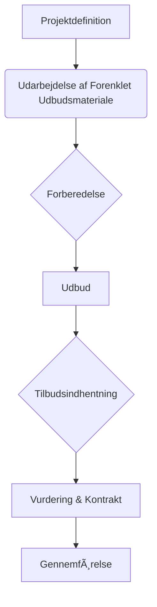

# Forenklet Udbudspraksis

Dette projekt fokuserer på udviklingen af en strømlinet og papirbesparende tilgang til udbudsmateriale, særligt for mindre byfornyelsessager. Målet er at reducere papirmængden markant, samtidig med at kvaliteten af udbudsmaterialet bevares. Denne tilgang involverer et samarbejde mellem rådgivere, entreprenører og bygherrer for at optimere processen og potentielt nedbringe omkostninger.

| Sektion | Beskrivelse |
|---|---|
| [Introduktion](#introduktion) | Formålet, omfanget og en overordnet forklaring af forenklet udbudspraksis. |
| [Definition af Mindre Byfornyelsessager](#definition-af-mindre-byfornyelsessager) | Afgrænsning af de sagstyper, som den forenklede praksis er tiltænkt. |
| [Fordele ved Forenklet Udbudspraksis](#fordele-ved-forenklet-udbudspraksis) | Identifikation af de potentielle ressource- og omkostningsbesparelser for de involverede parter. |
| [Rollefordeling og Samarbejde](#rollefordeling-og-samarbejde) | Beskrivelse af hvordan rådgivere, entreprenører og bygherrer interagerer i processen. |
| [Processer og Metoder](#processer-og-metoder) | Gennemgang af foreslåede metoder til at minimere udbudsmateriale og proces. |
| [Estimerede Omkostninger](#estimerede-omkostninger) | Sammenligning af omkostningsniveauet for traditionelt udbud versus forenklet udbud. |
| [Kvalitetssikring og Måling](#kvalitetssikring-og-måling) | Overvejelser om, hvordan kvaliteten af materialet og processen kan vurderes. |
| [Fremtidige Anbefalinger](#fremtidige-anbefalinger) | RÃ¥dgivning om videre arbejde med den forenklede udbudspraksis. |

## Introduktion

Formålet med dette projekt er at demonstrere en metode til at skære væsentligt i papirmængden, når der udbydes mindre byfornyelsessager, med bevarelse af kvaliteten i udbudsmaterialet [smallest-doc.pdf, 1]. Abildhauge A/S har i samarbejde med entreprenørerne CeG A/S og B. Nygaard Sørensen A/S udviklet et forenklet udbudsmateriale med henblik på at belyse, hvordan et minimeret udbud påvirker omkostninger for rådgiver, entreprenør og bygherre, samt hvordan det påvirker udbudsformen [smallest-doc.pdf, 1]. Projektdokumentationen omfatter et eksempel på et minimeret udbudsmateriale (udbudsmappen) med fælles- og særlige betingelser samt denne projektdokumentation [smallest-doc.pdf, 1].

 

Diagrammet nedenfor illustrerer den overordnede flydende proces af et forenklet udbud, hvor fokus er på optimering og reduktion af papirforbrug.

 

### Formål og Omfang

Projektet sigter mod at præsentere en model for forenklet udbudsmateriale til mindre omfattende byfornyelsessager [smallest-doc.pdf, 1].

 

### Sektions oversigt

| Sektion | Beskrivelse |
|---|---|
| [Definition af Mindre Byfornyelsessager](#definition-af-mindre-byfornyelsessager) | Afgrænsning af de sagstyper, som den forenklede praksis er tiltænkt. |
| [Fordele ved Forenklet Udbudspraksis](#fordele-ved-forenklet-udbudspraksis) | Identifikation af de potentielle ressource- og omkostningsbesparelser for de involverede parter. |
| [Rollefordeling og Samarbejde](#rollefordeling-og-samarbejde) | Beskrivelse af hvordan rådgivere, entreprenører og bygherrer interagerer i processen. |
| [Processer og Metoder](#processer-og-metoder) | Gennemgang af foreslåede metoder til at minimere udbudsmateriale og proces. |
| [Estimerede Omkostninger](#estimerede-omkostninger) | Sammenligning af omkostningsniveauet for traditionelt udbud versus forenklet udbud. |
| [Kvalitetssikring og Måling](#kvalitetssikring-og-måling) | Overvejelser om, hvordan kvaliteten af materialet og processen kan vurderes. |
| [Fremtidige Anbefalinger](#fremtidige-anbefalinger) | RÃ¥dgivning om videre arbejde med den forenklede udbudspraksis. |

## Definition af Mindre Byfornyelsessager

Mindre byfornyelsessager defineres i dette projekt som sager med samlede omkostninger op til 5 mio. kr., hvilket svarer til ca. 3 mio. kr. i håndværkerudgifter [smallest-doc.pdf, 1].

## Fordele ved Forenklet Udbudspraksis

Entreprenøren ser muligheder for ressourcebesparelse i håndteringen af et minimeret udbudsmateriale. Dette omfatter overskuelighed i materialet, færre tilbudsgivere, samt tidlig deltagelse fra entreprenørens side med henblik på fastlæggelse af metode og tid [smallest-doc.pdf, 1].

Det skønnes, at et tilbud med et forenklet udbudsgrundlag kan beregnes på 2-3 uger for ca. 37.000 kr. Dette skal ses i relation til, at omkostningsniveauet for entreprenørerne på det aktuelle demonstrationsprojekt har været mellem 60.000 og 100.000 kr. pr. entreprenør ved traditionelt udbud [smallest-doc.pdf, 1].

Langt sværere er det dog at påvise ressourcebesparelser i forhold til rådgiverens og entreprenørens aktiviteter ved traditionelt udbud. En grundig gennemgang af aktiviteterne viser, at rådgiveren kun har få muligheder for at ændre i sine aktiviteter. Samlet set for sagen skønnes en mulig reduktion i ressourceforbruget på kun 0,3% for rådgiveren [smallest-doc.pdf, 1].

## Rollefordeling og Samarbejde

Bygherren og myndighederne skal være aktive medspillere for at opnå et nedbragt omkostningsniveau. Udbudssituationen og antallet af bydende skal overvejes nøje, ligesom tidsplanen kan påvirke entreprenørens pris [smallest-doc.pdf, 1].

Fremtidens digitale udvikling spiller ligeledes en rolle i forenkling, standardisering og overskuelighed, især i dialogen mellem rådgiver og entreprenør om mængdebeskrivelser [smallest-doc.pdf, 1]. Mængdebeskrivelsen har stor betydning for entreprenørens arbejde med tilbuddet. Da der mangler nationale standarder for opmålingsmetoder, er det fortsat kritisk, at rådgiveren tager ansvaret [smallest-doc.pdf, 1].

## Processer og Metoder

Den største reduktion i omkostningsniveauet foreslås opnået ved at undlade at sende sagen bredt i udbud eller ved at anvende omvendt licitation. Det optimale er en fælles gennemgang på ejendommen med rådgiver og entreprenør, hvor rådgiveren oplyser mængderne på de enkelte arbejder [smallest-doc.pdf, 1].

 

### Eksempel på udbudsmateriale

Projektdokumentationen består af et eksempel på et forenklet udbudsmateriale (udbudsmappen), som indeholder Fælles- og særlige betingelser [smallest-doc.pdf, 1].

## Estimerede Omkostninger

| Omkostningstype | Traditionelt Udbud | Forenklet Udbud | Besparelse (Estimeret) | Kilde |
|---|---|---|---|---|
| Entreprenør Tilbudsberegning | 60.000 - 100.000 kr. per entreprenør | Ca. 37.000 kr. (for 2-3 uger) | Op til 63.000 kr. per entreprenør | [smallest-doc.pdf, 1] |
| Rådgivers ressourceforbrug | (Ikke specificeret men implicit højere) | Reduktion på ca. 0,3% (skønnet) | (Ikke kvantificeret) | [smallest-doc.pdf, 1] |

## Kvalitetssikring og MÃ¥ling

Om udbudsmaterialet og den vindende entreprenørs tilbud har været af tilstrækkelig god kvalitet, kan først måles, når byggesagen skal gennemføres [smallest-doc.pdf, 1].

Selvom demonstrationsbyggeriet ikke blev gennemført grundet salg af ejendommen, giver projektet anbefalinger om at arbejde videre med afprøvning af og forædling af det minimerede udbud. Dette gælder også i relation til målgruppen for udbuddet: Entreprenør, underentreprenør, bygherre, myndigheder og Byggeskadefonden [smallest-doc.pdf, 1].

## Fremtidige Anbefalinger

Projektet giver anbefalinger om fortsat at arbejde med afprøvning og forædling af det minimerede udbudsmateriale samt dets anvendelse hos de relevante parter [smallest-doc.pdf, 1].

 

### Sammenfatning af potentielle indsatser for at reducere omkostninger i udbudsprocessen:

*   **Undlade bred udbudsproces eller anvende omvendt licitation**: For at opnå den største reduktion i omkostningsniveauet [smallest-doc.pdf, 1].
*   **Fælles gennemgang med rådgiver og entreprenør**: Hvor rådgiver oplyser mængder, og entreprenør deltager tidligt for metode- og tidsfastlæggelse [smallest-doc.pdf, 1].
*   **Digitalisering**: Udnyttelse af digitale løsninger for forenkling, standardisering og overskuelighed i dialogen om mængdebeskrivelser [smallest-doc.pdf, 1].
*   **Aktiv medvirken fra bygherre og myndigheder**: For at nedbringe det samlede omkostningsniveau [smallest-doc.pdf, 1].
*   **Overvejelse af udbudssituation og antal bydende**: Samt tidsplanens indflydelse på entreprenørens pris [smallest-doc.pdf, 1].