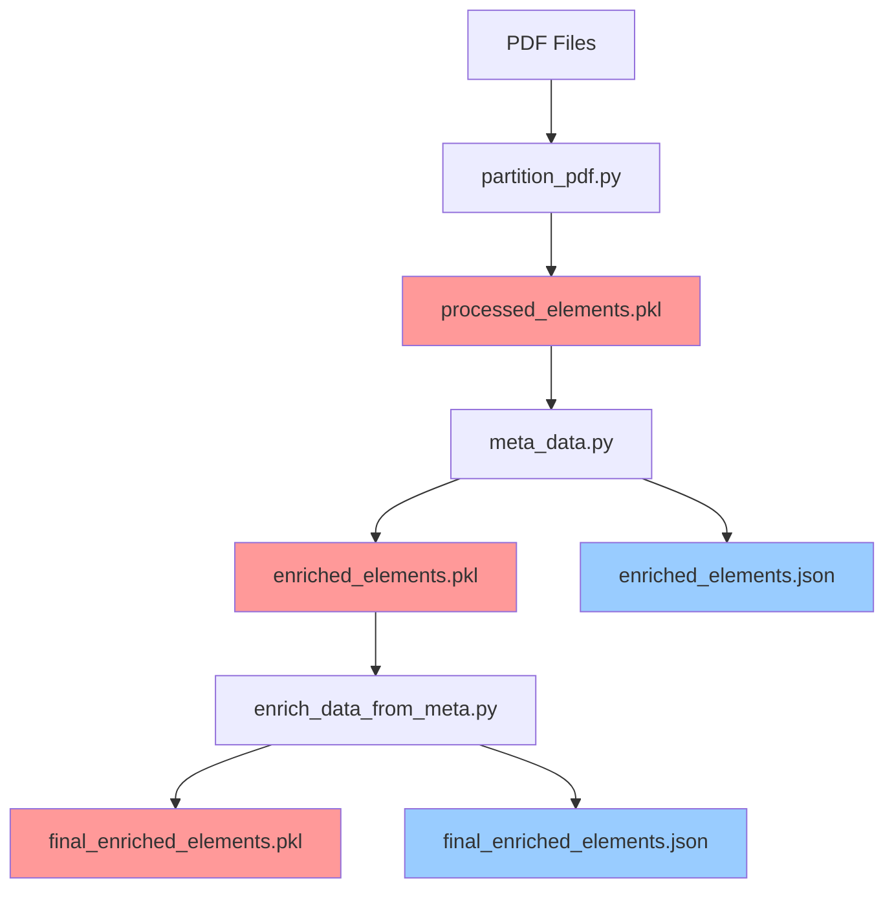
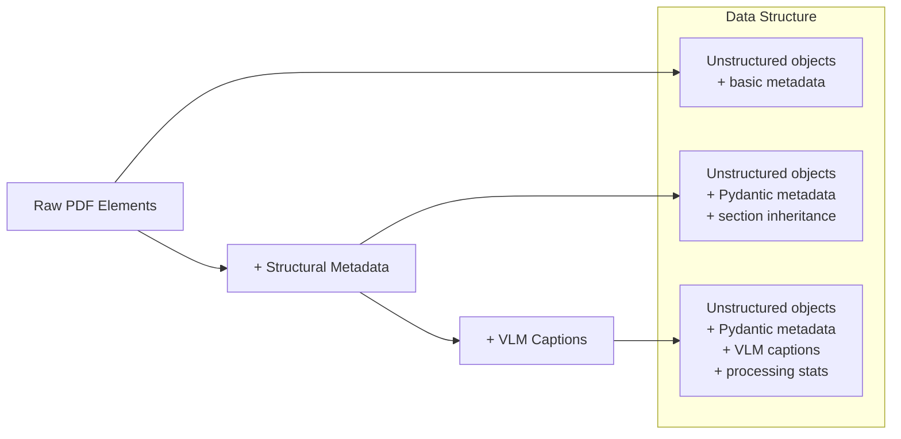
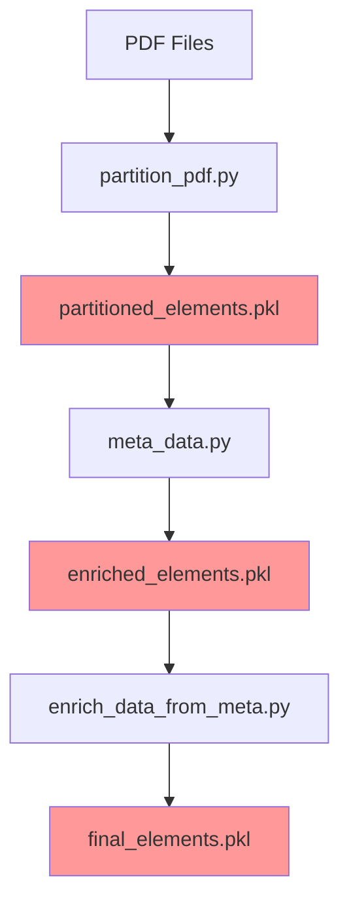
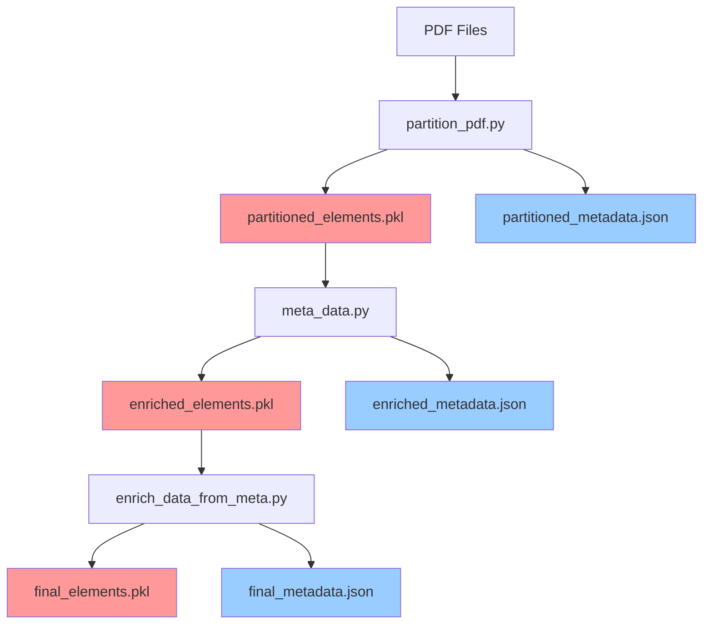

# Data Flow Analysis: Pickle vs JSON Usage Between Notebooks

## Overview

This document analyzes the data flow between the three main notebooks in the ConstructionRAG pipeline:
1. `partition_pdf.py` - PDF partitioning and element extraction
2. `meta_data.py` - Structural metadata enrichment
3. `enrich_data_from_meta.py` - VLM captioning and final enrichment

## Current Data Flow Architecture



**Legend:**
- 🔴 **Red (Pickle files)**: Primary data storage with full object serialization
- 🔵 **Blue (JSON files)**: Metadata-only storage for human readability

## Detailed File Usage Analysis

### 1. `partition_pdf.py` → `meta_data.py`

#### What `partition_pdf.py` Creates:
```python
# Saves to: processed_elements.pkl
data_to_save = {
    "raw_elements": raw_pdf_elements,        # Unstructured elements
    "extracted_pages": extracted_pages,      # Image page metadata
    "page_analysis": page_analysis,          # Page complexity analysis
    "filepath": filepath,                    # Source file path
}
```

#### What `meta_data.py` Reads:
```python
# Reads from: processed_elements.pkl
with open(pickle_file_path, "rb") as f:
    data = pickle.load(f)
    
raw_elements = data.get("raw_elements", [])
extracted_pages = data.get("extracted_pages", {})
page_analysis = data.get("page_analysis", {})
```

**Why Pickle?** 
- `raw_elements` contains complex Unstructured library objects
- These objects have methods, properties, and internal state
- JSON cannot serialize Python objects with methods

### 2. `meta_data.py` → `enrich_data_from_meta.py`

#### What `meta_data.py` Creates:
```python
# Saves to: enriched_elements.pkl (PRIMARY)
enriched_elements = [
    {
        "id": element_id,
        "original_element": element,           # Original Unstructured object
        "structural_metadata": structural_meta, # Pydantic model
        "element_type": "text_or_table",
    }
]

# Saves to: enriched_elements.json (SECONDARY)
serializable_elements = [
    {
        "id": element["id"],
        "element_type": element["element_type"],
        "structural_metadata": element["structural_metadata"].model_dump(),
        # Note: original_element is NOT included in JSON
    }
]
```

#### What `enrich_data_from_meta.py` Reads:
```python
# Reads from: enriched_elements.pkl (PRIMARY)
with open(pickle_file_path, "rb") as f:
    data = pickle.load(f)

# Access original elements for VLM processing
for element in data:
    original_element = element["original_element"]  # Full Unstructured object
    struct_meta = element["structural_metadata"]   # Pydantic model
```

**Why Both Formats?**
- **Pickle**: Preserves full `original_element` objects needed for VLM processing
- **JSON**: Human-readable metadata for analysis and debugging

### 3. `enrich_data_from_meta.py` → Final Output

#### What `enrich_data_from_meta.py` Creates:
```python
# Saves to: final_enriched_elements.pkl (PRIMARY)
all_enriched_elements = [
    {
        "element_id": element_id,
        "original_element": table_element,      # Full enriched element
        "enrichment_metadata": enrichment_meta, # VLM processing results
        "element_type": "table",
    }
]

# Saves to: final_enriched_elements.json (SECONDARY)
serializable_elements = [
    {
        "element_id": element["element_id"],
        "element_type": element["element_type"],
        "enrichment_metadata": element["enrichment_metadata"].model_dump(),
        # Note: original_element is NOT included in JSON
    }
]
```

## Data Structure Evolution



## File Size and Content Comparison

| File Type | Size | Contains | Purpose |
|-----------|------|----------|---------|
| `processed_elements.pkl` | Large | Full Unstructured objects + metadata | Primary data transfer |
| `enriched_elements.pkl` | Large | Full objects + structural metadata | Primary data transfer |
| `enriched_elements.json` | Small | Metadata only (no original objects) | Human analysis |
| `final_enriched_elements.pkl` | Large | Full objects + VLM results | Primary data transfer |
| `final_enriched_elements.json` | Small | VLM metadata only | Human analysis |

## Current Issues and Inconsistencies

### 1. **Dual File Maintenance**
Each notebook creates both `.pkl` and `.json` files, but only the `.pkl` files are actually used for data transfer.

### 2. **JSON Files Are Redundant**
The JSON files contain only metadata and are never read by subsequent notebooks - they're purely for human inspection.

### 3. **Inconsistent Naming**
- `partition_pdf.py` creates `processed_elements.pkl`
- `meta_data.py` creates `enriched_elements.pkl`
- `enrich_data_from_meta.py` creates `enriched_elements.pkl` (same name!)

### 4. **Data Loss in JSON**
JSON files lose the `original_element` objects, making them incomplete for processing.

## Recommended Unified Data Structure

### Option 1: Pickle-Only Approach (Recommended)



**Benefits:**
- Single source of truth per stage
- No data loss
- Simpler file management
- Consistent naming convention

**Implementation:**
```python
# Unified data structure across all notebooks
data_structure = {
    "metadata": {
        "pipeline_stage": "partition|enrich|vlm",
        "timestamp": "2025-01-21T08:48:33",
        "source_file": "test-with-little-variety.pdf",
        "processing_config": {...}
    },
    "elements": [
        {
            "id": "element_001",
            "original_element": unstructured_object,  # Full object
            "structural_metadata": pydantic_model,    # Enhanced metadata
            "vlm_metadata": pydantic_model,          # VLM results (if applicable)
            "element_type": "text|table|image_page"
        }
    ],
    "extracted_pages": {...},  # Image page metadata
    "page_analysis": {...}     # Page complexity data
}
```

### Option 2: Hybrid Approach with Clear Separation



**Benefits:**
- Clear separation of concerns
- Human-readable metadata files
- Full data preservation in pickle files

## Final Recommendation

**I recommend Option 1: Pickle-Only Approach** for the following reasons:

### 1. **Simplicity**
- Single file per stage
- No confusion about which file to use
- Easier debugging and troubleshooting

### 2. **Data Integrity**
- No risk of data loss
- Complete object preservation
- Consistent data structure

### 3. **Performance**
- Faster loading (no dual file operations)
- Less disk I/O
- Simpler code paths

### 4. **Maintenance**
- Fewer files to manage
- Clear naming convention: `{stage}_elements.pkl`
- Easier to version control

### Implementation Strategy:

1. **Standardize naming**: `partitioned_elements.pkl` → `enriched_elements.pkl` → `final_elements.pkl`

2. **Unified data structure**: Use the same base structure across all notebooks

3. **Optional JSON export**: Add a separate utility function for creating human-readable exports when needed

4. **Clear documentation**: Document the data structure and file purposes

5. **Backward compatibility**: Keep JSON files as optional exports for analysis tools

This approach eliminates the current confusion while maintaining all functionality and improving maintainability. 