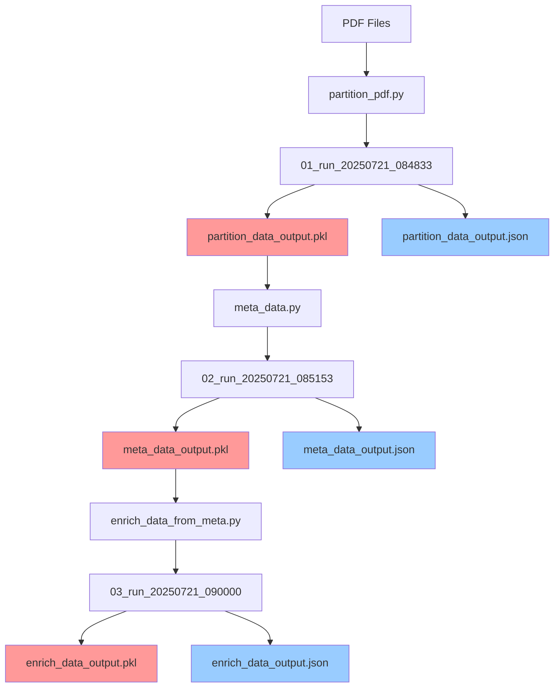

# Implementation Plan: Fixing Naming Inconsistencies

## Overview

This plan addresses two key improvements:
1. **Standardize file naming** based on notebook names
2. **Add step prefixes** to run directories for better organization

## Current vs Proposed Naming

### File Naming Changes

| Notebook | Current Output | Proposed Output | Purpose |
|----------|----------------|-----------------|---------|
| `partition_pdf.py` | `processed_elements.pkl` | `partition_data_output.pkl` | Primary data transfer |
| `partition_pdf.py` | `processed_elements.json` | `partition_data_output.json` | Human-readable metadata |
| `meta_data.py` | `enriched_elements.pkl` | `meta_data_output.pkl` | Primary data transfer |
| `meta_data.py` | `enriched_elements.json` | `meta_data_output.json` | Human-readable metadata |
| `enrich_data_from_meta.py` | `enriched_elements.pkl` | `enrich_data_output.pkl` | Primary data transfer |
| `enrich_data_from_meta.py` | `enriched_elements.json` | `enrich_data_output.json` | Human-readable metadata |

### Directory Naming Changes

| Step | Current | Proposed | Example |
|------|---------|----------|---------|
| 1. Partition | `run_20250721_084833` | `01_run_20250721_084833` | `01_run_20250721_084833` |
| 2. Meta Data | `run_20250721_085153` | `02_run_20250721_085153` | `02_run_20250721_085153` |
| 3. Enrich Data | `run_20250721_090000` | `03_run_20250721_090000` | `03_run_20250721_090000` |

## Updated Data Flow Architecture



## Implementation Plan

### Phase 1: Update `partition_pdf.py`

**Files to modify:**
- `notebooks/01_partition/partition_pdf.py`

**Changes needed:**

1. **Update output file names:**
```python
# Current
PICKLE_OUTPUT_PATH = CURRENT_RUN_DIR / "processed_elements.pkl"

# New
PICKLE_OUTPUT_PATH = CURRENT_RUN_DIR / "partition_data_output.pkl"
JSON_OUTPUT_PATH = CURRENT_RUN_DIR / "partition_data_output.json"
```

2. **Update run directory naming:**
```python
# Current
CURRENT_RUN_DIR = OUTPUT_BASE_DIR / f"run_{timestamp}"

# New
CURRENT_RUN_DIR = OUTPUT_BASE_DIR / f"01_run_{timestamp}"
```

3. **Add JSON export functionality:**
```python
# Add after pickle save
def save_partition_data_json(data_to_save, output_path):
    """Save partition data as human-readable JSON"""
    json_data = {
        "metadata": {
            "pipeline_stage": "partition",
            "timestamp": datetime.now().isoformat(),
            "source_file": os.path.basename(data_to_save["filepath"]),
            "total_elements": len(data_to_save["raw_elements"]),
            "extracted_pages": len(data_to_save["extracted_pages"]),
            "analyzed_pages": len(data_to_save["page_analysis"])
        },
        "elements_summary": [
            {
                "index": i,
                "category": getattr(el, "category", "Unknown"),
                "text_preview": getattr(el, "text", "")[:200] + "..." if len(getattr(el, "text", "")) > 200 else getattr(el, "text", ""),
                "page_number": getattr(getattr(el, "metadata", {}), "page_number", "Unknown")
            }
            for i, el in enumerate(data_to_save["raw_elements"])
        ],
        "extracted_pages": data_to_save["extracted_pages"],
        "page_analysis": data_to_save["page_analysis"]
    }
    
    with open(output_path, "w") as f:
        json.dump(json_data, f, indent=2)
```

### Phase 2: Update `meta_data.py`

**Files to modify:**
- `notebooks/02_meta_data/meta_data.py`

**Changes needed:**

1. **Update input file path:**
```python
# Current
INPUT_PICKLE_PATH = PARTITION_DATA_DIR / PARTITION_RUN_TO_LOAD / "processed_elements.pkl"

# New
INPUT_PICKLE_PATH = PARTITION_DATA_DIR / PARTITION_RUN_TO_LOAD / "partition_data_output.pkl"
```

2. **Update output file names:**
```python
# Current
OUTPUT_PATH = CURRENT_RUN_DIR / "enriched_elements.json"

# New
OUTPUT_PATH = CURRENT_RUN_DIR / "meta_data_output.json"
PICKLE_OUTPUT_PATH = CURRENT_RUN_DIR / "meta_data_output.pkl"
```

3. **Update run directory naming:**
```python
# Current
CURRENT_RUN_DIR = OUTPUT_BASE_DIR / f"run_{timestamp}"

# New
CURRENT_RUN_DIR = OUTPUT_BASE_DIR / f"02_run_{timestamp}"
```

4. **Update save function calls:**
```python
# Current
save_enriched_elements(enriched_elements, OUTPUT_PATH)

# New
save_enriched_elements(enriched_elements, OUTPUT_PATH, PICKLE_OUTPUT_PATH)
```

### Phase 3: Update `enrich_data_from_meta.py`

**Files to modify:**
- `notebooks/03_enrich_data/enrich_data_from_meta.py`

**Changes needed:**

1. **Update input file path:**
```python
# Current
INPUT_PICKLE_PATH = META_DATA_RUN_DIR / "enriched_elements.pkl"

# New
INPUT_PICKLE_PATH = META_DATA_RUN_DIR / "meta_data_output.pkl"
```

2. **Update output file names:**
```python
# Current
OUTPUT_PATH = CURRENT_RUN_DIR / "enriched_elements.json"

# New
OUTPUT_PATH = CURRENT_RUN_DIR / "enrich_data_output.json"
PICKLE_OUTPUT_PATH = CURRENT_RUN_DIR / "enrich_data_output.pkl"
```

3. **Update run directory naming:**
```python
# Current
CURRENT_RUN_DIR = output_base_path / f"run_{timestamp}"

# New
CURRENT_RUN_DIR = output_base_path / f"03_run_{timestamp}"
```

4. **Update save function calls:**
```python
# Current
save_enriched_elements(all_enriched_elements, OUTPUT_PATH)

# New
save_enriched_elements(all_enriched_elements, OUTPUT_PATH, PICKLE_OUTPUT_PATH)
```

### Phase 4: Update Configuration Variables

**Files to modify:**
- All three notebooks

**Changes needed:**

1. **Update `meta_data.py` configuration:**
```python
# Current
PARTITION_RUN_TO_LOAD = "run_20250721_084833"

# New
PARTITION_RUN_TO_LOAD = "01_run_20250721_084833"
```

2. **Update `enrich_data_from_meta.py` configuration:**
```python
# Current
META_DATA_RUN_TO_LOAD = "run_20250721_085153"

# New
META_DATA_RUN_TO_LOAD = "02_run_20250721_085153"
```

## Updated Directory Structure

```
data/internal/
├── 01_partition_data/
│   └── 01_run_20250721_084833/
│       ├── partition_data_output.pkl
│       ├── partition_data_output.json
│       ├── vlm_pages/
│       └── tables/
├── 02_meta_data/
│   └── 02_run_20250721_085153/
│       ├── meta_data_output.pkl
│       ├── meta_data_output.json
│       └── sample_analysis.csv
└── 03_enrich_data/
    └── 03_run_20250721_090000/
        ├── enrich_data_output.pkl
        ├── enrich_data_output.json
        └── vlm_processing_stats.json
```

## Benefits of This Approach

### 1. **Clear Data Lineage**
- File names clearly indicate which notebook created them
- Directory prefixes show the processing order
- Easy to trace data flow through the pipeline

### 2. **Reduced Confusion**
- No more duplicate file names (`enriched_elements.pkl`)
- Clear distinction between stages
- Self-documenting file structure

### 3. **Better Organization**
- Chronological ordering with prefixes
- Easy to identify latest runs
- Clear separation of concerns

### 4. **Maintainability**
- Consistent naming pattern across all notebooks
- Easy to add new pipeline stages
- Clear documentation of data flow

## Migration Strategy

### Option 1: Clean Slate (Recommended)
1. Delete existing run directories
2. Implement new naming scheme
3. Re-run pipeline from scratch

### Option 2: Gradual Migration
1. Implement new naming for new runs
2. Keep existing runs for reference
3. Update configuration variables as needed

## Testing Plan

1. **Test each notebook individually** with new naming
2. **Verify data flow** between notebooks
3. **Check file readability** for both pickle and JSON
4. **Validate directory structure** matches expected format
5. **Test configuration updates** work correctly

## Rollback Plan

If issues arise:
1. Keep backup of current working versions
2. Revert configuration variables to old run names
3. Update file paths to use old naming scheme
4. Test with existing data files

This approach maintains the benefits of both pickle (full data preservation) and JSON (human readability) while creating a much clearer and more maintainable data pipeline structure. 