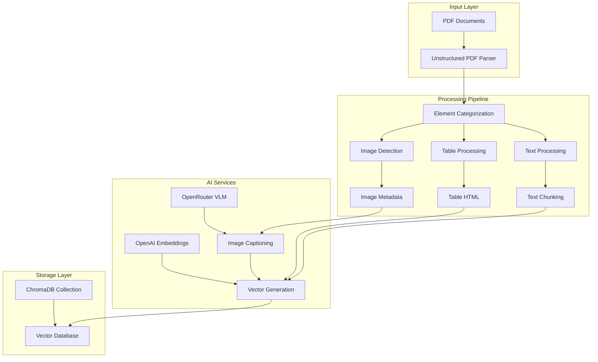
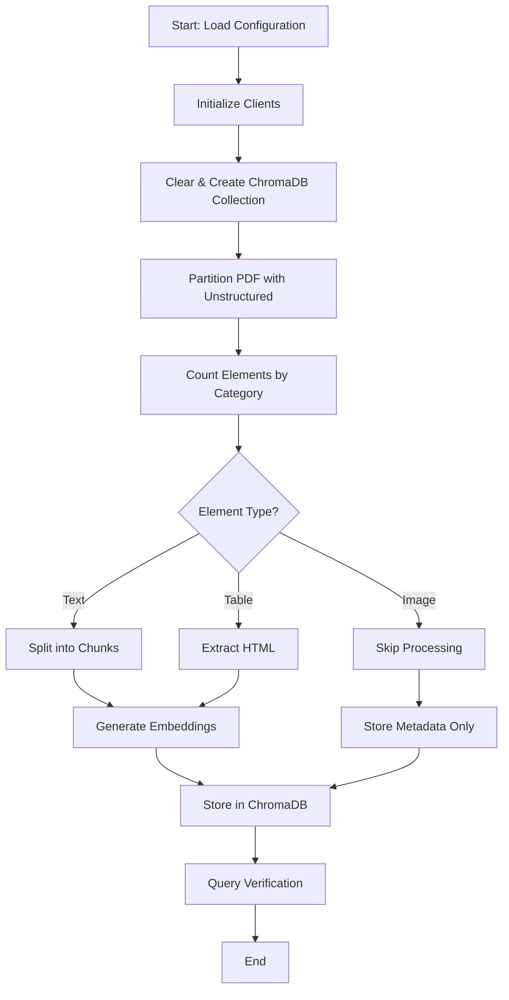
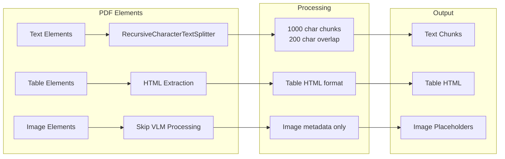
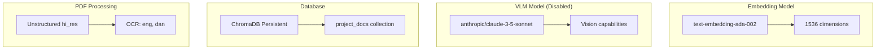
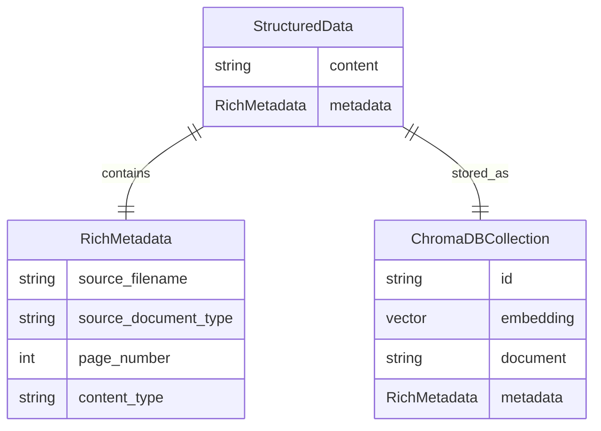

# ConstructionRAG Notebook Overview

## System Architecture

## Data Flow

## Element Processing Logic

## Configuration & Models

## Data Structure

## How the Notebook Works

### 1. **Initialization Phase**
- Loads environment variables (API keys)
- Defines Pydantic models for structured metadata
- Initializes OpenAI embedding client
- Creates/clears ChromaDB collection to avoid dimension mismatches
- Verifies embedding model produces correct dimensions (1536)

### 2. **PDF Processing Phase**
- Uses Unstructured library with `hi_res` strategy
- Extracts text, tables, and images from PDF
- Counts elements by category for transparency
- Processes documents in Danish and English (OCR)

### 3. **Element Categorization**
- **Text Elements**: Split into 1000-character chunks with 200-character overlap
- **Table Elements**: Converted to HTML format for structured storage
- **Image Elements**: Currently skipped (VLM processing disabled)

### 4. **Embedding Generation**
- Uses OpenAI's `text-embedding-ada-002` model
- Generates 1536-dimensional vectors for all text content
- Ensures consistency between storage and query embeddings

### 5. **Database Storage**
- Stores in ChromaDB with rich metadata
- Each entry includes: content, embedding, source file, page number, content type
- Uses UUIDs for unique identification

### 6. **Verification Phase**
- Performs test query using explicit embedding generation
- Demonstrates retrieval with distance scores
- Validates end-to-end pipeline functionality

## Key Features

### ✅ **Working Components**
- PDF parsing with Unstructured
- Text and table extraction
- Element categorization and counting
- Embedding generation with OpenAI
- ChromaDB storage and retrieval
- Explicit embedding consistency for queries

### ⏸️ **Disabled Components**
- VLM image captioning (commented out with `'''`)
- VLM test functionality (commented out with `'''`)

### 📊 **Output Metrics**
- Total elements found
- Breakdown by category (Text, Image, Table)
- Image count for future VLM processing
- Embedding dimensions verification
- Query results with distances

## Technical Details

### **Embedding Consistency Fix**
The notebook solves the common ChromaDB dimension mismatch issue by:
1. Explicitly generating query embeddings using the same model
2. Using `query_embeddings` parameter instead of `query_texts`
3. Ensuring the same `text-embedding-ada-002` model is used throughout

### **Error Handling**
- Graceful handling of missing image files
- Collection recreation to avoid dimension conflicts
- Comprehensive logging for debugging

### **Scalability Considerations**
- Modular design allows easy re-enabling of VLM features
- Configurable chunk sizes and overlap
- Support for multiple document types and languages

## Usage Instructions

1. **Setup**: Ensure `.env` file contains `OPENAI_API_KEY` and `OPENROUTER_API_KEY`
2. **Run**: Execute the notebook cells in order
3. **Monitor**: Watch the category breakdown and embedding verification
4. **Query**: Test retrieval with the verification query
5. **Extend**: Uncomment VLM sections when ready to process images

## Future Enhancements

- Re-enable VLM image captioning
- Add support for multiple PDF files
- Implement semantic search capabilities
- Add document similarity analysis
- Create web interface for querying

---

*This notebook provides a complete RAG pipeline for construction documents, with the ability to easily re-enable image processing when VLM services are properly configured.* 