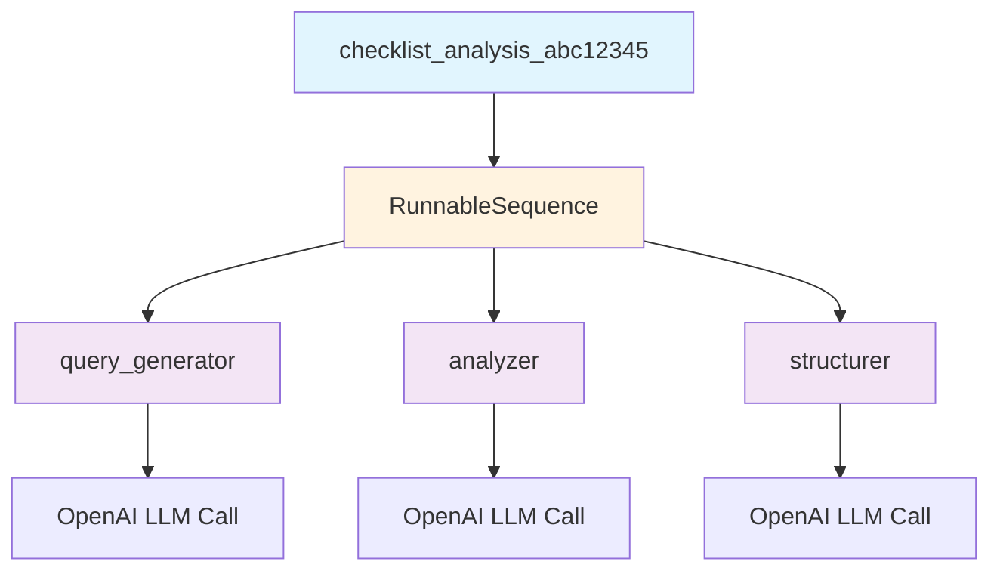
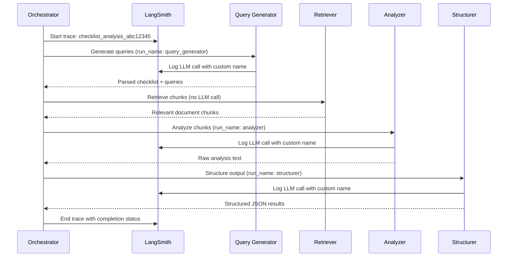

# LangSmith Tracing Implementation for Checklist Analysis Pipeline

## Quick Reference

- **Location**: `/backend/src/pipeline/checklist/orchestrator.py`
- **Entry Point**: `ChecklistAnalysisOrchestrator.process_checklist_analysis()` (line 22)
- **Configuration**: Environment variables in `.env` file
- **Key Implementation**: `@chain` decorator for trace grouping (lines 54-141)
- **LLM Steps**: query_generator.py, analyzer.py, structurer.py with custom run names

## Overview

LangSmith tracing provides comprehensive observability for the checklist analysis pipeline, enabling developers to monitor LLM calls, track performance, and debug issues across the 4-step analysis process. The implementation uses LangChain's `@chain` decorator to create a hierarchical trace structure that groups all pipeline steps under a single parent trace.

## Why LangSmith Tracing Was Implemented

### Business Value
- **Performance Monitoring**: Track LLM response times and token usage across pipeline steps
- **Quality Assurance**: Monitor output quality and identify model performance issues
- **Cost Optimization**: Analyze token consumption patterns to optimize model selection
- **Debugging Support**: Trace failures and performance bottlenecks in production

### Technical Benefits
- **Hierarchical Tracing**: Groups related LLM calls under a single pipeline execution
- **Custom Metadata**: Tracks analysis run IDs, model names, and pipeline configurations
- **Error Tracking**: Captures and traces exceptions with full context
- **Production Visibility**: Real-time monitoring of pipeline performance

## Architecture

### Trace Hierarchy



### Pipeline Flow with Tracing



## Implementation Details

### @chain Decorator Approach

The implementation uses LangChain's `@chain` decorator to create proper trace grouping:

```python
# In orchestrator.py (lines 54-141)
from langchain_core.runnables import chain

@chain
async def checklist_analysis_chain(inputs):
    # All pipeline steps are executed within this chain
    # This creates a single parent trace that groups all LLM calls
    
    # Step 1: Query Generation (with custom run_name)
    parsed_data = await generate_queries_from_checklist(
        checklist_content, language, model_name
    )
    
    # Step 2: Document Retrieval (no LLM call)
    unique_chunks = await retrieve_chunks_for_queries_batch(
        parsed_data["queries"], indexing_run_id
    )
    
    # Step 3: Analysis (with custom run_name)
    raw_analysis = await analyze_checklist_with_chunks(
        parsed_data["items"], unique_chunks, language, model_name
    )
    
    # Step 4: Structuring (with custom run_name)
    structured_results = await structure_analysis_output(
        raw_analysis, parsed_data["items"], language, model_name
    )
    
    return results
```

### Custom Run Names for LLM Steps

Each LLM step uses a custom `run_name` to identify its purpose in traces:

```python
# In query_generator.py (line 34)
async def call_llm(llm_client: ChatOpenAI, prompt: str) -> str:
    message = HumanMessage(content=prompt)
    response = await llm_client.ainvoke([message], config={"run_name": "query_generator"})
    return response.content

# In analyzer.py (line 32)
async def call_llm(llm_client: ChatOpenAI, prompt: str) -> str:
    message = HumanMessage(content=prompt)
    response = await llm_client.ainvoke([message], config={"run_name": "analyzer"})
    return response.content

# In structurer.py (line 128)
async def call_llm(llm_client: ChatOpenAI, prompt: str) -> str:
    message = HumanMessage(content=prompt)
    response = await llm_client.ainvoke([message], config={"run_name": "structurer"})
    return response.content
```

### Trace Configuration and Metadata

The chain is invoked with comprehensive configuration:

```python
# Chain execution with metadata (lines 120-141)
result = await checklist_analysis_chain.ainvoke(
    {
        "checklist_content": analysis_run.checklist_content,
        "language": language,
        "model_name": analysis_run.model_name,
        "analysis_run_id": analysis_run_id,
        "indexing_run_id": str(analysis_run.indexing_run_id)
    },
    config={
        "run_name": f"checklist_analysis_{analysis_run_id[:8]}",
        "metadata": {
            "analysis_run_id": analysis_run_id,
            "indexing_run_id": str(analysis_run.indexing_run_id),
            "checklist_id": analysis_run.checklist_id if hasattr(analysis_run, 'checklist_id') else None
        },
        "tags": [
            "checklist_analysis",
            analysis_run.model_name,
            "production"
        ]
    }
)
```

## Environment Setup

### Required Environment Variables

Add these variables to your `.env` file:

```bash
# LangSmith Configuration
LANGCHAIN_TRACING_V2=true
LANGCHAIN_API_KEY=your_langsmith_api_key_here
LANGCHAIN_PROJECT=specfinder-checklist-analysis

# Optional: Endpoint customization
LANGCHAIN_ENDPOINT=https://api.smith.langchain.com
```

### Production Configuration

For production environments, ensure these variables are set in your deployment platform:

- **Railway**: Set environment variables in the Railway dashboard
- **Docker**: Include in docker-compose.yml or Dockerfile ENV directives
- **Local Development**: Use `.env` file (never commit to git)

## LangSmith UI Trace Appearance

### Trace Structure in UI

When viewing traces in LangSmith, you'll see:

1. **Parent Trace**: `checklist_analysis_abc12345`
   - Contains all metadata (analysis_run_id, indexing_run_id, model_name)
   - Shows total execution time and status
   - Tagged with "checklist_analysis", model name, "production"

2. **Child Trace**: `RunnableSequence` (automatic LangChain wrapper)
   - This is normal and expected behavior
   - Contains the actual pipeline execution steps

3. **LLM Call Traces**: Individual steps with clear names
   - `query_generator`: Shows prompt and parsed checklist output
   - `analyzer`: Shows analysis prompt, chunks, and raw analysis
   - `structurer`: Shows structuring prompt and final JSON output

### Trace Metadata Examples

Each trace includes rich metadata for filtering and analysis:

```json
{
  "analysis_run_id": "550e8400-e29b-41d4-a716-446655440000",
  "indexing_run_id": "670e8400-e29b-41d4-a716-446655440001",
  "checklist_id": "checklist_123",
  "model_name": "anthropic/claude-3-sonnet",
  "pipeline_step": "query_generator|analyzer|structurer",
  "language": "danish"
}
```

## Code Examples

### Complete Implementation Flow

```python
class ChecklistAnalysisOrchestrator:
    async def process_checklist_analysis(self, analysis_run_id: str):
        # 1. Setup tracing context
        from langchain_core.runnables import chain
        
        # 2. Define traced pipeline
        @chain
        async def checklist_analysis_chain(inputs):
            # All steps executed within this trace context
            results = await self._execute_pipeline_steps(inputs)
            return results
        
        # 3. Execute with tracing metadata
        result = await checklist_analysis_chain.ainvoke(
            pipeline_inputs,
            config={
                "run_name": f"checklist_analysis_{analysis_run_id[:8]}",
                "metadata": trace_metadata,
                "tags": ["checklist_analysis", model_name, "production"]
            }
        )
```

### LLM Call Pattern

```python
async def call_llm(llm_client: ChatOpenAI, prompt: str) -> str:
    """Standard pattern for traced LLM calls."""
    message = HumanMessage(content=prompt)
    
    # The config with run_name creates a named trace
    response = await llm_client.ainvoke(
        [message], 
        config={"run_name": "step_specific_name"}
    )
    
    return response.content
```

## Troubleshooting

### Common Issues and Solutions

#### Issue: RunnableSequence Appears in Traces

**Symptom**: Traces show `RunnableSequence` as an intermediate step

**Explanation**: This is normal behavior when using `@chain` decorator. LangChain automatically wraps the function in a RunnableSequence for execution.

**Solution**: This is expected and doesn't affect functionality. The actual pipeline steps will appear as child traces.

#### Issue: Missing Custom Run Names

**Symptom**: LLM calls appear with generic names instead of "query_generator", "analyzer", "structurer"

**Root Cause**: `config={"run_name": "..."}` not passed to `ainvoke()`

**Solution**: Ensure all `call_llm` functions include the config parameter:

```python
# Correct implementation
response = await llm_client.ainvoke([message], config={"run_name": "analyzer"})

# Incorrect - missing config
response = await llm_client.ainvoke([message])
```

#### Issue: Traces Not Appearing in LangSmith

**Symptom**: No traces visible in LangSmith dashboard

**Troubleshooting Steps**:

1. **Check Environment Variables**:
   ```bash
   echo $LANGCHAIN_TRACING_V2  # Should be "true"
   echo $LANGCHAIN_API_KEY     # Should be your API key
   echo $LANGCHAIN_PROJECT     # Should be your project name
   ```

2. **Verify API Key Permissions**: Ensure API key has write access to the project

3. **Check Network Connectivity**: Verify the application can reach `api.smith.langchain.com`

4. **Review Logs**: Look for LangSmith-related error messages in application logs

#### Issue: Incomplete Trace Metadata

**Symptom**: Traces appear but lack expected metadata fields

**Solution**: Verify metadata structure in chain invocation:

```python
config={
    "run_name": f"checklist_analysis_{analysis_run_id[:8]}",
    "metadata": {
        "analysis_run_id": analysis_run_id,        # Required
        "indexing_run_id": str(indexing_run_id),   # Required
        "checklist_id": checklist_id               # Optional
    },
    "tags": ["checklist_analysis", model_name, "production"]
}
```

## Alternative Approaches Considered

### CallbackManager Approach (Rejected)

**Attempted Implementation**:
```python
from langchain.callbacks import CallbackManager
from langsmith import Client

# This approach was tried but abandoned
callback_manager = CallbackManager([LangChainTracer()])
```

**Why Rejected**:
- Complex callback setup required for each LLM call
- Difficult to maintain consistent trace grouping
- Required manual trace management across async operations

### tracing_context Approach (Rejected)

**Attempted Implementation**:
```python
from langsmith import tracing_context

# This approach was tried but abandoned
with tracing_context(run_name="checklist_analysis"):
    # Pipeline execution
```

**Why Rejected**:
- Context management was unreliable with async operations
- Inconsistent trace nesting behavior
- Limited metadata customization options

### @chain Decorator Approach (Selected)

**Why Chosen**:
- **Automatic Grouping**: Creates proper parent-child trace relationships
- **Simple Implementation**: Minimal code changes required
- **Reliable Async Support**: Works consistently with async/await patterns
- **Rich Metadata**: Full support for custom metadata and tags
- **Future-Proof**: Uses LangChain's recommended tracing patterns

## Performance Impact

### Overhead Analysis

- **Network Overhead**: ~50-100ms per pipeline execution for trace upload
- **Memory Overhead**: Minimal (trace data is serialized and sent asynchronously)
- **CPU Overhead**: <1% additional processing time for trace generation

### Production Considerations

- **Batching**: LangSmith automatically batches trace uploads
- **Retry Logic**: Built-in retry mechanism for failed trace uploads
- **Graceful Degradation**: Pipeline continues execution even if tracing fails

## Related Documentation

- `/public-docs/01-features/docs_checklist_analysis_pipeline.md` - Main pipeline documentation
- `/public-docs/02-api/docs_checklist_endpoints.md` - API endpoint documentation
- `/public-docs/03-database/docs_checklist_schema.md` - Database schema for checklist data

## Future Enhancements

### Planned Improvements

1. **Custom Metrics**: Add token count and cost tracking per pipeline step
2. **Performance Alerts**: Set up automated alerts for slow pipeline executions
3. **A/B Testing**: Use trace data to compare different model configurations
4. **User Journey Tracking**: Link traces to specific user sessions and projects

### Integration Opportunities

- **Error Monitoring**: Connect trace failures to error tracking systems
- **Analytics Dashboard**: Build custom dashboards using LangSmith trace data
- **Cost Optimization**: Analyze trace data to optimize model selection and prompt engineering