# Checklist Analysis Feature Implementation Guide

## Quick Reference

- **Location**: `/frontend/src/components/features/checklist/` and `/frontend/src/components/features/project-pages/ProjectChecklistContent.tsx`
- **Entry Point**: `ProjectChecklistContent.tsx` (main component)
- **Route**: Integrated into existing project pages as a new tab
- **Status**: Frontend mock complete, backend implementation required
- **Components**: ChecklistBox, ChecklistEditor, AnalysisResults, ResultsTable

## Overview

The Checklist Analysis feature enables construction professionals to create custom checklists and analyze project documents against them using the RAG system. This feature transforms the document Q&A system into a structured audit tool that can systematically verify document completeness, identify missing information, and flag potential risks.

### Key Capabilities
- **Custom Checklist Creation**: Users can define structured checklists with predefined status categories
- **Document Analysis**: RAG-powered analysis of uploaded documents against checklist items
- **Categorized Results**: Items are classified as Found, Missing, Risk, Conditions, or Pending Clarification
- **Source Attribution**: Results include specific document references (file name and page number)
- **Export Functionality**: Results can be exported to PDF and CSV formats
- **Analysis History**: Previous analysis runs can be saved and retrieved

## User Interface

### 6-Box Python Notebook-Style Interface

The feature uses a collapsible box interface inspired by Jupyter notebooks:

```mermaid
flowchart TD
    A["📦 Box 0: Load Existing Analysis<br/>Select previous analysis runs"] --> B["📦 Box 1: Upload PDF Files<br/>Drag & drop construction documents"]
    B --> C["📦 Box 2: Define Checklist<br/>Create/edit checklist templates"]
    C --> D["⚡ Analyze Button<br/>Execute RAG analysis"]
    D --> E["📦 Box 3: Raw LLM Output<br/>View unprocessed AI analysis"]
    D --> F["📦 Box 4: Structured Results<br/>Categorized table view"]
    D --> G["📦 Box 5: Save/Export<br/>PDF, CSV export & save runs"]
```



### Box Functionality

1. **Box 0 - Load Existing Analysis**: Dropdown to select and load previous analysis runs with their checklists and results
2. **Box 1 - Upload PDF Files**: Drag-and-drop interface for construction documents (PDFs only)
3. **Box 2 - Define Checklist**: Text editor with predefined templates and custom checklist creation
4. **Box 3 - Raw LLM Output**: Display of unprocessed AI analysis in monospace text
5. **Box 4 - Structured Results**: Organized table with status-based categorization and filtering
6. **Box 5 - Save/Export**: Options to save analysis runs and export results to PDF/CSV

### Status Categories

Each checklist item is analyzed and assigned one of five statuses:

- **🟢 Found**: Information is present and complete in documentation
- **🔴 Missing**: Required information is absent from all documents
- **⚠️ Risk**: Information exists but presents potential project risks
- **📋 Conditions**: Item has dependencies or conditional requirements
- **❓ Pending Clarification**: Information is unclear or requires further review

## Current Implementation (Frontend Mock)

### Components Structure

```
/frontend/src/components/features/checklist/
├── ChecklistBox.tsx          # Collapsible container component
├── ChecklistEditor.tsx       # Checklist creation/editing interface
├── AnalysisResults.tsx       # Raw LLM output display
└── ResultsTable.tsx          # Structured results with status grouping

/frontend/src/components/features/project-pages/
└── ProjectChecklistContent.tsx # Main container component
```

### Mock Data Included

- **3 sample analysis runs** with metadata (name, date, checklist type, status)
- **6 example results** covering all status categories
- **3 predefined checklist templates** (IT Infrastructure, AIA Security, Complete Building Security)
- **Realistic raw LLM output** example showing Danish construction analysis

### Current Frontend Capabilities

- ✅ Complete UI workflow with all 6 boxes
- ✅ File upload interface (validation for PDF files only)
- ✅ Checklist editor with template selection
- ✅ Analysis execution simulation (3-second loading)
- ✅ Results display with status-based grouping
- ✅ Export button placeholders (PDF/CSV)
- ✅ Save analysis functionality placeholder
- ✅ Toast notifications for user feedback

## Backend Requirements

### Core Analysis Pipeline

The backend needs to implement a new analysis pipeline that processes checklist items against document content:


### Required Processing Steps

1. **Document Preprocessing**: Use existing RAG pipeline to chunk and embed documents if not already processed
2. **Checklist Parsing**: Extract individual items and their expected status categories
3. **Item-by-Item Analysis**: Query RAG system for each checklist item to find relevant information
4. **Status Classification**: Use LLM to determine status (Found/Missing/Risk/Conditions/Pending Clarification)
5. **Source Attribution**: Map findings back to specific documents and page numbers
6. **Result Structuring**: Convert raw LLM output into structured data format

## API Endpoints

### New Endpoints Required

```python
# Checklist Analysis
POST   /api/checklist/analyze                    # Execute checklist analysis
GET    /api/checklist/runs/{indexing_run_id}     # List analysis runs for project
GET    /api/checklist/runs/{analysis_run_id}     # Get specific analysis run
DELETE /api/checklist/runs/{analysis_run_id}     # Delete analysis run
POST   /api/checklist/runs/{analysis_run_id}/export  # Export results (PDF/CSV)

# Checklist Templates  
GET    /api/checklist/templates                  # List saved checklist templates
POST   /api/checklist/templates                  # Save new checklist template
GET    /api/checklist/templates/{template_id}    # Get specific template
PUT    /api/checklist/templates/{template_id}    # Update template
DELETE /api/checklist/templates/{template_id}    # Delete template
```

### Request/Response Models

```python
# Analysis Request
class ChecklistAnalysisRequest(BaseModel):
    indexing_run_id: str
    checklist_content: str
    checklist_name: str
    files: Optional[List[UploadFile]] = None  # For additional files

# Analysis Response
class ChecklistAnalysisResponse(BaseModel):
    analysis_run_id: str
    status: AnalysisStatus
    checklist_name: str
    raw_output: str
    structured_results: List[ChecklistResult]
    created_at: datetime
    updated_at: datetime

# Individual Result
class ChecklistResult(BaseModel):
    id: str
    number: str
    name: str
    status: ChecklistStatus  # found, missing, risk, conditions, pending_clarification
    description: str
    confidence_score: Optional[float]
    source: Optional[DocumentSource]

class DocumentSource(BaseModel):
    document_name: str
    page_number: int
    chunk_id: Optional[str]
    excerpt: Optional[str]

# Template Models
class ChecklistTemplate(BaseModel):
    id: str
    name: str
    content: str
    category: str
    user_id: Optional[str]  # None for system templates
    created_at: datetime
```

## Database Schema

### New Tables Required

```sql
-- Checklist analysis runs
CREATE TABLE checklist_analysis_runs (
    id UUID PRIMARY KEY DEFAULT gen_random_uuid(),
    indexing_run_id UUID NOT NULL REFERENCES indexing_runs(id),
    user_id UUID REFERENCES auth.users(id),
    checklist_name VARCHAR(255) NOT NULL,
    checklist_content TEXT NOT NULL,
    status analysis_status NOT NULL DEFAULT 'pending',
    raw_output TEXT,
    error_message TEXT,
    access_level access_level NOT NULL DEFAULT 'private',
    created_at TIMESTAMP WITH TIME ZONE DEFAULT NOW(),
    updated_at TIMESTAMP WITH TIME ZONE DEFAULT NOW()
);

-- Individual checklist results
CREATE TABLE checklist_results (
    id UUID PRIMARY KEY DEFAULT gen_random_uuid(),
    analysis_run_id UUID NOT NULL REFERENCES checklist_analysis_runs(id) ON DELETE CASCADE,
    item_number VARCHAR(50) NOT NULL,
    item_name VARCHAR(500) NOT NULL,
    status checklist_status NOT NULL,
    description TEXT NOT NULL,
    confidence_score DECIMAL(3,2),
    source_document VARCHAR(255),
    source_page INTEGER,
    source_chunk_id UUID REFERENCES chunks(id),
    source_excerpt TEXT,
    created_at TIMESTAMP WITH TIME ZONE DEFAULT NOW()
);

-- Checklist templates
CREATE TABLE checklist_templates (
    id UUID PRIMARY KEY DEFAULT gen_random_uuid(),
    user_id UUID REFERENCES auth.users(id), -- NULL for system templates
    name VARCHAR(255) NOT NULL,
    content TEXT NOT NULL,
    category VARCHAR(100) NOT NULL DEFAULT 'custom',
    is_public BOOLEAN DEFAULT FALSE,
    access_level access_level NOT NULL DEFAULT 'private',
    created_at TIMESTAMP WITH TIME ZONE DEFAULT NOW(),
    updated_at TIMESTAMP WITH TIME ZONE DEFAULT NOW()
);

-- Enums
CREATE TYPE analysis_status AS ENUM ('pending', 'running', 'completed', 'failed');
CREATE TYPE checklist_status AS ENUM ('found', 'missing', 'risk', 'conditions', 'pending_clarification');
```

### Indexes Required

```sql
CREATE INDEX idx_checklist_analysis_runs_indexing_run_id ON checklist_analysis_runs(indexing_run_id);
CREATE INDEX idx_checklist_analysis_runs_user_id ON checklist_analysis_runs(user_id);
CREATE INDEX idx_checklist_analysis_runs_status ON checklist_analysis_runs(status);
CREATE INDEX idx_checklist_results_analysis_run_id ON checklist_results(analysis_run_id);
CREATE INDEX idx_checklist_results_status ON checklist_results(status);
CREATE INDEX idx_checklist_templates_user_id ON checklist_templates(user_id);
CREATE INDEX idx_checklist_templates_category ON checklist_templates(category);
```

## Integration Points

### RAG Pipeline Integration

The checklist analysis feature leverages the existing RAG infrastructure:


### Access Control Integration

The feature respects the existing access control system:

- **Public Projects** (`access_level: public`): Anonymous users can view but not create analyses
- **Authenticated Projects** (`access_level: auth`): Any authenticated user can create analyses
- **Private Projects** (`access_level: private`): Only project owners can create analyses

### Query Pipeline Reuse

The checklist analysis reuses components from the existing query pipeline:

1. **Query Processing Step**: Generate semantic variations of each checklist item
2. **Retrieval Step**: Use vector similarity search to find relevant document chunks
3. **Generation Step**: Use LLM to analyze chunks against checklist criteria

## Performance Characteristics

### Expected Processing Times

- **Small Checklist** (5-10 items): 30-60 seconds
- **Medium Checklist** (15-25 items): 1-3 minutes  
- **Large Checklist** (30+ items): 3-8 minutes

### Resource Requirements

- **LLM Calls**: 2-3 calls per checklist item (analysis + classification)
- **Vector Searches**: 1-2 searches per checklist item
- **Storage**: ~50KB per analysis run, ~5KB per result item

### Optimization Strategies

1. **Parallel Processing**: Analyze multiple checklist items concurrently
2. **Caching**: Cache similar checklist item analyses within the same project
3. **Chunking**: Group related checklist items for batch processing
4. **Progressive Results**: Stream results as they complete rather than waiting for full analysis

## Implementation Priority

### Phase 1: Core Analysis (High Priority)
- [ ] Database schema creation
- [ ] Basic analysis endpoint (`POST /api/checklist/analyze`)
- [ ] Result retrieval endpoint (`GET /api/checklist/runs/{run_id}`)
- [ ] Integration with existing RAG pipeline

### Phase 2: Template Management (Medium Priority)
- [ ] Template CRUD endpoints
- [ ] System templates seeding
- [ ] Template sharing functionality

### Phase 3: Export & Advanced Features (Low Priority)
- [ ] PDF export generation
- [ ] CSV export functionality
- [ ] Analysis run management (delete, rename)
- [ ] Performance optimizations

## Security Considerations

- **Input Validation**: Sanitize checklist content to prevent injection attacks
- **Rate Limiting**: Implement analysis rate limits to prevent abuse
- **File Validation**: Ensure uploaded files are valid PDFs and within size limits
- **Access Control**: Enforce RLS policies for all checklist-related operations
- **Output Sanitization**: Clean LLM output before storing/displaying to users

## Testing Requirements

### Integration Tests
- [ ] End-to-end analysis workflow with real documents
- [ ] Access control enforcement across all endpoints
- [ ] Error handling for malformed checklists and invalid files

### Unit Tests  
- [ ] Checklist parsing and item extraction
- [ ] Status classification logic
- [ ] Result structuring and formatting
- [ ] Template management operations

This feature represents a significant enhancement to the ConstructionRAG platform, transforming it from a Q&A tool into a comprehensive document audit system for the construction industry.