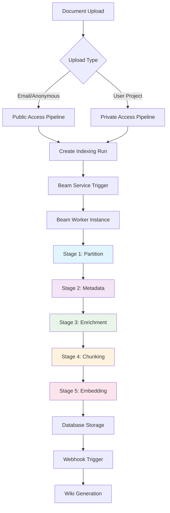
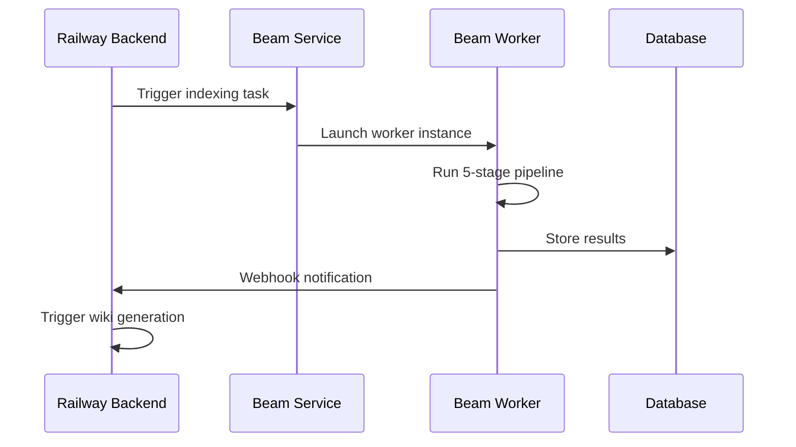

# Indexing Pipeline

## Quick Reference
- **Location**: `/backend/src/pipeline/indexing/`
- **Entry Point**: `IndexingPipeline.run()` at `/backend/src/pipeline/indexing/pipeline.py:45`
- **Configuration**: `/backend/src/config/pipeline/pipeline_config.json`
- **Tests**: `/backend/tests/integration/test_indexing.py`

## Overview

The ConstructionRAG indexing pipeline is a sophisticated 5-stage document processing system that transforms construction PDFs into a searchable knowledge base. The pipeline leverages hybrid processing strategies, GPU acceleration via Beam, and intelligent content extraction optimized for Danish construction documents.

## Architecture



## Processing Stages

### Stage 1: Partition - Document Content Extraction

**Purpose**: Extract text, tables, and images from PDF documents using hybrid processing strategies.
**Implementation**: `partition.py` with `UnifiedPartitionerV2`

The system automatically detects whether a document is scanned or native PDF:
- **Native PDFs** (≥25 chars/page): Fast PyMuPDF extraction
- **Scanned PDFs** (<25 chars/page): Unstructured OCR + PyMuPDF images

**Table Validation System**:
- Size validation: Maximum 5000 characters, 20 columns
- Repetition analysis: Rejects tables with >70% repeated content
- Drawing page detection: Skips tables on diagram-heavy pages
- Confidence scoring: Minimum 30% confidence threshold

### Stage 2: Metadata - Document Structure Analysis

**Purpose**: Extract document structure, section hierarchies, and content classification.
**Implementation**: `metadata.py` with `UnifiedElementAnalyzer`

**Features**:
- Language detection optimized for Danish construction terminology
- Section detection (numbered sections: 1.2.3, A.1, etc.)
- Page-aware tracking maintains section context across pages
- Technical content recognition (measurements, codes, standards)

### Stage 3: Enrichment - VLM Caption Generation

**Purpose**: Generate detailed captions for images and tables using Vision Language Models.
**Implementation**: `enrichment.py` with `ConstructionVLMCaptioner`

**VLM Integration**:
- Model: Anthropic Claude via OpenRouter
- Specialization: Construction/technical document analysis
- Language: Danish captions for localized content
- Focus Areas: Tables, technical diagrams, architectural plans

### Stage 4: Chunking - Intelligent Content Segmentation

**Purpose**: Create semantically coherent chunks optimized for retrieval.
**Implementation**: `chunking.py` with `IntelligentChunker`

**Strategy**:
- Semantic chunking with RecursiveCharacterTextSplitter
- Target size: 1000 characters with 200-character overlap
- Maximum size: 1200 characters (enforced splitting)
- VLM caption prioritization for visual content
- Section title inheritance (configurable)

### Stage 5: Embedding - Vector Generation and Storage

**Purpose**: Generate embeddings and store in vector database with batch optimization.
**Implementation**: `embedding.py` with `VoyageEmbeddingClient`

**Configuration**:
- Model: Voyage-multilingual-2 (1024 dimensions)
- Batch size: 100 chunks per API call
- Cost optimization: Resume capability for failed runs
- Storage: Supabase PostgreSQL with pgvector extension

## Implementation Details

### Beam Integration



**Resource Management**:
- Instance type: CPU-optimized (GPU removed for cost efficiency)
- Concurrent documents: 5 documents per worker (configurable)
- Step timeout: 30 minutes per stage
- Memory management: Temporary file cleanup after each document

### Multi-Document Processing

The system uses intelligent batching:
1. **Individual Document Steps** (Stages 1-4): Process each document independently
2. **Batch Embedding Step** (Stage 5): Collect all chunks and generate embeddings in optimized batches

This reduces API calls by 80% through unified embedding generation.

## Configuration

### Pipeline Configuration (pipeline_config.json)
```json
{
  "indexing": {
    "partition": {
      "ocr_strategy": "auto",
      "extract_tables": true,
      "extract_images": true,
      "table_validation": {
        "enabled": true,
        "max_table_size": 5000
      }
    },
    "chunking": {
      "chunk_size": 1000,
      "overlap": 200,
      "strategy": "semantic"
    },
    "embedding": {
      "model": "voyage-multilingual-2",
      "batch_size": 100
    }
  }
}
```

### Environment Variables
- `BEAM_WEBHOOK_URL`: Beam task queue endpoint
- `BEAM_AUTH_TOKEN`: Authentication for Beam API
- `VOYAGE_API_KEY`: Embedding service authentication
- `OPENROUTER_API_KEY`: VLM service access

## Database Schema

### Core Tables
- **indexing_runs**: Processing status and step results
- **documents**: PDF metadata and file paths
- **chunks**: Processed text segments with metadata
- **embeddings**: Vector representations (pgvector)

### Storage Patterns
- Supabase Storage: PDF files, extracted images, table images
- PostgreSQL: Document metadata, chunks, embeddings
- Vector Search: pgvector extension for similarity queries
- Progress Tracking: Step results stored in JSONB columns

## Performance Characteristics

### Processing Speed
- Native PDFs: ~2-3 minutes per document (10-20 pages)
- Scanned PDFs: ~5-8 minutes per document (OCR overhead)
- Batch Processing: 5 concurrent documents optimal
- Embedding Generation: ~10 seconds per 100 chunks

### Resource Usage
- Memory: Peak 2GB per document during image processing
- Storage: ~50MB temporary files per document
- API Costs: $0.10-0.30 per document (embedding + VLM)
- Processing Time: 80% partition/enrichment, 20% embedding

## Troubleshooting

### Common Issues

**1. Partition Step Failures**
- *Symptom*: "PyMuPDF analysis failed"
- *Cause*: Corrupted or password-protected PDFs
- *Solution*: Validate PDF integrity before upload

**2. VLM Caption Timeout**
- *Symptom*: "Enrichment step incomplete"
- *Cause*: Large images or API rate limits
- *Solution*: Reduce image resolution or implement retry logic

**3. Embedding API Limits**
- *Symptom*: "Voyage API error: 429"
- *Cause*: Rate limiting or quota exhaustion
- *Solution*: Implement exponential backoff and batch size reduction

**4. Database Connection Issues**
- *Symptom*: "Failed to store chunk results"
- *Cause*: Network issues or connection pool exhaustion
- *Solution*: Connection retry with admin client fallback

### Debug Information
```bash
export LOG_LEVEL=DEBUG
export PIPELINE_DEBUG=true
```

### Monitoring Queries
```sql
-- Check indexing run status
SELECT id, status, created_at, updated_at, 
       jsonb_array_length(step_results) as completed_steps
FROM indexing_runs 
WHERE created_at > NOW() - INTERVAL '24 hours'
ORDER BY created_at DESC;

-- Monitor chunk generation
SELECT document_id, COUNT(*) as chunk_count, 
       AVG(LENGTH(content)) as avg_chunk_size
FROM chunks 
GROUP BY document_id;
```

## Related Documentation
- For system architecture, see: `/public-docs/ARCHITECTURE.md`
- For wiki generation, see: `/public-docs/features/wiki-generation.md`
- For API endpoints, see: `/public-docs/api/endpoints.md`
- For deployment, see: `/public-docs/implementation/deployment.md`