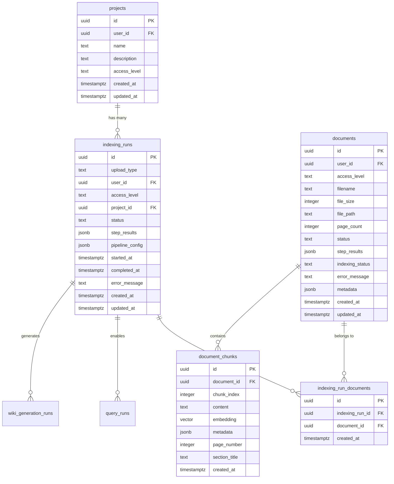
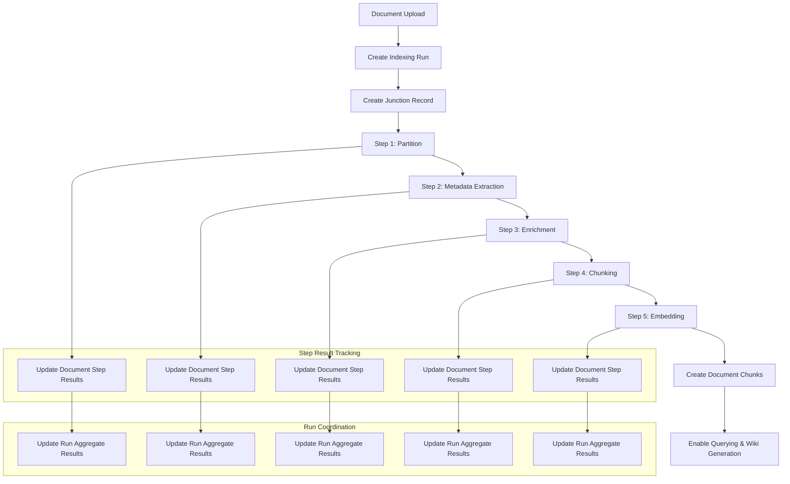
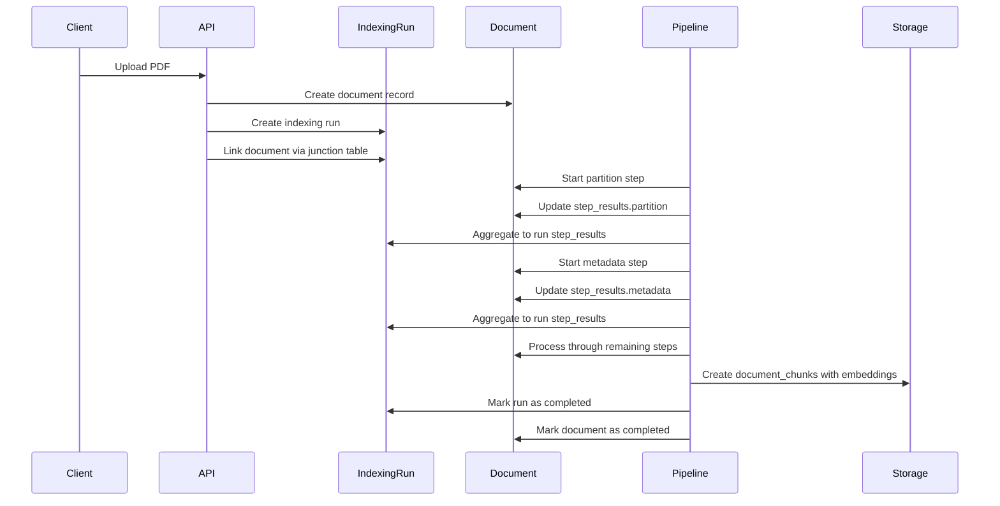
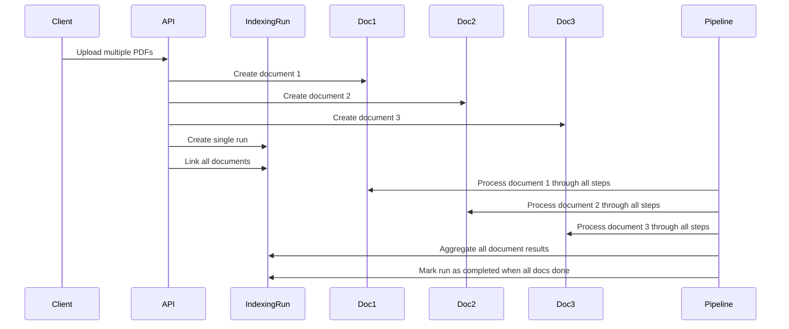
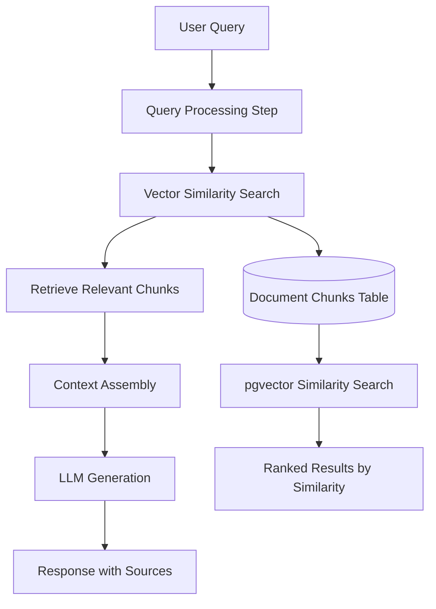

# Indexing Pipeline Data Structure and Relationships

## Overview

This document explains the comprehensive data structure and relationships within SpecFinder's indexing pipeline - a sophisticated document processing system that transforms construction PDFs into searchable knowledge bases through a 5-step processing pipeline.

The system uses a dual-tracking approach where both indexing runs and individual documents store step results, enabling fine-grained progress tracking and flexible processing workflows.

## Core Architecture

The indexing pipeline follows a many-to-many relationship model between indexing runs and documents, with sophisticated step result tracking at multiple levels:



## Entity Relationships and Purpose

### 1. Projects - Project Management Layer
**Purpose**: Organizational containers for related documents and processing runs

**Key Features**:
- Owner-only access control by default
- Support for multiple indexing runs per project
- Access levels: `public`, `auth`, `owner`, `private`

### 2. Indexing Runs - Processing Orchestration
**Purpose**: High-level processing coordination and run-level step tracking

**Key Features**:
- **Many-to-many relationship** with documents through junction table
- **Dual upload types**: `email` (anonymous) vs `user_project` (authenticated)
- **Pipeline configuration storage** for reproducible processing
- **Aggregate step results** combining all document processing

**Step Results Structure**:
```json
{
  "partition": {
    "step": "partition",
    "status": "completed",
    "duration_seconds": 45.2,
    "summary_stats": {
      "text_elements": 156,
      "table_elements": 12,
      "extracted_pages": 8
    },
    "started_at": "2025-01-15T10:00:00Z",
    "completed_at": "2025-01-15T10:00:45Z"
  },
  "metadata": { /* ... */ },
  "enrichment": { /* ... */ },
  "chunking": { /* ... */ },
  "embedding": { /* ... */ }
}
```

### 3. Documents - Individual File Processing
**Purpose**: File-level metadata and document-specific step results

**Key Features**:
- **Individual step tracking** for each document in a multi-document run
- **Processing status management** with detailed error tracking
- **Current step detection** for progress visualization
- **File metadata storage** (size, pages, storage path)

**Document Step Results**:
- Mirrors indexing run structure but specific to individual documents
- Enables partial processing recovery and document-level debugging
- Supports computed properties for timing analysis

### 4. Indexing Run Documents Junction Table
**Purpose**: Many-to-many relationship management

**Key Features**:
- Enables batch processing of multiple documents in single runs
- Supports document reprocessing across different runs
- Maintains processing history and audit trails

### 5. Document Chunks - Vector Storage
**Purpose**: Final processed units for semantic search and retrieval

**Key Features**:
- **1024-dimensional embeddings** using Voyage-multilingual-2
- **Semantic chunking** with 1000 character size, 200 character overlap
- **Rich metadata** including page numbers, section titles, processing context
- **pgvector integration** for high-performance similarity search

## Processing Pipeline Flow

The indexing pipeline processes documents through five sequential steps, with results stored at both run and document levels:



### Step-by-Step Processing Details

#### 1. Partition Step (`PartitionStep`)
**Purpose**: Extract and structure content from PDFs

**Outputs**:
- Text elements with bounding boxes and font metadata
- Table elements with extracted content and images
- Full-page extractions for visual content
- Document type detection (scanned vs regular)

**Technologies**: PyMuPDF + Unstructured (for scanned documents)

#### 2. Metadata Step
**Purpose**: Extract document structure and hierarchical information

**Outputs**:
- Section headings and document outline
- Page-level metadata and complexity analysis
- Font analysis for semantic structure detection

#### 3. Enrichment Step
**Purpose**: Generate VLM captions for visual content

**Outputs**:
- AI-generated captions for tables and diagrams
- Enhanced metadata for visual elements
- Context-aware descriptions using Anthropic models

#### 4. Chunking Step
**Purpose**: Create semantic text chunks for vector search

**Outputs**:
- Semantic chunks with optimal size for retrieval
- Preserved document structure and context
- Cross-reference metadata linking chunks to source pages

#### 5. Embedding Step
**Purpose**: Generate vector embeddings for semantic search

**Outputs**:
- 1024-dimensional vectors using Voyage-multilingual-2
- Batch processing for efficiency
- Storage in pgvector-enabled PostgreSQL

## Data Flow Examples

### Single Document Processing


### Multi-Document Batch Processing


## Access Control and Security

The system implements sophisticated access control through multiple levels:

### Upload Types
- **Email uploads**: Anonymous access, public sharing enabled
- **User project uploads**: Authenticated access with Row Level Security

### Access Levels
- **Public**: Anonymous read access
- **Auth**: Any authenticated user
- **Owner**: Resource owner only  
- **Private**: Restricted access

### Row Level Security (RLS)
PostgreSQL RLS policies ensure users can only access their own data:

```sql
-- Documents: Users can only access their own documents
CREATE POLICY "Users can access their own documents" ON documents
    FOR ALL USING (user_id::uuid = auth.uid());

-- Indexing runs: Access based on document ownership
CREATE POLICY "Users can access indexing runs for their documents" ON indexing_runs
    FOR ALL USING (
        EXISTS (
            SELECT 1 FROM indexing_run_documents ird
            JOIN documents d ON ird.document_id = d.id
            WHERE ird.indexing_run_id = indexing_runs.id
            AND d.user_id::uuid = auth.uid()
        )
    );
```

## Performance Optimizations

### Database Indexing Strategy
```sql
-- Vector search optimization
CREATE INDEX idx_document_chunks_embedding ON document_chunks 
USING ivfflat (embedding vector_cosine_ops) WITH (lists = 100);

-- Step results querying
CREATE INDEX idx_documents_step_results ON documents USING GIN (step_results);

-- Junction table optimization
CREATE INDEX idx_indexing_run_documents_indexing_run_id ON indexing_run_documents(indexing_run_id);
CREATE INDEX idx_indexing_run_documents_document_id ON indexing_run_documents(document_id);
```

### Computed Properties
Documents and indexing runs include computed properties for efficient querying:

```python
@computed_field(return_type=dict[str, float])
def step_timings(self) -> dict[str, float]:
    """Extract step timings from step_results"""
    timings = {}
    for step_name, step_data in self.step_results.items():
        if isinstance(step_data, dict) and "duration_seconds" in step_data:
            timings[step_name] = step_data["duration_seconds"]
    return timings

@computed_field(return_type=str | None)  
def current_step(self) -> str | None:
    """Get the current step being processed"""
    step_order = ["partition", "metadata", "enrichment", "chunking", "embedding"]
    for step_name in step_order:
        step_data = self.step_results.get(step_name)
        if not step_data or step_data.get("status") != "completed":
            return step_name
    return None  # All steps completed
```

## Integration with Other Systems

### Wiki Generation Pipeline
Indexing runs automatically trigger wiki generation upon completion:


### Query System Integration
Document chunks enable sophisticated query processing:



### Error Handling and Recovery

The dual-tracking system enables sophisticated error handling:

1. **Document-level failures**: Individual documents can fail without affecting the entire run
2. **Step-level recovery**: Processing can resume from any failed step
3. **Partial success scenarios**: Some documents in a batch can complete while others fail
4. **Detailed error tracking**: Error messages and details stored at both document and run levels

## Code References

### Key Files
- **Database Schema**: `/supabase/migrations/`
  - `20250728080000_add_pipeline_tables.sql` - Initial indexing run structure
  - `20250801030000_redesign_document_indexing_relationship.sql` - Many-to-many junction table
  - `20250802010000_add_step_results_to_documents.sql` - Document-level step tracking

- **Data Models**: `/backend/src/models/`
  - `pipeline.py` - IndexingRun, StepResult, and related models
  - `domain/document.py` - Document model with computed properties

- **Pipeline Implementation**: `/backend/src/pipeline/indexing/steps/`
  - `partition.py` - PDF processing and content extraction
  - `chunking.py` - Semantic text chunking
  - `embedding.py` - Vector embedding generation

### Example Usage

```python
# Create indexing run for user project
indexing_run = IndexingRun(
    upload_type=UploadType.USER_PROJECT,
    user_id=user.id,
    project_id=project.id,
    status=PipelineStatus.PENDING
)

# Process document through pipeline
for step_name in ["partition", "metadata", "enrichment", "chunking", "embedding"]:
    step_result = await pipeline_step.execute(document_input)
    
    # Update document step results
    document.step_results[step_name] = step_result
    
    # Aggregate to run level
    indexing_run.step_results[step_name] = aggregate_step_results(
        [doc.step_results[step_name] for doc in run_documents]
    )

# Final chunk creation
chunks = await create_document_chunks(enriched_content, embeddings)
```

This architecture provides a robust, scalable foundation for processing construction documents while maintaining detailed audit trails and enabling flexible recovery scenarios.