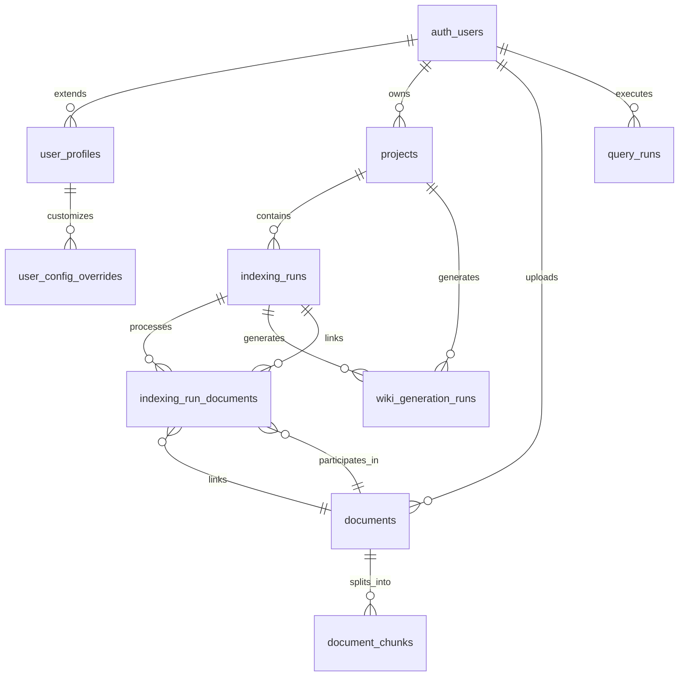
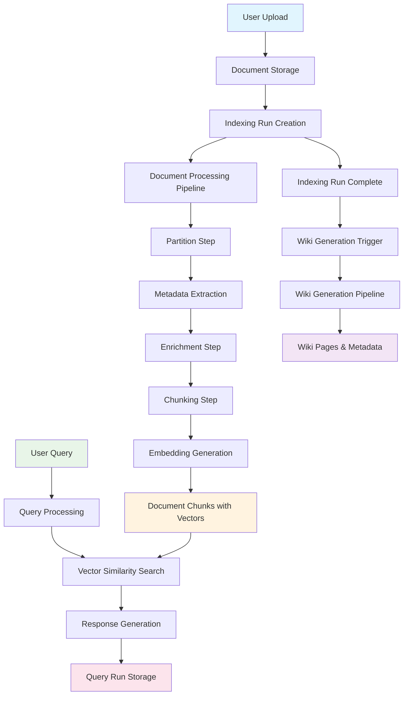
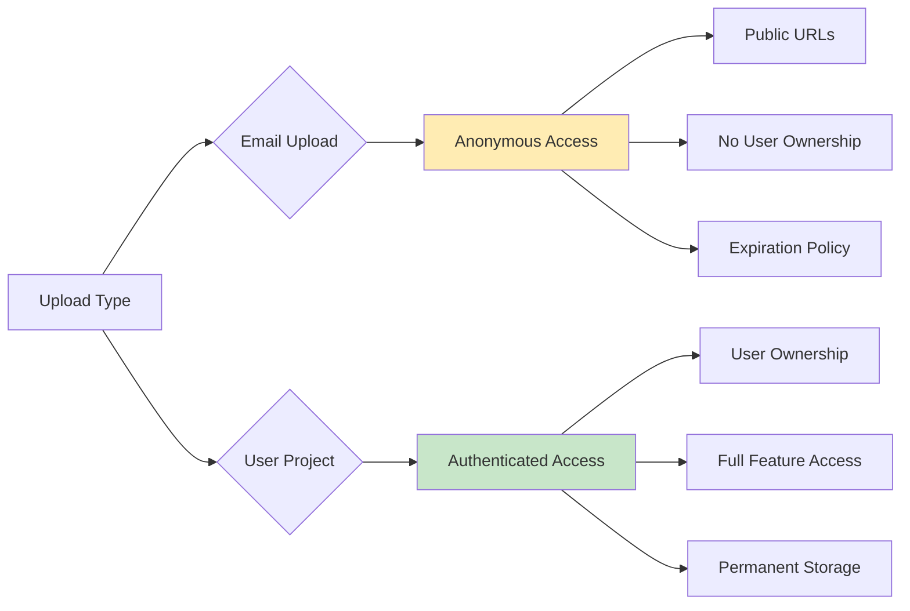

# Database Schema Documentation - ConstructionRAG

## Overview

The ConstructionRAG system uses a PostgreSQL database hosted on Supabase with the pgvector extension for vector similarity search. The database is designed to support a production-ready AI-powered construction document processing and Q&A system.

### Key Features
- **Row-Level Security (RLS)**: Comprehensive security policies ensuring users only access their own data
- **Vector Search**: Optimized for semantic similarity using pgvector with HNSW indexing
- **Multi-Access Levels**: Support for public (anonymous), authenticated, owner, and private access levels
- **Audit Trail**: Comprehensive tracking of document processing steps and user activities
- **Soft Deletion**: Projects support soft deletion for data recovery
- **Pipeline Tracking**: Detailed step-by-step tracking of document processing and wiki generation

## Database Architecture



## Core Tables

### Authentication & User Management

#### user_profiles
Extends Supabase Auth with additional user information.

| Column | Type | Constraints | Description |
|--------|------|-------------|-------------|
| id | UUID | PRIMARY KEY, FOREIGN KEY → auth.users(id) | User identifier from Supabase Auth |
| email | TEXT | | User email address |
| full_name | TEXT | | User's full name |
| created_at | TIMESTAMPTZ | DEFAULT NOW() | Account creation timestamp |
| updated_at | TIMESTAMPTZ | DEFAULT NOW() | Last profile update |

**Indexes:**
- Primary key on `id`

**RLS Policies:**
- Users can only view and update their own profile

### Project Management

#### projects
Manages user projects with access control and soft deletion.

| Column | Type | Constraints | Description |
|--------|------|-------------|-------------|
| id | UUID | PRIMARY KEY, DEFAULT gen_random_uuid() | Project unique identifier |
| user_id | UUID | NOT NULL, FOREIGN KEY → auth.users(id) | Project owner |
| name | TEXT | NOT NULL | Project name |
| description | TEXT | | Project description |
| access_level | TEXT | NOT NULL, DEFAULT 'owner', CHECK IN ('public','auth','owner','private') | Access control level |
| deleted_at | TIMESTAMPTZ | | Soft deletion timestamp |
| deleted_by | UUID | FOREIGN KEY → auth.users(id) | User who deleted the project |
| created_at | TIMESTAMPTZ | NOT NULL, DEFAULT NOW() | Project creation timestamp |
| updated_at | TIMESTAMPTZ | NOT NULL, DEFAULT NOW() | Last update timestamp |

**Indexes:**
- Primary key on `id`
- `idx_projects_user_id` on `user_id`
- `idx_projects_access_level` on `access_level`
- `idx_projects_deleted_at` on `deleted_at` (WHERE deleted_at IS NULL)

**RLS Policies:**
- Owner-only CRUD operations
- SELECT excludes soft-deleted records

### Document Management

#### documents
Stores uploaded PDF documents with processing status and metadata.

| Column | Type | Constraints | Description |
|--------|------|-------------|-------------|
| id | UUID | PRIMARY KEY, DEFAULT gen_random_uuid() | Document unique identifier |
| user_id | UUID | FOREIGN KEY → auth.users(id) | Document owner (nullable for anonymous) |
| access_level | TEXT | DEFAULT 'private' | Access control level |
| filename | TEXT | NOT NULL | Original filename |
| file_size | INTEGER | | File size in bytes |
| file_path | TEXT | | Supabase Storage path |
| page_count | INTEGER | | Number of pages in PDF |
| status | TEXT | DEFAULT 'pending', CHECK IN ('pending','processing','completed','failed') | Processing status |
| error_message | TEXT | | Error message if processing failed |
| metadata | JSONB | DEFAULT '{}' | Document metadata |
| step_results | JSONB | DEFAULT '{}' | Processing step results |
| indexing_status | TEXT | | Current indexing pipeline status |
| created_at | TIMESTAMPTZ | DEFAULT NOW() | Upload timestamp |
| updated_at | TIMESTAMPTZ | DEFAULT NOW() | Last update timestamp |

**Indexes:**
- Primary key on `id`
- `idx_documents_user_id` on `user_id`
- `idx_documents_status` on `status`
- `idx_documents_created_at` on `created_at`

**RLS Policies:**
- Users can access their own documents
- System (service_role) can access all documents

#### document_chunks
Stores text chunks with vector embeddings for semantic search.

| Column | Type | Constraints | Description |
|--------|------|-------------|-------------|
| id | UUID | PRIMARY KEY, DEFAULT gen_random_uuid() | Chunk unique identifier |
| document_id | UUID | NOT NULL, FOREIGN KEY → documents(id) ON DELETE CASCADE | Parent document |
| chunk_index | INTEGER | NOT NULL | Chunk position in document |
| content | TEXT | NOT NULL | Extracted text content |
| embedding_1024 | VECTOR(1024) | | Vector embedding (Voyage AI multilingual-2) |
| metadata | JSONB | DEFAULT '{}' | Chunk metadata |
| page_number | INTEGER | | Source page number |
| section_title | TEXT | | Section title if available |
| created_at | TIMESTAMPTZ | DEFAULT NOW() | Creation timestamp |

**Indexes:**
- Primary key on `id`
- `idx_document_chunks_document_id` on `document_id`
- `idx_document_chunks_page_number` on `page_number`
- `idx_document_chunks_embedding_1024_hnsw` HNSW index on `embedding_1024` for vector similarity

**RLS Policies:**
- Users can access chunks from their documents
- System can access all chunks

### Pipeline Management

#### indexing_runs
Tracks document indexing pipeline executions with comprehensive step results.

| Column | Type | Constraints | Description |
|--------|------|-------------|-------------|
| id | UUID | PRIMARY KEY, DEFAULT gen_random_uuid() | Run unique identifier |
| upload_type | TEXT | NOT NULL, DEFAULT 'user_project', CHECK IN ('email','user_project') | Upload type |
| user_id | UUID | FOREIGN KEY → auth.users(id) | Owner (nullable for anonymous) |
| access_level | TEXT | DEFAULT 'private' | Access control level |
| project_id | UUID | FOREIGN KEY → projects(id) | Associated project |
| status | TEXT | DEFAULT 'pending', CHECK IN ('pending','running','completed','failed') | Pipeline status |
| step_results | JSONB | DEFAULT '{}' | Detailed step execution results |
| pipeline_config | JSONB | | Configuration used for this run |
| started_at | TIMESTAMPTZ | DEFAULT NOW() | Start timestamp |
| completed_at | TIMESTAMPTZ | | Completion timestamp |
| error_message | TEXT | | Error message if failed |

**Indexes:**
- Primary key on `id`
- `idx_indexing_runs_upload_type` on `upload_type`
- `idx_indexing_runs_user_id` on `user_id`
- `idx_indexing_runs_project_id` on `project_id`
- `idx_indexing_runs_status` on `status`

**RLS Policies:**
- Users can access runs for documents they own
- Public access for completed email uploads
- System can access all runs

#### indexing_run_documents
Junction table linking indexing runs to documents (many-to-many relationship).

| Column | Type | Constraints | Description |
|--------|------|-------------|-------------|
| id | UUID | PRIMARY KEY, DEFAULT gen_random_uuid() | Junction record identifier |
| indexing_run_id | UUID | NOT NULL, FOREIGN KEY → indexing_runs(id) ON DELETE CASCADE | Indexing run |
| document_id | UUID | NOT NULL, FOREIGN KEY → documents(id) ON DELETE CASCADE | Document |
| created_at | TIMESTAMPTZ | DEFAULT NOW() | Link creation timestamp |

**Constraints:**
- `UNIQUE(indexing_run_id, document_id)` - Prevents duplicate links

**Indexes:**
- Primary key on `id`
- `idx_indexing_run_documents_indexing_run_id` on `indexing_run_id`
- `idx_indexing_run_documents_document_id` on `document_id`

**RLS Policies:**
- Users can access junction records for their documents
- System can access all junction records

### Wiki Generation

#### wiki_generation_runs
Tracks wiki generation pipeline executions with structured output metadata.

| Column | Type | Constraints | Description |
|--------|------|-------------|-------------|
| id | UUID | PRIMARY KEY, DEFAULT gen_random_uuid() | Wiki run unique identifier |
| indexing_run_id | UUID | NOT NULL, FOREIGN KEY → indexing_runs(id) ON DELETE CASCADE | Source indexing run |
| upload_type | TEXT | NOT NULL, DEFAULT 'user_project', CHECK IN ('email','user_project') | Upload type |
| user_id | UUID | FOREIGN KEY → auth.users(id) | Owner user (nullable) |
| access_level | TEXT | DEFAULT 'private' | Access control level |
| project_id | UUID | FOREIGN KEY → projects(id) | Associated project |
| upload_id | TEXT | | Upload ID for email uploads |
| status | TEXT | NOT NULL, DEFAULT 'pending', CHECK IN ('pending','running','completed','failed') | Generation status |
| language | TEXT | DEFAULT 'danish', CHECK IN ('danish','english') | Wiki language |
| model | TEXT | DEFAULT 'google/gemini-2.5-flash' | LLM model used |
| step_results | JSONB | DEFAULT '{}' | Detailed step results |
| wiki_structure | JSONB | DEFAULT '{}' | Generated wiki structure |
| pages_metadata | JSONB | DEFAULT '{}' | Page metadata (titles, paths, order) |
| storage_path | TEXT | | Base storage path |
| started_at | TIMESTAMPTZ | DEFAULT NOW() | Start timestamp |
| completed_at | TIMESTAMPTZ | | Completion timestamp |
| error_message | TEXT | | Error message if failed |
| created_at | TIMESTAMPTZ | DEFAULT NOW() | Creation timestamp |
| updated_at | TIMESTAMPTZ | DEFAULT NOW() | Last update timestamp |

**Indexes:**
- Primary key on `id`
- `idx_wiki_generation_runs_indexing_run_id` on `indexing_run_id`
- `idx_wiki_generation_runs_upload_type` on `upload_type`
- `idx_wiki_generation_runs_user_id` on `user_id`
- `idx_wiki_generation_runs_project_id` on `project_id`
- `idx_wiki_generation_runs_upload_id` on `upload_id`
- `idx_wiki_generation_runs_status` on `status`
- `idx_wiki_generation_runs_started_at` on `started_at`

**RLS Policies:**
- Users can manage their own wiki generation runs
- Public access for email uploads
- System can access all runs

### Query & Analytics

#### query_runs
Stores user queries with comprehensive performance and quality metrics.

| Column | Type | Constraints | Description |
|--------|------|-------------|-------------|
| id | UUID | PRIMARY KEY, DEFAULT gen_random_uuid() | Query unique identifier |
| user_id | TEXT | | User identifier (TEXT for orchestrator compatibility) |
| access_level | TEXT | DEFAULT 'private' | Access control level |
| project_id | UUID | FOREIGN KEY → projects(id) | Associated project (future) |
| indexing_run_id | UUID | FOREIGN KEY → indexing_runs(id) ON DELETE SET NULL | Queried indexing run |
| original_query | TEXT | NOT NULL | User's original query |
| query_variations | JSONB | | Generated query variations |
| search_results | JSONB | | Retrieved search results |
| final_response | TEXT | | Generated response |
| performance_metrics | JSONB | | Model, tokens, confidence metrics |
| quality_metrics | JSONB | | Relevance, confidence, similarity scores |
| response_time_ms | INTEGER | | Response time in milliseconds |
| step_timings | JSONB | | Individual step execution times |
| error_message | TEXT | | Error message if failed |
| created_at | TIMESTAMPTZ | DEFAULT NOW() | Query timestamp |
| updated_at | TIMESTAMPTZ | DEFAULT NOW() | Last update timestamp |

**Indexes:**
- Primary key on `id`
- `idx_query_runs_user_id` on `user_id`
- `idx_query_runs_indexing_run_id` on `indexing_run_id`
- `idx_query_runs_created_at` on `created_at DESC`
- `idx_query_runs_response_time` on `response_time_ms`

**RLS Policies:**
- Users can access their own query runs
- System can access all query runs

#### queries (Legacy)
Legacy queries table maintained for backward compatibility.

| Column | Type | Constraints | Description |
|--------|------|-------------|-------------|
| id | UUID | PRIMARY KEY, DEFAULT gen_random_uuid() | Query unique identifier |
| user_id | UUID | FOREIGN KEY → auth.users(id) | User who made the query |
| query_text | TEXT | NOT NULL | Query text |
| response_text | TEXT | | Generated response |
| metadata | JSONB | DEFAULT '{}' | Additional metadata |
| created_at | TIMESTAMPTZ | DEFAULT NOW() | Query timestamp |

### Configuration Management

#### user_config_overrides
Stores user-specific configuration overrides for pipeline customization.

| Column | Type | Constraints | Description |
|--------|------|-------------|-------------|
| id | UUID | PRIMARY KEY, DEFAULT gen_random_uuid() | Override unique identifier |
| user_id | UUID | NOT NULL, FOREIGN KEY → auth.users(id) | User who set the override |
| config_type | TEXT | NOT NULL | Configuration type ('indexing' or 'querying') |
| config_key | TEXT | NOT NULL | Configuration key (e.g., 'chunking.chunk_size') |
| config_value | JSONB | NOT NULL | Configuration value |
| updated_at | TIMESTAMPTZ | DEFAULT NOW() | Last update timestamp |

**RLS Policies:**
- Users can access their own configuration overrides
- System can access all configurations

## Data Flow Architecture



## Access Control Patterns

### RLS Policy Structure
The database implements comprehensive Row-Level Security with dual patterns:

1. **User Policies**: Allow users to access their own data via `auth.uid()`
2. **System Policies**: Allow service role to access all data for processing

### Access Levels
- **public**: Anonymous access allowed
- **auth**: Any authenticated user can access
- **owner**: Only the owner can access
- **private**: Strictest access control

### Anonymous vs. Authenticated Access



## Vector Search Implementation

### Embedding Strategy
- **Model**: Voyage AI multilingual-2 (1024 dimensions)
- **Index Type**: HNSW (Hierarchical Navigable Small World)
- **Similarity**: Cosine similarity
- **Storage**: pgvector extension

### Search Performance
```sql
-- Optimized vector search function
CREATE INDEX idx_document_chunks_embedding_1024_hnsw 
ON document_chunks 
USING hnsw (embedding_1024 vector_cosine_ops)
WHERE embedding_1024 IS NOT NULL;
```

## Analytics & Monitoring

### Query Analytics View
Provides aggregated query performance metrics:
- Total queries per day
- Success/failure rates
- Average response times
- Confidence and relevance scores

### Performance Functions
- `get_recent_query_performance()`: Real-time performance metrics
- Built-in query timing tracking
- Step-by-step pipeline monitoring

## Migration History

The database has evolved through comprehensive migrations:

1. **Initial Schema** (2025-07-28): Basic document and query structure
2. **Pipeline Enhancement** (2025-08-01): Many-to-many document relationships
3. **Vector Updates** (2025-01-28): Voyage AI multilingual-2 integration
4. **Wiki Generation** (2025-08-08): Comprehensive wiki pipeline support
5. **Access Control** (2025-08-10): Multi-level access control implementation
6. **Project Management** (2025-08-16): Full project lifecycle management
7. **Analytics Enhancement** (2025-09-01): Query tracking and soft deletion

## Performance Considerations

### Indexing Strategy
- Primary keys and foreign keys automatically indexed
- Custom indexes on frequently queried columns
- HNSW vector indexes for similarity search
- Partial indexes for filtered queries

### Query Optimization
- Use prepared statements for repeated queries
- Leverage pgvector for efficient vector operations
- Implement proper RLS policies to avoid data leakage
- Monitor query performance with built-in analytics

### Scaling Considerations
- Vector search scales well with HNSW indexing
- RLS policies may impact performance on large datasets
- Consider partitioning for high-volume scenarios
- Implement connection pooling for concurrent access