# ConstructionRAG Architecture Overview

## Table of Contents
1. [System Architecture Overview](#1-system-architecture-overview)
2. [Data Flow Diagrams](#2-data-flow-diagrams)
3. [Component Integration Map](#3-component-integration-map)
4. [Security Architecture](#4-security-architecture)
5. [Deployment Pipeline](#5-deployment-pipeline)
6. [Coding Standards & Practices](#6-coding-standards--practices)
7. [Data Models & Schemas](#7-data-models--schemas)
8. [Performance & Scaling](#8-performance--scaling)
9. [User Journey Sequence Diagrams](#9-user-journey-sequence-diagrams)

---

## 1. System Architecture Overview

### High-Level Architecture

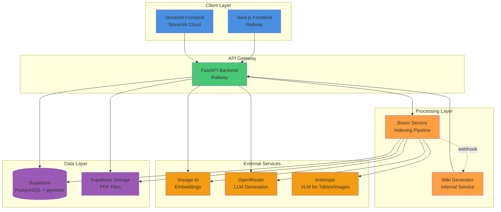

### Technology Stack

| Layer | Technology | Version | Purpose |
|-------|------------|---------|---------|
| **Frontend** | Next.js | 15.3 | Production React frontend with App Router |
| **Frontend (Legacy)** | Streamlit | Latest | Development/demo interface |
| **Backend API** | FastAPI | Latest | RESTful API server |
| **Language** | Python | 3.11+ | Backend development |
| **Database** | PostgreSQL | 15+ | Primary data storage |
| **Vector DB** | pgvector | 0.5+ | Vector similarity search |
| **Auth** | Supabase Auth | Latest | JWT-based authentication |
| **File Storage** | Supabase Storage | Latest | PDF document storage |
| **Embeddings** | Voyage AI | voyage-multilingual-2 | 1024-dim multilingual embeddings |
| **LLM** | OpenRouter | Various | Text generation (multiple models) |
| **VLM** | Anthropic | Claude 3.5 | Table/image understanding |
| **Processing** | Beam | Latest | Serverless GPU compute |
| **Deployment** | Railway | Latest | Backend & frontend hosting |
| **Deployment** | Streamlit Cloud | Latest | Legacy frontend hosting |

### Deployment Architecture

```mermaid
graph LR
    subgraph "Development"
        DEV_LOCAL[Local Docker<br/>Compose]
    end
    
    subgraph "CI/CD"
        GITHUB[GitHub<br/>Repository]
    end
    
    subgraph "Production - Railway"
        RAIL_BACK[Backend API<br/>Dockerfile]
        RAIL_FRONT[Frontend<br/>Dockerfile]
    end
    
    subgraph "Production - Beam"
        BEAM_PROC[Indexing<br/>beam-app.py]
    end
    
    subgraph "Production - Streamlit"
        STREAM_APP[Legacy UI<br/>streamlit_app/]
    end
    
    DEV_LOCAL --> |push| GITHUB
    GITHUB --> |auto-deploy| RAIL_BACK
    GITHUB --> |auto-deploy| RAIL_FRONT
    GITHUB --> |manual: beam deploy| BEAM_PROC
    GITHUB --> |auto-deploy| STREAM_APP
    
    style DEV_LOCAL fill:#95A5A6
    style GITHUB fill:#2C3E50
    style RAIL_BACK fill:#48C774
    style RAIL_FRONT fill:#4A90E2
    style BEAM_PROC fill:#FF9F40
    style STREAM_APP fill:#4A90E2
```

---

## 2. Data Flow Diagrams

### Indexing Pipeline Flow

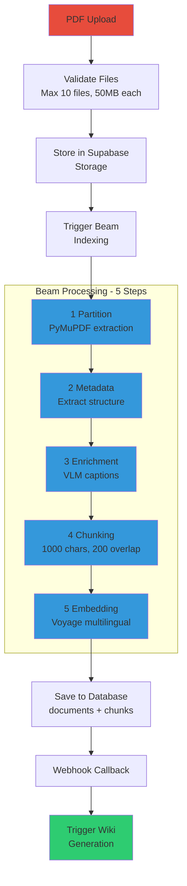

### Query Processing Pipeline

```mermaid
graph LR
    QUERY[User Query] --> PROCESS[Query Processing]
    
    subgraph "Processing Steps"
        PROCESS --> VARIATIONS[Generate<br/>Variations]
        VARIATIONS --> HYDE[HyDE Query<br/>Generation]
        HYDE --> EMBED[Embed Query<br/>Voyage AI]
    end
    
    subgraph "Retrieval"
        EMBED --> VECTOR[Vector Search<br/>pgvector]
        VECTOR --> RANK[Rank Results<br/>Similarity Score]
        RANK --> FILTER[Apply Filters<br/>Access Control]
    end
    
    subgraph "Generation"
        FILTER --> CONTEXT[Build Context<br/>Top K chunks]
        CONTEXT --> GENERATE[Generate Answer<br/>OpenRouter]
        GENERATE --> FORMAT[Format Response<br/>with Citations]
    end
    
    FORMAT --> RESPONSE[Return to User]
    
    style QUERY fill:#E74C3C
    style EMBED fill:#3498DB
    style VECTOR fill:#9B59B6
    style GENERATE fill:#F39C12
    style RESPONSE fill:#2ECC71
```

### Wiki Generation Pipeline

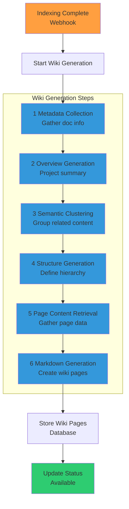

### Authentication & Authorization Flow

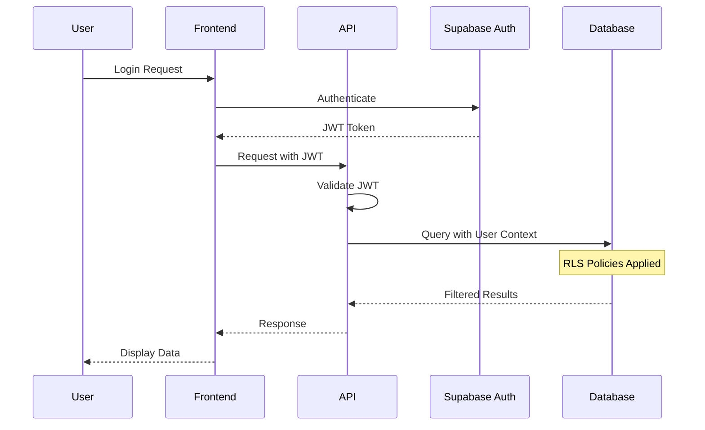

### File Upload Flow

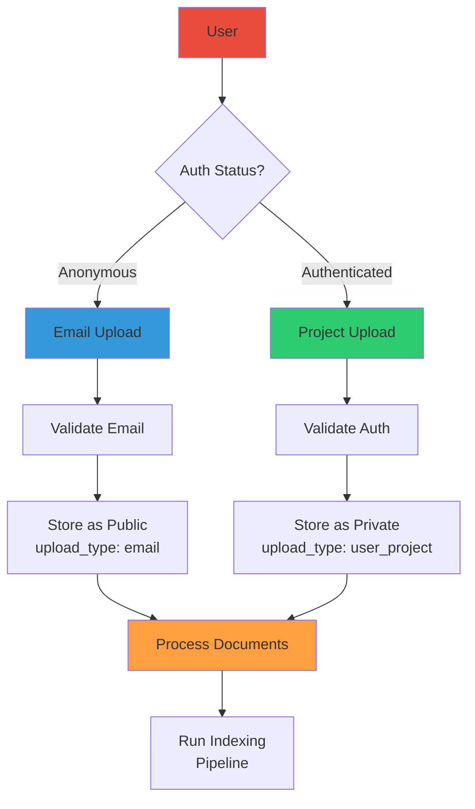

---

## 3. Component Integration Map

### API Endpoint Structure

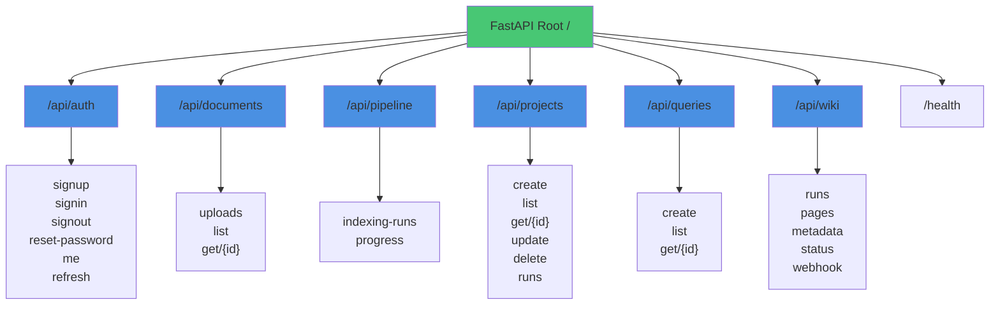

### Service Dependencies

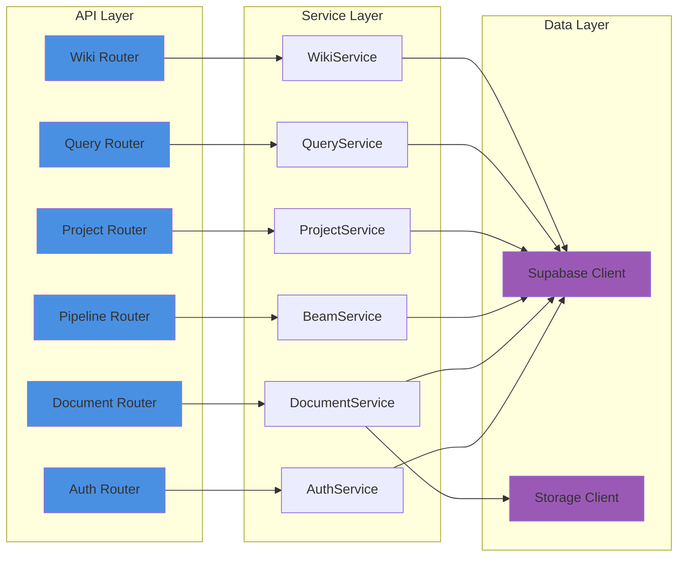

### Database Schema Relationships

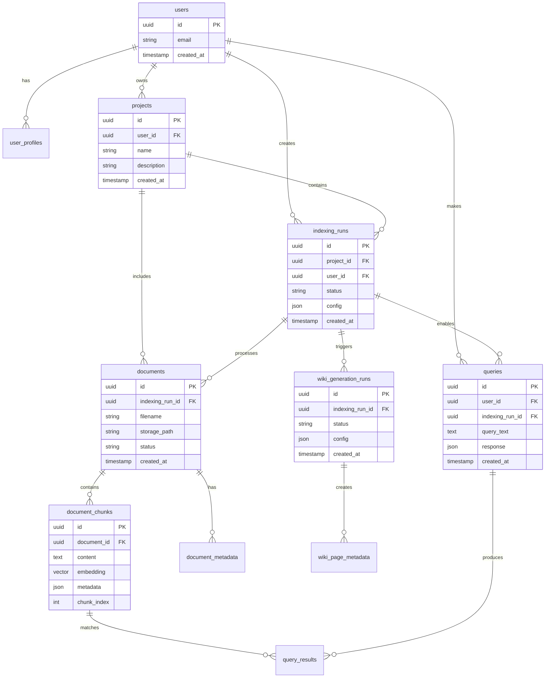

### External Service Integration

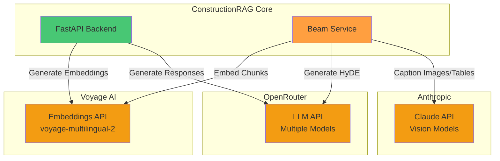

---

## 4. Security Architecture

### Authentication Mechanisms

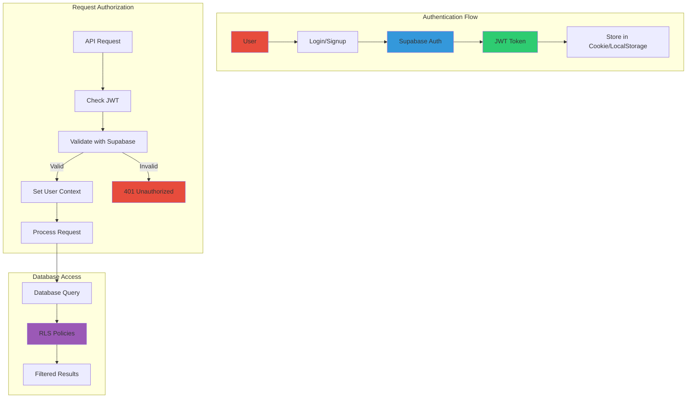

### Row-Level Security (RLS) Implementation

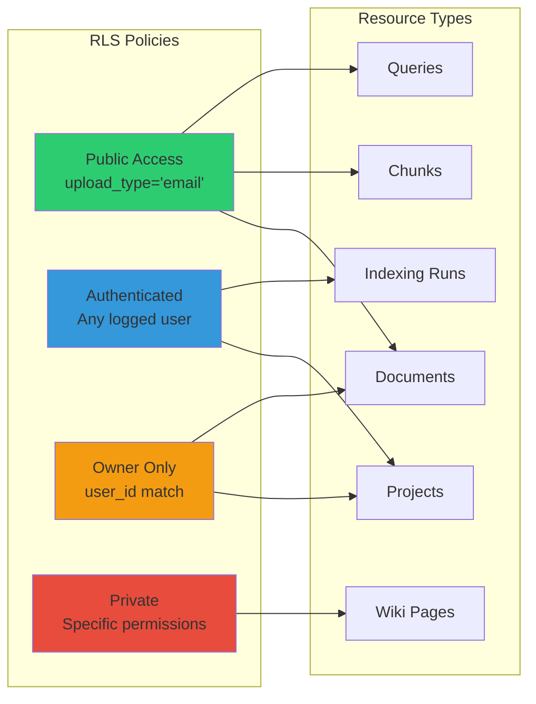

### API Security Patterns

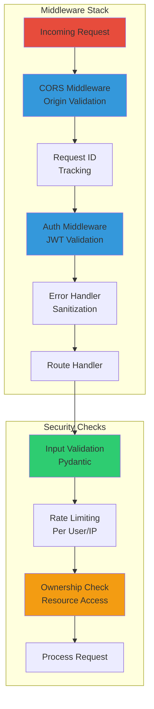

### Data Access Control Matrix

| Resource | Public (Anonymous) | Authenticated | Owner | Admin |
|----------|-------------------|---------------|-------|-------|
| **Projects** | ❌ | Read own | Full CRUD | Full CRUD |
| **Documents (email)** | Read | Read | N/A | Full CRUD |
| **Documents (project)** | ❌ | Read if member | Full CRUD | Full CRUD |
| **Chunks** | Read if doc public | Read if doc access | Full access | Full CRUD |
| **Queries** | Create/Read own | Create/Read own | Full CRUD | Full CRUD |
| **Indexing Runs** | Read if public | Read own | Full CRUD | Full CRUD |
| **Wiki Pages** | Read if public | Read if access | Full CRUD | Full CRUD |
| **User Profiles** | ❌ | Read/Update own | Full CRUD | Full CRUD |

### Webhook Security

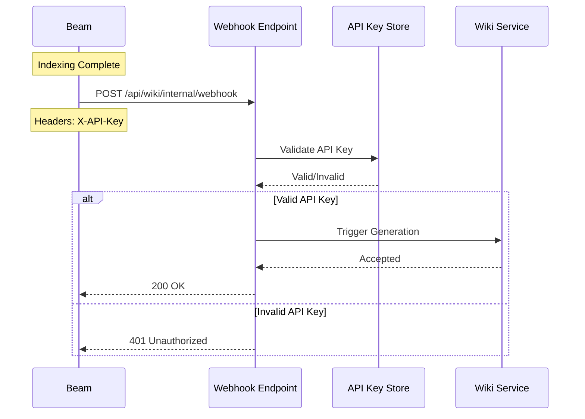

---

## 5. Deployment Pipeline

### CI/CD Workflow

```mermaid
graph LR
    subgraph "Development"
        DEV[Developer] --> COMMIT[Git Commit]
        COMMIT --> PUSH[Git Push]
    end
    
    subgraph "GitHub"
        PUSH --> MAIN[main branch]
        MAIN --> TRIGGER[Trigger Deploy]
    end
    
    subgraph "Auto Deployment"
        TRIGGER --> RAILWAY[Railway Build]
        TRIGGER --> STREAMLIT[Streamlit Build]
        
        RAILWAY --> BACKEND_DEPLOY[Backend Docker]
        RAILWAY --> FRONTEND_DEPLOY[Frontend Docker]
        
        STREAMLIT --> LEGACY_DEPLOY[Streamlit App]
    end
    
    subgraph "Manual Deployment"
        DEV --> BEAM_CLI[beam deploy]
        BEAM_CLI --> BEAM_DEPLOY[Beam Function]
    end
    
    style DEV fill:#95A5A6
    style MAIN fill:#2C3E50
    style RAILWAY fill:#48C774
    style STREAMLIT fill:#4A90E2
    style BEAM_DEPLOY fill:#FF9F40
```

### Environment Management

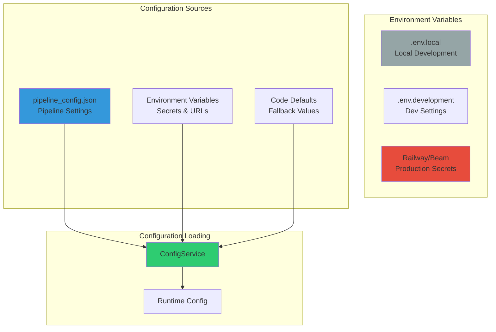

### Infrastructure as Code

```yaml
# Railway Configuration (railway.toml)
[build]
builder = "DOCKERFILE"
dockerfilePath = "./Dockerfile"

[deploy]
healthcheckPath = "/health"
healthcheckTimeout = 300
restartPolicyType = "ON_FAILURE"
restartPolicyMaxRetries = 3

# Beam Configuration (beam-config.py)
app.run(
    "process_documents",
    cpu=4,
    memory="16Gi",
    gpu="T4",
    python_version="3.11",
    python_packages=[
        "pymupdf",
        "voyage-ai",
        "anthropic",
        "supabase"
    ]
)
```

### Monitoring & Health Checks

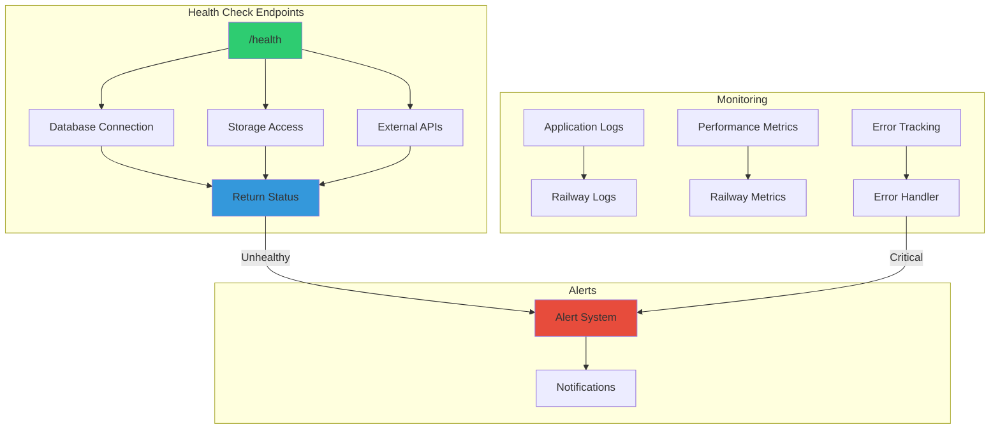

---

## 6. Coding Standards & Practices

### Code Organization Principles

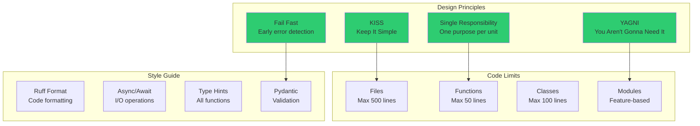

### File Size and Modularization Rules

| Component | Maximum Size | Organization |
|-----------|-------------|--------------|
| **Python Files** | 500 lines | Split by feature/responsibility |
| **Functions** | 50 lines | Single clear purpose |
| **Classes** | 100 lines | Single concept/entity |
| **React Components** | 200 lines | Split into sub-components |
| **API Routes** | 30 lines/endpoint | Delegate to services |
| **Test Files** | 300 lines | One test file per module |

### Testing Strategy

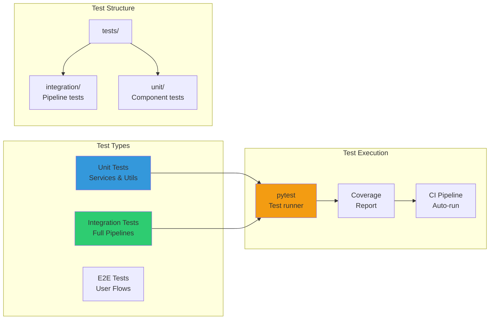

### Error Handling Patterns

```python
# Early Return Pattern
async def process_document(doc_id: str) -> Document:
    # Fail fast with validation
    if not doc_id:
        raise ValueError("Document ID required")
    
    # Check permissions early
    if not has_access(doc_id):
        raise PermissionError("Access denied")
    
    # Main logic after validations
    document = await fetch_document(doc_id)
    return document

# Consistent Error Middleware
@app.exception_handler(AppError)
async def app_error_handler(request, exc):
    return JSONResponse(
        status_code=exc.status_code,
        content={"error": exc.message}
    )
```

### Configuration Management

```mermaid
graph TD
    subgraph "Configuration Sources"
        JSON[pipeline_config.json<br/>Single Source of Truth]
        ENV[.env files<br/>Secrets & URLs]
        DEFAULTS[Code Defaults<br/>Fallbacks]
    end
    
    subgraph "Loading Strategy"
        JSON --> LOADER[ConfigService]
        ENV --> LOADER
        DEFAULTS --> LOADER
        LOADER --> VALIDATE[Validation]
        VALIDATE --> CACHE[Hot Reload Cache]
    end
    
    subgraph "Usage"
        CACHE --> PIPELINE[Pipeline Config]
        CACHE --> API[API Settings]
        CACHE --> SERVICES[Service Config]
    end
    
    style JSON fill:#3498DB
    style ENV fill:#E74C3C
    style CACHE fill:#2ECC71
```

---

## 7. Data Models & Schemas

### Core Pydantic Models Hierarchy

```mermaid
graph TD
    subgraph "User Models"
        USER[UserProfile]
        USER_CREATE[UserProfileCreate]
        USER_UPDATE[UserProfileUpdate]
    end
    
    subgraph "Document Models"
        DOC[Document]
        DOC_CREATE[DocumentCreate]
        DOC_UPDATE[DocumentUpdate]
        DOC_CHUNK[DocumentChunk]
        DOC_WITH_CHUNKS[DocumentWithChunks]
    end
    
    subgraph "Pipeline Models"
        PIPELINE_CONFIG[PipelineConfig]
        PIPELINE_STATUS[PipelineStatus]
        INDEXING_RUN[IndexingRun]
        QUERY_RUN[QueryRun]
        WIKI_RUN[WikiGenerationRun]
    end
    
    subgraph "Query Models"
        QUERY[Query]
        QUERY_CREATE[QueryCreate]
        QUERY_RESPONSE[QueryResponse]
        QUERY_HISTORY[QueryHistory]
    end
    
    USER --> USER_CREATE
    USER --> USER_UPDATE
    
    DOC --> DOC_CREATE
    DOC --> DOC_UPDATE
    DOC --> DOC_CHUNK
    DOC --> DOC_WITH_CHUNKS
    
    PIPELINE_CONFIG --> INDEXING_RUN
    PIPELINE_CONFIG --> QUERY_RUN
    PIPELINE_CONFIG --> WIKI_RUN
    
    QUERY --> QUERY_CREATE
    QUERY --> QUERY_RESPONSE
    
    style USER fill:#4A90E2
    style DOC fill:#2ECC71
    style PIPELINE_CONFIG fill:#F39C12
    style QUERY fill:#9B59B6
```

### Database Table Structures

```sql
-- Core Tables with Key Fields
CREATE TABLE users (
    id UUID PRIMARY KEY,
    email VARCHAR(255) UNIQUE,
    created_at TIMESTAMP DEFAULT NOW()
);

CREATE TABLE projects (
    id UUID PRIMARY KEY,
    user_id UUID REFERENCES users(id),
    name VARCHAR(255),
    description TEXT,
    created_at TIMESTAMP DEFAULT NOW()
);

CREATE TABLE indexing_runs (
    id UUID PRIMARY KEY,
    project_id UUID REFERENCES projects(id),
    user_id UUID REFERENCES users(id),
    status VARCHAR(50), -- pending, processing, completed, failed
    config JSONB,
    upload_type VARCHAR(20), -- email, user_project
    created_at TIMESTAMP DEFAULT NOW()
);

CREATE TABLE documents (
    id UUID PRIMARY KEY,
    indexing_run_id UUID REFERENCES indexing_runs(id),
    filename VARCHAR(500),
    storage_path TEXT,
    status VARCHAR(50),
    metadata JSONB,
    created_at TIMESTAMP DEFAULT NOW()
);

CREATE TABLE document_chunks (
    id UUID PRIMARY KEY,
    document_id UUID REFERENCES documents(id),
    content TEXT,
    embedding VECTOR(1024), -- Voyage multilingual-2
    metadata JSONB,
    chunk_index INTEGER,
    created_at TIMESTAMP DEFAULT NOW()
);

-- Indexes for Performance
CREATE INDEX idx_chunks_embedding ON document_chunks 
    USING ivfflat (embedding vector_cosine_ops);
CREATE INDEX idx_chunks_document ON document_chunks(document_id);
CREATE INDEX idx_documents_run ON documents(indexing_run_id);
```

### Vector Embedding Specifications

```mermaid
graph LR
    subgraph "Embedding Configuration"
        MODEL[voyage-multilingual-2]
        DIM[1024 Dimensions]
        BATCH[Batch Size: 128]
        MAX_TOKENS[Max Tokens: 1000]
    end
    
    subgraph "Storage"
        PGVECTOR[pgvector Extension]
        INDEX[IVFFlat Index]
        SIMILARITY[Cosine Similarity]
    end
    
    subgraph "Usage"
        CHUNKS[Document Chunks]
        QUERIES[User Queries]
        CLUSTERING[Semantic Clustering]
    end
    
    MODEL --> PGVECTOR
    DIM --> PGVECTOR
    PGVECTOR --> INDEX
    INDEX --> SIMILARITY
    
    SIMILARITY --> CHUNKS
    SIMILARITY --> QUERIES
    SIMILARITY --> CLUSTERING
    
    style MODEL fill:#F39C12
    style PGVECTOR fill:#9B59B6
    style SIMILARITY fill:#2ECC71
```

### API Request/Response Schemas

```typescript
// Upload Request
interface UploadRequest {
    files: File[];  // Max 10 files, 50MB each
    email?: string; // For anonymous uploads
    project_id?: string; // For authenticated uploads
}

// Query Request
interface QueryRequest {
    query: string;
    indexing_run_id: string;
    max_results?: number; // Default: 10
    include_metadata?: boolean;
}

// Query Response
interface QueryResponse {
    id: string;
    query: string;
    answer: string;
    sources: Array<{
        document_name: string;
        chunk_index: number;
        relevance_score: number;
        content_preview: string;
    }>;
    processing_time_ms: number;
    created_at: string;
}

// Indexing Progress Response
interface IndexingProgress {
    run_id: string;
    status: 'pending' | 'processing' | 'completed' | 'failed';
    current_step: string;
    steps_completed: number;
    total_steps: number;
    documents_processed: number;
    total_documents: number;
    error_message?: string;
}
```

---

## 8. Performance & Scaling

### Concurrency Patterns

```mermaid
graph TD
    subgraph "Document Processing"
        UPLOAD[Document Upload] --> QUEUE[Processing Queue]
        QUEUE --> WORKERS[Worker Pool<br/>Max 5 concurrent]
        WORKERS --> PROCESS1[Doc 1]
        WORKERS --> PROCESS2[Doc 2]
        WORKERS --> PROCESS3[Doc 3]
        WORKERS --> PROCESS4[Doc 4]
        WORKERS --> PROCESS5[Doc 5]
    end
    
    subgraph "Async Operations"
        API[API Request] --> ASYNC[Async Handler]
        ASYNC --> IO1[Database I/O]
        ASYNC --> IO2[Storage I/O]
        ASYNC --> IO3[External API]
        IO1 --> GATHER[Gather Results]
        IO2 --> GATHER
        IO3 --> GATHER
        GATHER --> RESPONSE[Response]
    end
    
    style WORKERS fill:#FF9F40
    style ASYNC fill:#3498DB
    style GATHER fill:#2ECC71
```

### Caching Strategies

```mermaid
graph LR
    subgraph "Cache Layers"
        REQUEST[Request] --> L1[L1: WebFetch Cache<br/>15 minutes]
        L1 --> L2[L2: Query Cache<br/>In-memory]
        L2 --> L3[L3: Embedding Cache<br/>Database]
        L3 --> SOURCE[Source Data]
    end
    
    subgraph "Cache Keys"
        URL_HASH[URL Hash]
        QUERY_HASH[Query + Run Hash]
        CONTENT_HASH[Content Hash]
    end
    
    subgraph "Invalidation"
        TTL[Time-based TTL]
        EVENT[Event-based]
        MANUAL[Manual Clear]
    end
    
    URL_HASH --> L1
    QUERY_HASH --> L2
    CONTENT_HASH --> L3
    
    TTL --> L1
    EVENT --> L2
    MANUAL --> L3
    
    style L1 fill:#3498DB
    style L2 fill:#2ECC71
    style L3 fill:#F39C12
```

### Rate Limiting Implementation

```python
# Rate Limiting Configuration
RATE_LIMITS = {
    "anonymous": {
        "uploads": "10/hour",
        "queries": "50/hour",
        "api_calls": "100/hour"
    },
    "authenticated": {
        "uploads": "100/hour",
        "queries": "500/hour",
        "api_calls": "1000/hour"
    },
    "premium": {
        "uploads": "1000/hour",
        "queries": "5000/hour",
        "api_calls": "10000/hour"
    }
}
```

### Resource Optimization

```mermaid
graph TD
    subgraph "Processing Optimization"
        CHUNK_SIZE[Chunk Size: 1000 chars<br/>Optimal for embeddings]
        OVERLAP[Overlap: 200 chars<br/>Context preservation]
        BATCH[Batch Processing<br/>128 chunks/batch]
    end
    
    subgraph "Timeout Management"
        STEP_TIMEOUT[Step Timeout<br/>30 minutes]
        PIPELINE_TIMEOUT[Pipeline Timeout<br/>2 hours]
        QUERY_TIMEOUT[Query Timeout<br/>30 seconds]
    end
    
    subgraph "Memory Management"
        STREAM[Stream Processing<br/>Large files]
        CLEANUP[Auto Cleanup<br/>Temp files]
        POOL[Connection Pooling<br/>Database]
    end
    
    style CHUNK_SIZE fill:#3498DB
    style STEP_TIMEOUT fill:#F39C12
    style STREAM fill:#2ECC71
```

### Performance Metrics

| Metric | Target | Current | Optimization |
|--------|--------|---------|--------------|
| **Document Processing** | < 30s/MB | ~25s/MB | Parallel extraction |
| **Embedding Generation** | < 100ms/chunk | ~80ms/chunk | Batch processing |
| **Query Response** | < 2s | ~1.5s | Caching + indexing |
| **Wiki Generation** | < 5min | ~4min | Concurrent pages |
| **API Latency (p50)** | < 100ms | ~75ms | Connection pooling |
| **API Latency (p99)** | < 1s | ~800ms | Query optimization |
| **Concurrent Users** | 1000+ | 500 tested | Horizontal scaling |

---

## 9. User Journey Sequence Diagrams

### Anonymous User Document Upload and Query

```mermaid
sequenceDiagram
    participant User
    participant Frontend
    participant API
    participant Storage
    participant Beam
    participant Database
    
    Note over User: Anonymous User Journey
    
    User->>Frontend: Upload PDFs + Email
    Frontend->>API: POST /api/uploads (email)
    API->>API: Validate files & email
    API->>Storage: Store PDFs
    Storage-->>API: Storage paths
    API->>Database: Create indexing run (public)
    API->>Beam: Trigger indexing
    API-->>Frontend: Run ID & tracking link
    Frontend-->>User: Show progress page
    
    Note over Beam: Async Processing
    Beam->>Storage: Fetch PDFs
    Beam->>Beam: Process 5 steps
    Beam->>Database: Store chunks
    Beam->>API: Webhook complete
    
    User->>Frontend: View project
    Frontend->>API: GET /projects/{runId}
    API->>Database: Fetch public data
    Database-->>API: Project info
    API-->>Frontend: Project data
    Frontend-->>User: Display wiki & query
    
    User->>Frontend: Ask question
    Frontend->>API: POST /api/queries
    API->>Database: Vector search
    API->>API: Generate response
    API-->>Frontend: Answer + sources
    Frontend-->>User: Display result
```

### Authenticated User Project Management

```mermaid
sequenceDiagram
    participant User
    participant Frontend
    participant API
    participant Auth
    participant Database
    participant Beam
    
    Note over User: Authenticated User Journey
    
    User->>Frontend: Login
    Frontend->>Auth: Authenticate
    Auth-->>Frontend: JWT Token
    Frontend->>Frontend: Store token
    
    User->>Frontend: Create project
    Frontend->>API: POST /api/projects (JWT)
    API->>Auth: Validate JWT
    API->>Database: Create project (owner)
    Database-->>API: Project created
    API-->>Frontend: Project details
    
    User->>Frontend: Upload documents
    Frontend->>API: POST /api/uploads (JWT, project_id)
    API->>Database: Create indexing run (private)
    API->>Beam: Process with user context
    API-->>Frontend: Indexing started
    
    Note over User: Managing project
    User->>Frontend: View dashboard
    Frontend->>API: GET /api/projects (JWT)
    API->>Database: Fetch user projects (RLS)
    Database-->>API: Filtered projects
    API-->>Frontend: Project list
    
    User->>Frontend: Select project version
    Frontend->>API: GET /projects/{projectId}/runs/{runId}
    API->>Database: Fetch with permissions
    Database-->>API: Project + run data
    API-->>Frontend: Combined view
    Frontend-->>User: Display project
```

### Public vs Private Project Access Flow

```mermaid
sequenceDiagram
    participant Anonymous
    participant AuthUser as Authenticated User
    participant Frontend
    participant API
    participant Database
    
    Note over Anonymous: Public Project Access
    Anonymous->>Frontend: /projects/downtown-tower-abc123
    Frontend->>API: GET /api/projects/public/abc123
    API->>Database: Fetch if upload_type='email'
    Database-->>API: Public data only
    API-->>Frontend: Limited features
    Frontend-->>Anonymous: Read-only wiki/query
    
    Note over AuthUser: Private Project Access
    AuthUser->>Frontend: /dashboard/projects/tower/abc123
    Frontend->>API: GET /api/projects/abc123 (JWT)
    API->>API: Validate ownership
    API->>Database: Fetch with RLS
    Database-->>API: Full project data
    API-->>Frontend: All features
    Frontend-->>AuthUser: Full management UI
    
    Note over Anonymous: Attempting Private Access
    Anonymous->>Frontend: /dashboard/projects/tower/abc123
    Frontend->>Frontend: Check auth status
    Frontend-->>Anonymous: Redirect to login
```

### Wiki Generation Webhook Flow

```mermaid
sequenceDiagram
    participant User
    participant API
    participant Beam
    participant WikiService
    participant Database
    
    Note over User: Trigger indexing
    User->>API: POST /api/uploads
    API->>Beam: Start indexing with webhook URL
    API-->>User: Indexing started
    
    Note over Beam: Processing documents
    loop For each document
        Beam->>Beam: Partition
        Beam->>Beam: Extract metadata
        Beam->>Beam: Enrich with VLM
        Beam->>Beam: Chunk text
        Beam->>Beam: Generate embeddings
    end
    
    Beam->>Database: Store chunks
    Beam->>API: POST /api/wiki/internal/webhook
    Note over Beam: Include API key
    
    API->>API: Validate webhook key
    API->>WikiService: Trigger wiki generation
    WikiService-->>API: Accepted
    API-->>Beam: 200 OK
    
    Note over WikiService: Background processing
    WikiService->>Database: Collect metadata
    WikiService->>WikiService: Generate overview
    WikiService->>WikiService: Cluster content
    WikiService->>WikiService: Create structure
    WikiService->>Database: Retrieve content
    WikiService->>WikiService: Generate markdown
    WikiService->>Database: Store wiki pages
    
    User->>API: GET /api/wiki/runs/{runId}/status
    API->>Database: Check status
    Database-->>API: Complete
    API-->>User: Wiki ready
```

### Error Handling and Recovery Flow

```mermaid
sequenceDiagram
    participant User
    participant Frontend
    participant API
    participant Service
    participant Database
    
    Note over User: Request with error
    User->>Frontend: Perform action
    Frontend->>API: API request
    
    alt Validation Error
        API->>API: Pydantic validation
        API-->>Frontend: 422 Validation Error
        Frontend-->>User: Show field errors
    else Authentication Error
        API->>API: JWT validation fails
        API-->>Frontend: 401 Unauthorized
        Frontend-->>User: Redirect to login
    else Permission Error
        API->>Database: Query with RLS
        Database-->>API: No access
        API-->>Frontend: 403 Forbidden
        Frontend-->>User: Access denied message
    else Processing Error
        API->>Service: Process request
        Service-->>API: Service error
        API->>API: Log error with request ID
        API-->>Frontend: 500 Internal Error
        Frontend-->>User: Retry option
    else Rate Limit
        API->>API: Check rate limit
        API-->>Frontend: 429 Too Many Requests
        Frontend-->>User: Wait message
    end
    
    Note over User: Retry mechanism
    User->>Frontend: Retry action
    Frontend->>Frontend: Exponential backoff
    Frontend->>API: Retry request
    API->>Service: Process
    Service-->>API: Success
    API-->>Frontend: 200 OK
    Frontend-->>User: Success
```

---

## Appendix: Quick Reference

### Key URLs and Endpoints

| Service | Environment | URL |
|---------|------------|-----|
| **Frontend** | Local | http://localhost:3000 |
| **Backend API** | Local | http://localhost:8000 |
| **API Docs** | Local | http://localhost:8000/docs |
| **Streamlit** | Local | http://localhost:8501 |
| **Frontend** | Production | https://constructionrag.railway.app |
| **Backend API** | Production | https://api.constructionrag.railway.app |
| **Streamlit** | Production | https://constructionrag.streamlit.app |

### Common Commands

```bash
# Local Development
docker-compose up --build          # Start full stack
npm run dev                        # Frontend only
uvicorn src.main:app --reload     # Backend only
streamlit run streamlit_app/main.py # Legacy frontend

# Testing
pytest tests/                      # Run all tests
pytest tests/integration/          # Integration only
pytest tests/unit/                 # Unit tests only

# Code Quality
ruff format .                      # Format code
ruff check .                       # Lint code
mypy .                            # Type checking

# Deployment
git push origin main              # Auto-deploy Railway/Streamlit
beam deploy beam-app.py:process_documents  # Deploy Beam
```

### Configuration Files

| File | Purpose |
|------|---------|
| `backend/config/pipeline/pipeline_config.json` | Pipeline configuration |
| `backend/.env` | Local environment variables |
| `frontend/.env.local` | Frontend local config |
| `docker-compose.yml` | Local development setup |
| `backend/Dockerfile` | Production backend container |
| `frontend/Dockerfile` | Production frontend container |
| `railway.toml` | Railway deployment config |

### Critical Performance Parameters

| Parameter | Value | Location |
|-----------|-------|----------|
| **Chunk Size** | 1000 chars | pipeline_config.json |
| **Chunk Overlap** | 200 chars | pipeline_config.json |
| **Embedding Model** | voyage-multilingual-2 | pipeline_config.json |
| **Embedding Dimensions** | 1024 | Database schema |
| **Max Upload Size** | 50MB/file | API validation |
| **Max Files** | 10/upload | API validation |
| **Pipeline Timeout** | 30 min/step | Beam config |
| **Max Concurrent Docs** | 5 | Pipeline config |
| **WebFetch Cache** | 15 minutes | Service config |

---

*This document provides a comprehensive technical overview of the ConstructionRAG system architecture. For implementation details, refer to the source code and inline documentation.*