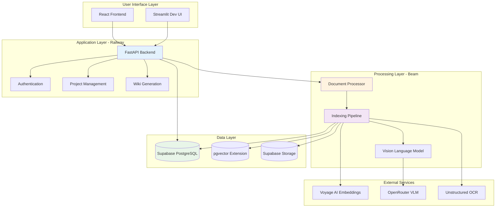
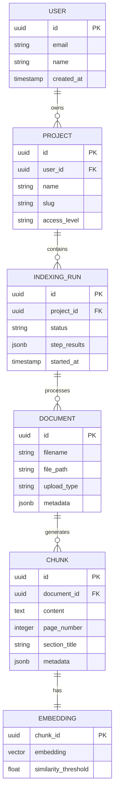
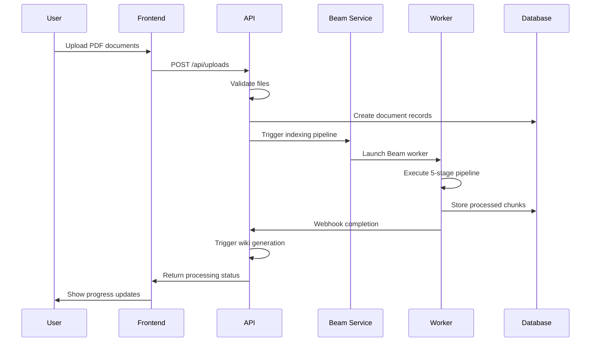
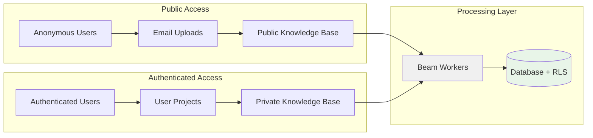
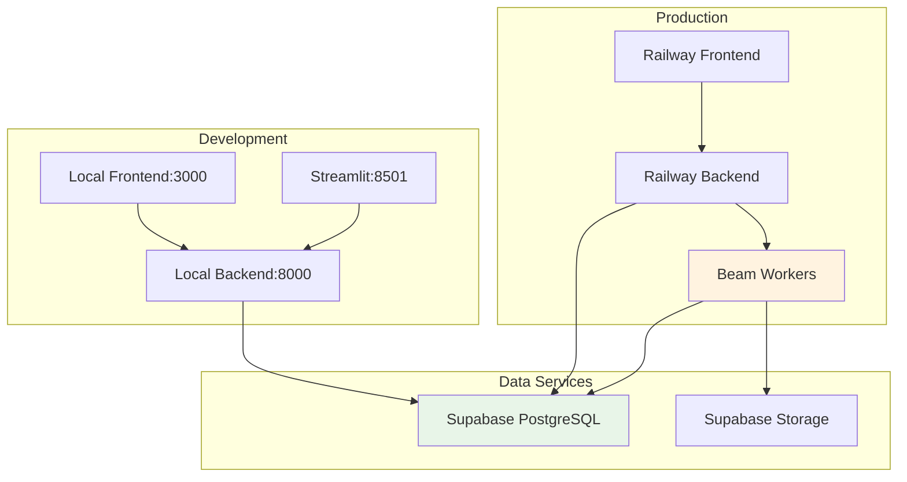
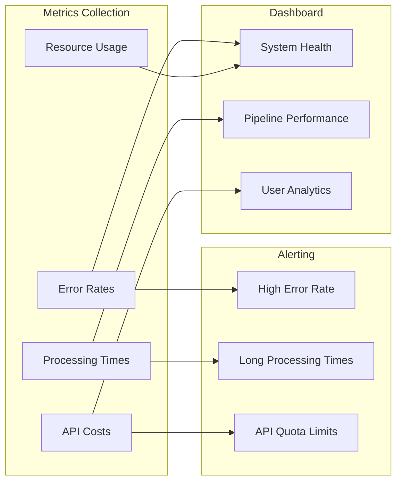

# Specfinder System Architecture

## System Overview

Specfinder implements a distributed document processing architecture that transforms construction PDFs into an intelligent, searchable knowledge base. The system separates compute-intensive processing from user-facing services to ensure scalability and responsiveness.

## High-Level Architecture



## Component Architecture

### Railway Backend Services
- **Role**: User-facing API, authentication, project management, and workflow orchestration
- **Key Components**: FastAPI app, Authentication service, Project service, Beam service, Wiki service
- **Deployment**: Railway cloud platform with automatic scaling

### Beam Processing Workers
- **Role**: GPU-accelerated document processing with heavy compute workloads
- **Key Components**: Indexing orchestrator, Document partitioner, VLM enrichment, Vector processing
- **Deployment**: Beam cloud with on-demand CPU instances (GPU removed for cost optimization)

### Data Storage Architecture



## Processing Flow

### Document Ingestion Flow



### Multi-Document Processing Timeline

```mermaid
gantt
    title Multi-Document Processing Timeline
    dateFormat HH:mm
    axisFormat %H:%M
    
    section Doc 1
    Partition     :active, doc1-part, 10:00, 10:02
    Metadata      :active, doc1-meta, 10:02, 10:03
    Enrichment    :active, doc1-enrich, 10:03, 10:08
    Chunking      :active, doc1-chunk, 10:08, 10:09
    
    section Doc 2
    Partition     :active, doc2-part, 10:00, 10:01
    Metadata      :active, doc2-meta, 10:01, 10:02
    Enrichment    :active, doc2-enrich, 10:02, 10:05
    Chunking      :active, doc2-chunk, 10:05, 10:06
    
    section Batch
    Embedding     :crit, embed, 10:09, 10:12
    Storage       :crit, store, 10:12, 10:13
```



## Access Control and Security

### Multi-Tenant Architecture

**Access Levels**:
- `public`: Anonymous access to email-uploaded documents
- `auth`: Authenticated user access with RLS policies
- `owner`: Full access to user's projects and documents
- `private`: Restricted access to specific resources

### Data Flow Security



### Row-Level Security (RLS)
```sql
-- Example RLS policy for chunks table
CREATE POLICY chunks_access_policy ON chunks
FOR SELECT USING (
  -- Public access for email uploads
  (SELECT upload_type FROM documents WHERE id = document_id) = 'email'
  OR
  -- User access for their projects
  (SELECT user_id FROM projects WHERE id = 
    (SELECT project_id FROM indexing_runs WHERE id = 
      (SELECT indexing_run_id FROM chunks WHERE id = chunks.id)
    )
  ) = auth.uid()
);
```

## Deployment Architecture



## Performance and Scalability

### System Capacity
- **Concurrent Users**: 100+ simultaneous users (Railway auto-scaling)
- **Document Processing**: 10 concurrent Beam workers
- **File Size**: 100MB maximum per PDF
- **Batch Size**: 5 documents per indexing run (optimal)

### Optimization Strategies
1. **Intelligent Caching**: VLM captions cached, embeddings reused for duplicate content
2. **Batch Processing**: Unified embedding generation reduces API calls by 80%
3. **Resource Management**: Auto-terminating workers, temp file cleanup, connection pooling

## Integration Patterns

### External Service Integration
- **Voyage AI**: Batch API calls with retry logic and quota management
- **OpenRouter**: Model selection based on complexity with timeout handling
- **Unstructured.io**: Hi-res OCR with coordinate normalization

### Internal Service Communication
- **Synchronous APIs**: User-facing operations (upload, query)
- **Asynchronous Processing**: Document indexing and wiki generation
- **Event-Driven**: Webhook notifications between Railway and Beam

## Monitoring and Observability



## Technology Stack
- **Backend**: FastAPI (Python) on Railway
- **Frontend**: Next.js 15.3 with App Router on Railway
- **Database**: Supabase (PostgreSQL with pgvector)
- **Processing**: Beam for compute-intensive tasks
- **AI Services**: Voyage AI (embeddings), OpenRouter (VLM)
- **Language**: Optimized for Danish construction documents

## Related Documentation
- For indexing pipeline details, see: `/public-docs/features/indexing-pipeline.md`
- For API endpoints, see: `/public-docs/api/endpoints.md`
- For deployment guide, see: `/public-docs/implementation/deployment.md`
- For configuration, see: `/public-docs/implementation/configuration.md`