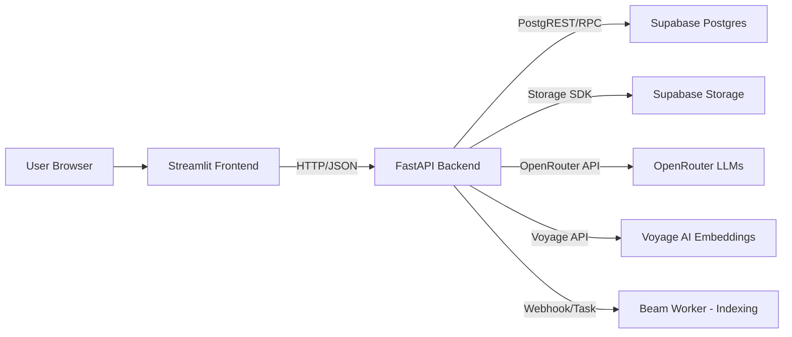
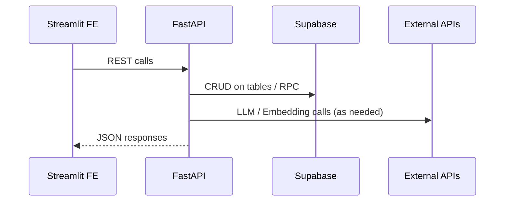
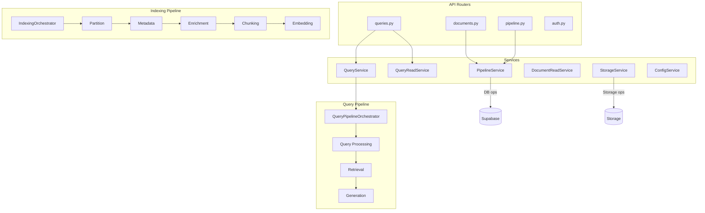
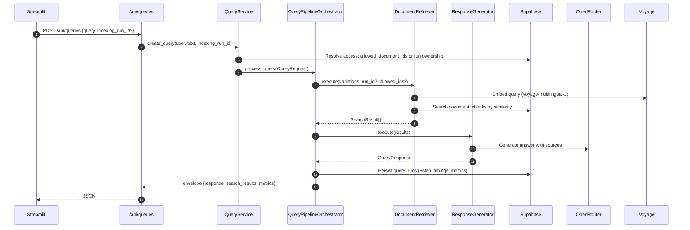
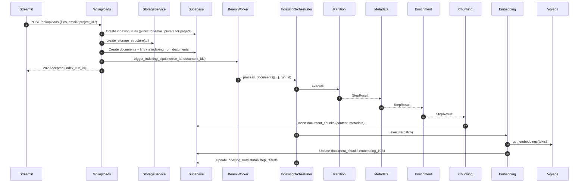
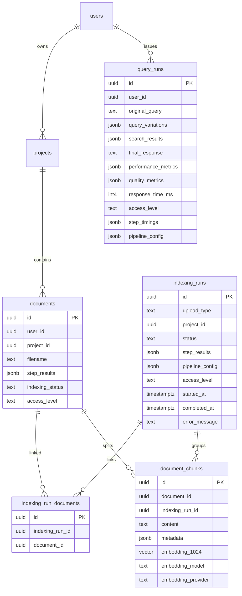
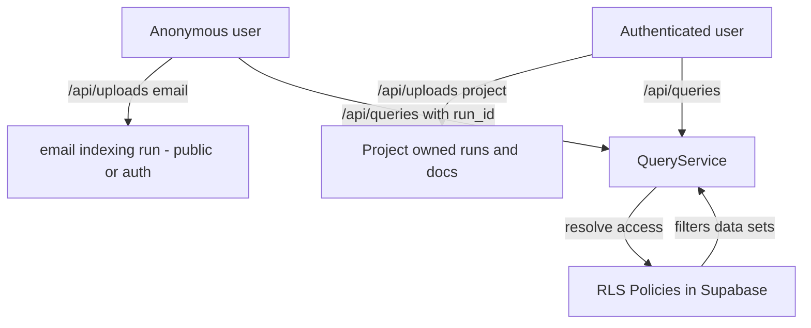
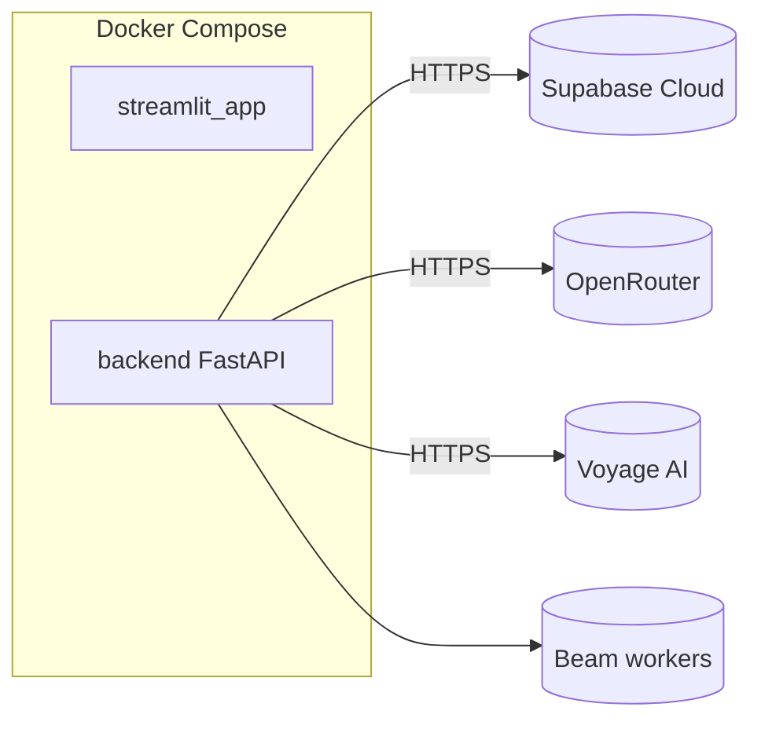

### ConstructionRAG System Architecture Overview

This document provides a high-level and detailed view of the ConstructionRAG system across frontend, backend, pipelines, data model, access control, and external integrations. Diagrams are Mermaid-based for clarity.

### High-Level System



### Frontend to Backend API Surface

- **Documents**: `POST /api/uploads`, `GET /api/documents`, `GET /api/documents/{id}`
- **Indexing Runs**: `GET /api/indexing-runs`, `GET /api/indexing-runs/{id}`, `GET /api/indexing-runs/{id}/progress`
- **Queries**: `POST /api/queries`, `GET /api/queries`, `GET /api/queries/{id}`
- **Health**: `/health`, `/api/health`



### Backend Module Architecture

- API routers: `src/api` (`queries.py`, `documents.py`, `pipeline.py`, `auth.py`)
- Services: `src/services` (`query_service.py`, `pipeline_service.py`, `document_service.py`, `storage_service.py`, ...)
- Pipelines:
  - Indexing: `src/pipeline/indexing/orchestrator.py` + steps (`partition`, `metadata`, `enrichment`, `chunking`, `embedding`)
  - Querying: `src/pipeline/querying/orchestrator.py` + steps (`query_processing`, `retrieval`, `generation`)



### Query Flow (Detailed)



### Indexing Flow (Email and Project Uploads)



### Data Model (Core Entities)



### Access Control and RLS Boundaries

- **Anonymous**: allowed only for email-based `indexing_runs` marked `access_level=public`; queries scoped to that run.
- **Authenticated**: can access own project data (private) + `public` and `auth` content.
- Query path computes `allowed_document_ids` or relies on `indexing_run_id` join filtering; read APIs double-check ownership.



### Storage Layout (Private Buckets with Signed URLs)

```text
pipeline-assets/
  email-uploads/index-runs/{index_run_id}/
    pdfs/
    temp/{partition|metadata|enrichment|chunking|embedding}/
    generated/{markdown|pages|assets/{images,css,js}}
    wiki/{wiki_run_id}/
  users/{user_id}/projects/{project_id}/index-runs/{index_run_id}/
    pdfs/
    temp/{...}
    generated/{...}
    wiki/{wiki_run_id}/
```

Uploads use admin context to bypass storage RLS server-side; clients receive signed URLs. See `src/services/storage_service.py`.

### Configuration and SoT

- Centralized effective config built by `src/services/config_service.py` from `config/pipeline/*.json` and used by orchestrators.
- Query pipeline uses effective `generation` and `retrieval` settings; indexing stores the effective config snapshot on each run.

### Error Handling, Logging, and Observability

- `src/middleware/request_id.py` injects a per-request ID.
- Central exception handlers in `src/middleware/error_handler.py` return consistent error envelopes.
- `src/utils/logging.py` sets structured logging; services use contextual logging.
- Query and indexing orchestrators persist timings and metrics to `query_runs` and `indexing_runs.step_results`.

### Deployment Topology



### Key Files and Entry Points

- Backend app: `backend/src/main.py`
- API routers: `backend/src/api/*.py`
- Indexing orchestrator: `backend/src/pipeline/indexing/orchestrator.py`
- Query orchestrator: `backend/src/pipeline/querying/orchestrator.py`
- Services (DB/Storage/Config): `backend/src/services/*.py`
- Frontend app: `frontend/streamlit_app/main.py`

### End-to-End Quality Controls

- Embedding model: `voyage-multilingual-2` with 1024 dims; stored in `document_chunks.embedding_1024`.
- Retrieval filters by `indexing_run_id` and/or precomputed `allowed_document_ids`.
- Generation uses OpenRouter with fallbacks; returns citations and confidence.


