# Loop.so Email Integration System

## Quick Reference

- **Location**: Primary email service implementations
  - Backend Service: `backend/src/services/loops_service.py`
  - Frontend Newsletter: `frontend/src/lib/loops.ts`
  - Newsletter API: `frontend/src/app/api/newsletter/signup/route.ts`
- **Entry Points**: 
  - Wiki completion emails: `WikiGenerationOrchestrator._send_completion_email_if_needed()` (line 500)
  - Newsletter signup: Frontend footer component via `/api/newsletter/signup`
- **Configuration**: 
  - Environment variable: `LOOPS_API_KEY`
  - Webhook API key: `BEAM_WEBHOOK_API_KEY`
- **Integration Points**:
  - Wiki generation webhook: `/api/wiki/internal/webhook`
  - Anonymous uploads: Email captured in upload form
  - User segmentation: "Public uploaders" vs "Newsletter Subscribers"

## Overview

The Loop.so integration provides automated email notifications and newsletter management for the ConstructionRAG platform. The system supports two distinct email flows with different user segmentation strategies, enabling targeted communication based on user engagement patterns.

Loop.so serves as the primary email service provider, offering transactional emails, audience management, and template-based messaging. The integration is designed to handle both anonymous user interactions (via email uploads) and authenticated user scenarios (newsletter subscriptions).

## Architecture

### High-Level Integration Design

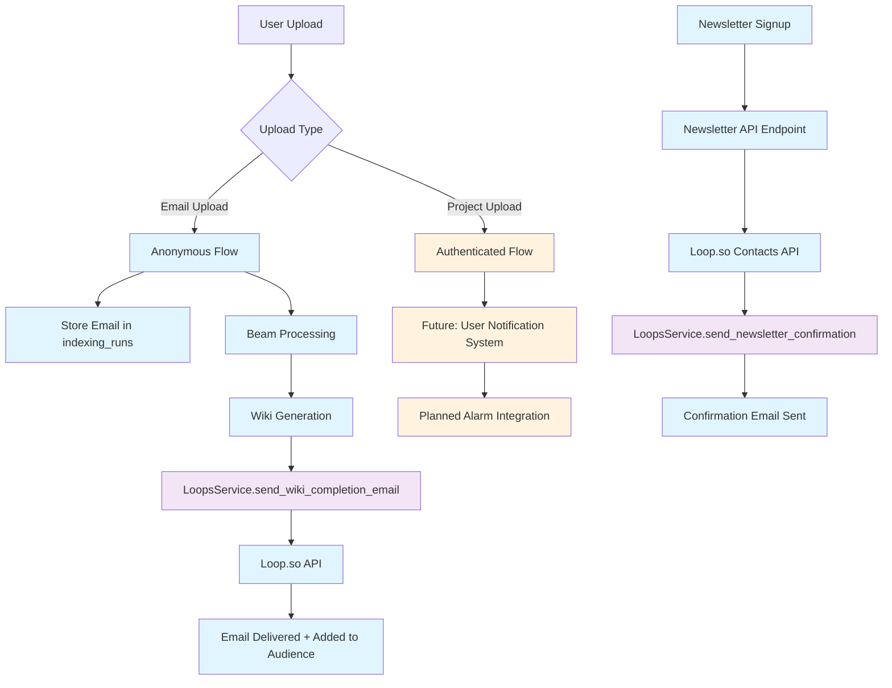

### Email Flow Architecture

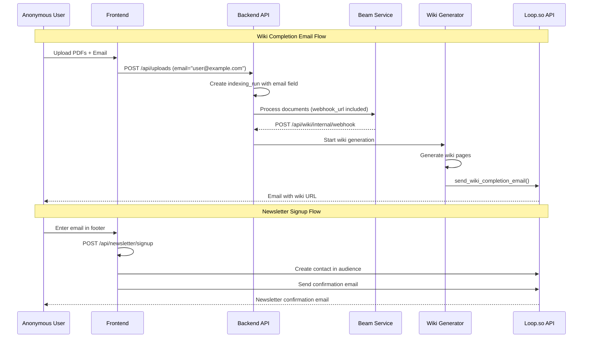

## Technical Implementation

### LoopsService Structure

The `LoopsService` class provides a centralized interface for all Loop.so API interactions:

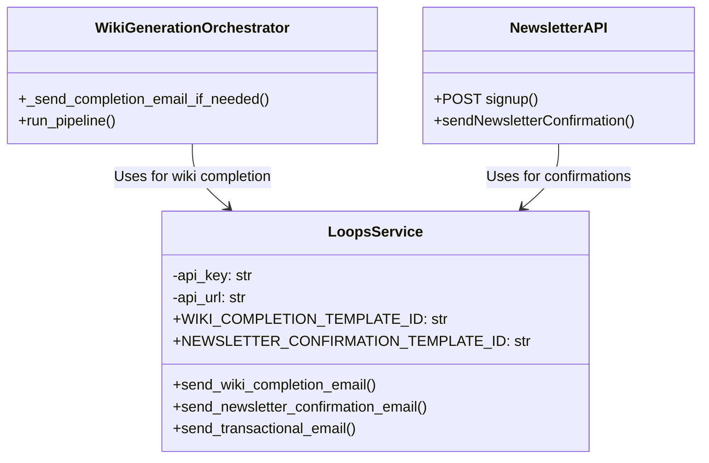

#### Key Methods

**Wiki Completion Email** (`send_wiki_completion_email`)
- **Template ID**: `cmfb0g26t89llxf0i592li27q`
- **Data Variables**: `wikiUrl`, `projectName`
- **User Group**: "Public uploaders"
- **Audience**: Automatically adds contacts with `addToAudience: true`

**Newsletter Confirmation** (`send_newsletter_confirmation_email`)
- **Template ID**: `cmfb5sk790boz4o0igafcmfm4`
- **User Group**: "Newsletter Subscribers"
- **Purpose**: Welcome/confirmation email for newsletter signups

**Generic Transactional** (`send_transactional_email`)
- **Purpose**: Future extensibility for custom email templates
- **Usage**: Currently unused, available for future features

### Email Templates and User Groups

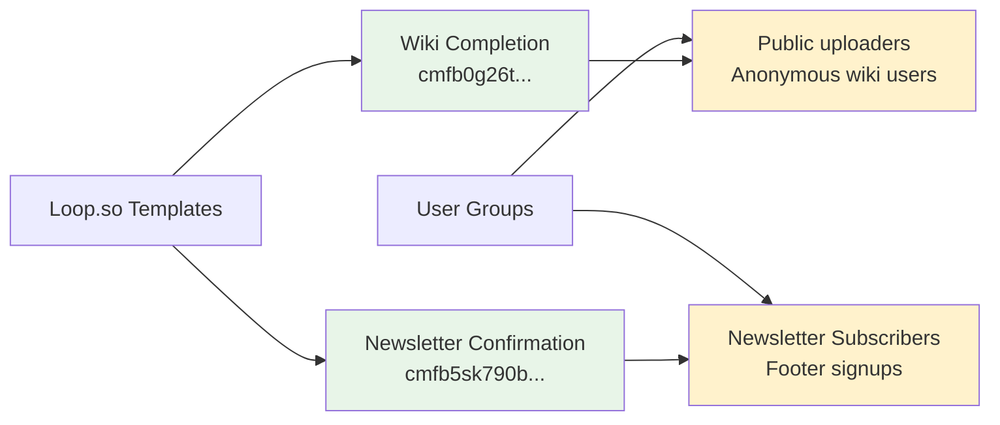

### Database Schema Integration

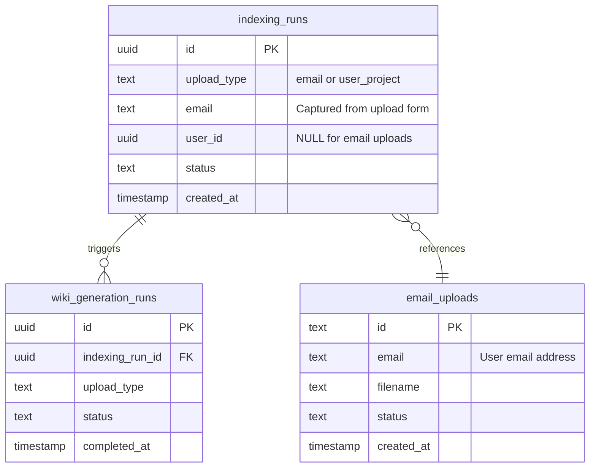

**Email Storage Strategy**:
- **Anonymous uploads**: Email stored in `indexing_runs.email` field
- **Newsletter signups**: Managed directly in Loop.so (no local storage)
- **Authenticated uploads**: User email accessible via `auth_service.get_current_user()` (available now)

## User Flows

### Anonymous Upload → Wiki Completion Notification

```mermaid
flowchart TD
    A[User visits site] --> B[Uploads PDFs + enters email]
    B --> C[Backend creates indexing_run<br/>with email field]
    C --> D[Documents sent to Beam<br/>for processing]
    D --> E[Beam completes indexing]
    E --> F[Beam calls webhook<br/>/api/wiki/internal/webhook]
    F --> G[Wiki generation starts]
    G --> H[Wiki pages generated]
    H --> I{Upload type = email?}
    I -->|Yes| J[Lookup email from<br/>indexing_run]
    I -->|No| K[Skip email notification]
    J --> L[Generate public wiki URL<br/>specfinder.io/projects/{run_id}]
    L --> M[LoopsService.send_wiki_completion_email]
    M --> N[Email sent to user<br/>Added to 'Public uploaders' group]
    
    classDef userAction fill:#e3f2fd
    classDef system fill:#f3e5f5
    classDef notification fill:#e8f5e8
    
    class A,B userAction
    class C,D,E,F,G,H,I,J,L system
    class M,N notification
```

### Newsletter Signup Flow

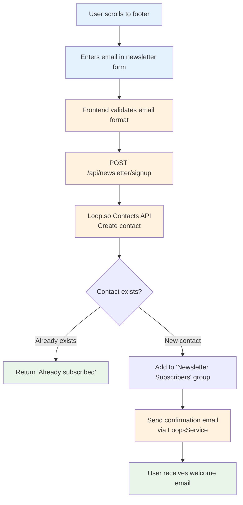

### Current Limitations: Authenticated Users

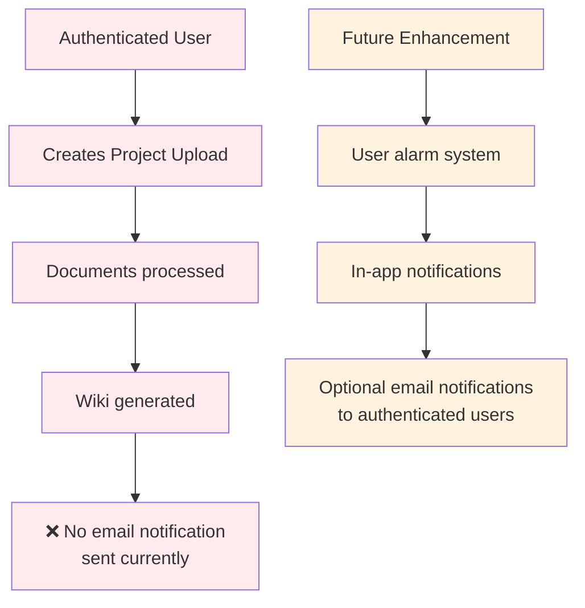

## Configuration & Setup

### Environment Variables

**Backend Configuration**:
```bash
# Required for email functionality
LOOPS_API_KEY=your_loops_api_key_here

# Required for webhook security
BEAM_WEBHOOK_API_KEY=your_webhook_api_key_here
```

**Frontend Configuration**:
```bash
# Required for newsletter signup
LOOPS_API_KEY=your_loops_api_key_here  # Same key as backend
```

### Loop.so Template Setup

**Template IDs** (hardcoded in service):
- **Wiki Completion**: `cmfb0g26t89llxf0i592li27q`
- **Newsletter Confirmation**: `cmfb5sk790boz4o0igafcmfm4`

**Required Template Variables**:
- Wiki completion: `wikiUrl`, `projectName`
- Newsletter confirmation: `email`

### API Integration Details

**Loop.so Endpoints Used**:
- **Transactional**: `https://app.loops.so/api/v1/transactional`
- **Contacts**: `https://app.loops.so/api/v1/contacts/create`

**Authentication**: Bearer token via `Authorization` header

**Rate Limits**: Managed by Loop.so (no explicit handling in codebase)

## Data Flow Diagrams

### Email Notification Pipeline

```mermaid
flowchart LR
    subgraph "Upload Process"
        A[PDF Upload + Email] --> B[indexing_run created]
        B --> C[email field populated]
    end
    
    subgraph "Processing Pipeline"
        D[Beam Processing] --> E[Wiki Generation]
        E --> F[Webhook Trigger]
    end
    
    subgraph "Email System"
        G[Extract email from DB] --> H[LoopsService]
        H --> I[Loop.so API]
        I --> J[Email Delivered]
    end
    
    C --> D
    F --> G
    J --> K[User Group Assignment]
    
    classDef storage fill:#e1f5fe
    classDef processing fill:#f3e5f5
    classDef email fill:#e8f5e8
    
    class A,B,C storage
    class D,E,F processing
    class G,H,I,J,K email
```

### User Segmentation in Loop.so

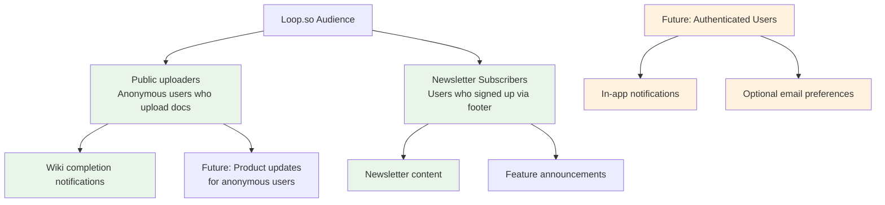

### Database Relationships for Email Handling

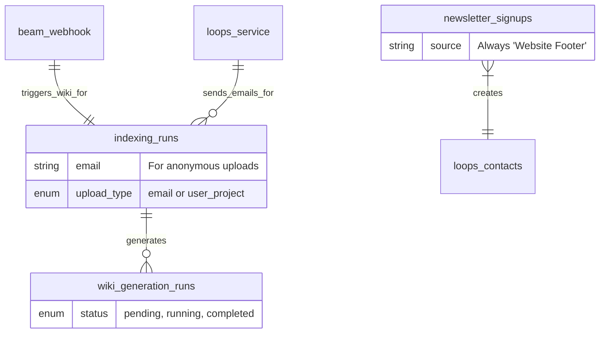

## Current Implementation Status

### What Works Now ✅

**Anonymous Upload Notifications**:
- Email captured during upload process
- Stored in `indexing_runs.email` field
- Wiki completion email sent automatically
- Users added to "Public uploaders" audience
- Public wiki URLs generated and shared

**Newsletter Management**:
- Footer signup form functional
- Email validation and duplicate handling
- Confirmation emails sent immediately
- Users added to "Newsletter Subscribers" group
- Error handling for API failures

**Template System**:
- Two template types configured in Loop.so
- Hardcoded template IDs for reliability
- Data variable injection working
- User group assignment automatic

**Email Access for Authenticated Users**:
- User emails accessible via `AuthService.get_current_user()` method
- Email stored reliably in Supabase `auth.users` table  
- Available for notifications even when `user_profiles` is missing
- No dependency on `user_profiles.email` field

### Current Gaps ❌

**Authenticated User Notifications**:
- No email notifications implemented for authenticated uploads yet
- Wiki completion happens silently for projects
- Users must manually check dashboard for completion
- Email access infrastructure already available via auth service

**Advanced Segmentation**:
- No behavior-based user segmentation
- Limited to two static groups
- No personalization based on usage patterns

**Email Preferences**:
- No user control over email frequency
- No unsubscribe handling implemented
- No preference management UI

## Future Enhancements

### Planned Alarm System for Authenticated Users

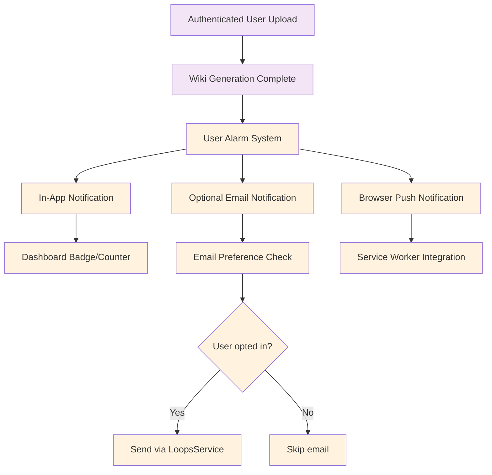

### Advanced Email Features

**Enhanced User Segmentation**:
- Behavior-based groups (frequent vs occasional users)
- Project size-based segmentation
- Industry/use-case specific groups

**Personalization Features**:
- Dynamic content based on upload history
- Personalized project recommendations
- Usage analytics in emails

**User Control**:
- Email preference dashboard
- Granular notification settings
- Unsubscribe flow integration

### Integration Opportunities

**Enhanced Supabase Auth Integration**:
- Sync authenticated user preferences with Loop.so
- Merge anonymous and authenticated user journeys
- Cross-platform notification preferences
- Advanced user segmentation based on auth status

**Analytics Integration**:
- Email open/click tracking
- Conversion funnel analysis
- A/B testing for email templates

**Multi-language Support**:
- Template localization for Danish/English
- User language preference detection
- Localized unsubscribe pages

## Email Access Implementation Guide

### Current Working Patterns

**For Anonymous Users** (implemented):
```python
# Email stored in indexing_runs table during upload
indexing_run = get_indexing_run(run_id)
user_email = indexing_run.email
```

**For Authenticated Users** (available now):
```python
# Email accessed via auth service
user = await auth_service.get_current_user(access_token)
user_email = user['email']  # From auth.users table
```

**For Newsletter Subscribers** (implemented):
```python
# Email handled directly by Loop.so API
# No local storage, managed in Loop.so contacts
```

### Critical Implementation Notes

⚠️ **Important**: Do NOT rely on `user_profiles.email` for authenticated users. Due to foreign key constraint timing issues during signup, the `user_profiles` table may not be populated immediately after user creation.

✅ **Recommended**: Always use `auth_service.get_current_user()` for authenticated user emails, which accesses the reliable `auth.users` table.

### Email Access Methods Comparison

| Method | Reliability | Use Case | Implementation |
|--------|-------------|----------|----------------|
| `indexing_runs.email` | ✅ High | Anonymous uploads | `indexing_run.email` |
| `auth_service.get_current_user()` | ✅ High | Authenticated users | `user['email']` |
| `user_profiles.email` | ❌ Unreliable | Not recommended | May be missing |
| Loop.so API | ✅ High | Newsletter only | External service |

### Future-Proof Email Implementation

When implementing authenticated user notifications:

```python
async def get_user_email_for_notification(indexing_run_id: str, access_token: str = None) -> str:
    """
    Get user email for notifications with fallback strategy
    """
    # Get indexing run details
    indexing_run = await get_indexing_run(indexing_run_id)
    
    if indexing_run.upload_type == "email":
        # Anonymous upload - use stored email
        return indexing_run.email
    elif indexing_run.upload_type == "user_project" and access_token:
        # Authenticated upload - use auth service
        user = await auth_service.get_current_user(access_token)
        return user['email']
    else:
        raise ValueError("Cannot determine user email for notification")
```

## Troubleshooting

### Common Issues

**Email Not Sent**:
- Check `LOOPS_API_KEY` environment variable
- Verify template IDs match Loop.so dashboard
- Confirm webhook endpoint is reachable
- Check logs for API response errors

**Template Variables Missing**:
- Ensure data variables match template expectations
- Verify wiki URL generation logic
- Check project name fallback values

**User Group Assignment Failed**:
- Confirm group names exist in Loop.so
- Check API key permissions
- Verify audience settings in Loop.so

### Error Messages and Solutions

**"LOOPS_API_KEY environment variable not set"**:
- Solution: Add `LOOPS_API_KEY` to environment configuration
- Location: Backend and frontend environment files

**"Invalid API key"**:
- Solution: Verify API key in Loop.so dashboard
- Check: Key permissions include transactional emails

**"Template not found"**:
- Solution: Verify template IDs in Loop.so dashboard
- Update: Hardcoded IDs in `loops_service.py`

**"Contact already exists"**:
- Expected behavior for newsletter signup
- Returns success message to user
- No action required

## Related Documentation

- **Pipeline Architecture**: `/public-docs/01-features/docs_wiki_generation_pipeline.md`
- **Authentication System**: `/public-docs/01-features/docs_authentication_system.md`
- **Upload Management**: `/public-docs/01-features/docs_document_upload_system.md`
- **Webhook Integration**: `/public-docs/02-api/docs_webhook_endpoints.md`
- **User Management**: `/public-docs/01-features/docs_user_project_management.md`