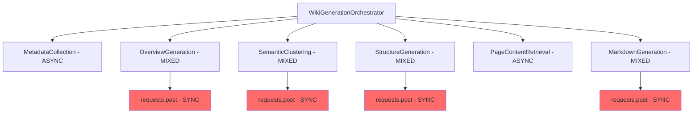
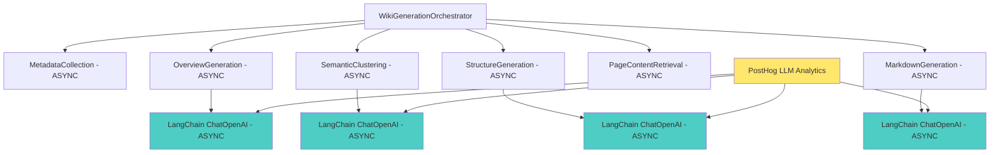

# Implementation Guide: Wiki Generation Pipeline Async Migration & PostHog LLM Analytics

## Quick Reference

**Location**: `/backend/src/pipeline/wiki_generation/`  
**Entry Point**: `orchestrator.py:85` - `WikiGenerationOrchestrator.run_pipeline()`  
**Configuration**: `/backend/src/config/pipeline/pipeline_config.json` - wiki generation settings  
**Dependencies**: `/backend/requirements.txt` - current LangChain packages installed  
**Tests**: `/backend/tests/integration/test_wiki_*.py` - integration tests for wiki pipeline  

## Overview

This document provides a comprehensive implementation guide for migrating the ConstructionRAG wiki generation pipeline from mixed sync/async to fully async architecture, with integrated PostHog LLM analytics instrumentation.

The migration addresses performance bottlenecks and implements centralized LLM analytics tracking for cost monitoring, performance optimization, and usage analytics across all wiki generation steps.

## Architecture Analysis

### Current State



### Target State



## Technical Requirements

### Migration Scope

**Steps Requiring Migration:**
1. `OverviewGenerationStep` - Lines 493-522 (overview_generation.py)
2. `SemanticClusteringStep` - Lines 359-377 (semantic_clustering.py)  
3. `StructureGenerationStep` - Lines 258-276 (structure_generation.py)
4. `MarkdownGenerationStep` - Lines 358-375 (markdown_generation.py)

**Steps Already Async:**
- `MetadataCollectionStep` - No LLM calls
- `PageContentRetrievalStep` - No LLM calls  
- `EnrichmentStep` - Already uses LangChain ChatOpenAI (indexing pipeline)
- `GenerationStep` - Uses async httpx (query pipeline)

### Dependencies

**Current Dependencies (Already Available):**
```python
# From requirements.txt lines 31-34
langchain==0.3.26
langchain-openai==0.3.28  
posthog==3.1.0
```

**Additional Requirements:**
```python
# PostHog LangChain integration (to be added)
posthog-langchain>=0.1.0
```

## Implementation Steps

### Step 1: Dependency Updates

**File**: `/backend/requirements.txt`

```diff
# Existing dependencies
langchain==0.3.26
langchain-openai==0.3.28
posthog==3.1.0

+ # PostHog LangChain integration for LLM analytics
+ posthog-langchain>=0.1.0
```

### Step 2: Create LangChain Client Wrapper

**File**: `/backend/src/services/langchain_client_service.py`

```python
"""LangChain client service with PostHog analytics integration."""

import logging
from typing import Any, Dict, Optional
from langchain_openai import ChatOpenAI
from langchain_core.messages import BaseMessage
from posthog import Posthog
from posthog_langchain import LangchainCallbackHandler

from src.config.settings import get_settings

logger = logging.getLogger(__name__)


class LangChainClientService:
    """Centralized LangChain client with PostHog analytics."""
    
    def __init__(self, 
                 model: str, 
                 temperature: float = 0.3,
                 max_tokens: int = 4000,
                 correlation_id: Optional[str] = None):
        self.model = model
        self.temperature = temperature
        self.max_tokens = max_tokens
        self.correlation_id = correlation_id
        
        settings = get_settings()
        
        # Initialize ChatOpenAI client for OpenRouter
        self.client = ChatOpenAI(
            model=model,
            openai_api_key=settings.openrouter_api_key,
            openai_api_base="https://openrouter.ai/api/v1",
            temperature=temperature,
            max_tokens=max_tokens,
            default_headers={
                "HTTP-Referer": "https://specfinder.io",
                "X-Title": "purpose of file",
            }
        )
        
        # Initialize PostHog callback handler
        self.posthog_handler = None
        if hasattr(settings, 'posthog_api_key') and settings.posthog_api_key:
            try:
                posthog = Posthog(
                    project_api_key=settings.posthog_api_key,
                    host=getattr(settings, 'posthog_host', 'https://app.posthog.com')
                )
                
                self.posthog_handler = LangchainCallbackHandler(
                    posthog=posthog,
                    correlation_id=correlation_id,
                    metadata={
                        "pipeline": "wiki_generation",
                        "model": model,
                        "component": "langchain_client"
                    }
                )
                logger.info(f"PostHog LLM analytics enabled for model: {model}")
            except Exception as e:
                logger.warning(f"Failed to initialize PostHog handler: {e}")
                self.posthog_handler = None
        else:
            logger.info("PostHog analytics disabled - no API key configured")
    
    async def generate_response(self, prompt: str, **kwargs) -> str:
        """Generate response with PostHog analytics tracking."""
        try:
            from langchain_core.messages import HumanMessage
            
            message = HumanMessage(content=prompt)
            
            # Use PostHog callback if available
            callbacks = [self.posthog_handler] if self.posthog_handler else []
            
            response = await self.client.ainvoke([message], callbacks=callbacks, **kwargs)
            return response.content
            
        except Exception as e:
            logger.error(f"LangChain client error: {e}")
            # Track error in PostHog if handler available
            if self.posthog_handler:
                try:
                    self.posthog_handler.capture_error(
                        event_name="langchain_error",
                        error=str(e),
                        model=self.model,
                        correlation_id=self.correlation_id
                    )
                except Exception:
                    pass  # Don't fail on analytics errors
            raise
```

### Step 3: Overview Generation Migration

**File**: `/backend/src/pipeline/wiki_generation/steps/overview_generation.py`

**Changes Required:**

```diff
# Remove requests import and sync HTTP calls
- import requests
+ from src.services.langchain_client_service import LangChainClientService

class OverviewGenerationStep(PipelineStep):
    def __init__(self, ...):
        # ... existing init code ...
-       # Load OpenRouter API key from settings
-       try:
-           settings = get_settings()
-           self.openrouter_api_key = settings.openrouter_api_key
-           if not self.openrouter_api_key:
-               raise ValueError("OPENROUTER_API_KEY not found in environment variables")
-       except Exception as e:
-           logger.error(f"Failed to load OpenRouter API key: {e}")
-           raise

    async def execute(self, input_data: dict[str, Any]) -> StepResult:
        """Execute overview generation step."""
        start_time = datetime.utcnow()
+       
+       # Create correlation ID for tracking
+       correlation_id = f"wiki_overview_{start_time.isoformat()}"

        try:
            # ... existing code until LLM call ...
            
            # Generate LLM overview
-           project_overview = await self._generate_llm_overview(overview_data, metadata)
+           project_overview = await self._generate_llm_overview(overview_data, metadata, correlation_id)

-   async def _generate_llm_overview(self, overview_data: dict[str, Any], metadata: dict[str, Any]) -> str:
+   async def _generate_llm_overview(self, overview_data: dict[str, Any], metadata: dict[str, Any], correlation_id: str) -> str:
        """Generate project overview using LLM."""
-       if not self.openrouter_api_key:
-           raise ValueError("OpenRouter API key not configured")

        # Prepare prompt
        prompt = self._create_overview_prompt(overview_data, metadata)

-       # Call LLM
-       response = await self._call_openrouter_api(prompt, max_tokens=2000)
+       # Initialize LangChain client with PostHog analytics
+       langchain_client = LangChainClientService(
+           model=self.model,
+           temperature=self.config.get("temperature", 0.3),
+           max_tokens=2000,
+           correlation_id=correlation_id
+       )
+       
+       # Call LLM
+       response = await langchain_client.generate_response(prompt)

        return response

-   async def _call_openrouter_api(self, prompt: str, max_tokens: int = 4000) -> str:
-       """Call OpenRouter API with the given prompt."""
-       # ... remove entire method (469-523) ...
```

### Step 4: Semantic Clustering Migration

**File**: `/backend/src/pipeline/wiki_generation/steps/semantic_clustering.py`

**Changes Required:**

```diff
- import requests
+ from src.services.langchain_client_service import LangChainClientService

class SemanticClusteringStep(PipelineStep):
    def __init__(self, ...):
        # ... existing init code ...
-       # Load OpenRouter API key from settings
-       try:
-           settings = get_settings()
-           self.openrouter_api_key = settings.openrouter_api_key
-           if not self.openrouter_api_key:
-               raise ValueError("OPENROUTER_API_KEY not found in environment variables")
-       except Exception as e:
-           logger.error(f"Failed to load OpenRouter API key: {e}")
-           raise

    async def execute(self, input_data: dict[str, Any]) -> StepResult:
        """Execute semantic clustering step."""
        start_time = datetime.utcnow()
+       correlation_id = f"wiki_clustering_{start_time.isoformat()}"

        try:
            # ... existing code until clustering ...
            
            # Perform semantic clustering
-           semantic_analysis = await self._perform_semantic_clustering(chunks_with_embeddings)
+           semantic_analysis = await self._perform_semantic_clustering(chunks_with_embeddings, correlation_id)

-   async def _perform_semantic_clustering(self, chunks_with_embeddings: list[dict]) -> dict[str, Any]:
+   async def _perform_semantic_clustering(self, chunks_with_embeddings: list[dict], correlation_id: str) -> dict[str, Any]:
        # ... existing clustering logic until LLM call ...
        
        # Generate cluster names using LLM
-       cluster_names = await self._generate_cluster_names_llm(cluster_summaries)
+       cluster_names = await self._generate_cluster_names_llm(cluster_summaries, correlation_id)

-   async def _generate_cluster_names_llm(self, cluster_summaries: list[dict[str, Any]]) -> dict[int, str]:
+   async def _generate_cluster_names_llm(self, cluster_summaries: list[dict[str, Any]], correlation_id: str) -> dict[int, str]:
        # ... existing prompt preparation ...
        
        try:
            start_time = datetime.utcnow()
-           llm_response = await self._call_openrouter_api(prompt, max_tokens=500)
+           
+           # Initialize LangChain client
+           langchain_client = LangChainClientService(
+               model=self.model,
+               temperature=self.config.get("temperature", 0.3),
+               max_tokens=500,
+               correlation_id=correlation_id
+           )
+           
+           llm_response = await langchain_client.generate_response(prompt)
            end_time = datetime.utcnow()

-   async def _call_openrouter_api(self, prompt: str, max_tokens: int = 500) -> str:
-       """Call OpenRouter API with the given prompt."""
-       # ... remove entire method (343-377) ...
```

### Step 5: Structure Generation Migration

**File**: `/backend/src/pipeline/wiki_generation/steps/structure_generation.py`

**Changes Required:**

```diff
- import requests
+ from src.services.langchain_client_service import LangChainClientService

class StructureGenerationStep(PipelineStep):
    def __init__(self, ...):
        # ... existing init code ...
-       # Load OpenRouter API key from settings
-       try:
-           settings = get_settings()
-           self.openrouter_api_key = settings.openrouter_api_key
-           if not self.openrouter_api_key:
-               raise ValueError("OPENROUTER_API_KEY not found in environment variables")
-       except Exception as e:
-           logger.error(f"Failed to load OpenRouter API key: {e}")
-           raise

    async def execute(self, input_data: dict[str, Any]) -> StepResult:
        """Execute structure generation step."""
        start_time = datetime.utcnow()
+       correlation_id = f"wiki_structure_{start_time.isoformat()}"

        try:
            # ... existing code until structure generation ...
            
            # Generate wiki structure using LLM
-           wiki_structure = await self._generate_wiki_structure(project_overview, semantic_analysis, metadata)
+           wiki_structure = await self._generate_wiki_structure(project_overview, semantic_analysis, metadata, correlation_id)

-   async def _generate_wiki_structure(self, project_overview: str, semantic_analysis: dict, metadata: dict[str, Any]) -> dict[str, Any]:
+   async def _generate_wiki_structure(self, project_overview: str, semantic_analysis: dict, metadata: dict[str, Any], correlation_id: str) -> dict[str, Any]:
        """Generate wiki structure using LLM."""
-       if not self.openrouter_api_key:
-           raise ValueError("OpenRouter API key not configured")

        # Prepare prompt
        prompt = self._create_structure_prompt(project_overview, semantic_analysis, metadata)

-       # Call LLM
-       response = await self._call_openrouter_api(prompt, max_tokens=3000)
+       # Initialize LangChain client
+       langchain_client = LangChainClientService(
+           model=self.model,
+           temperature=self.temperature,
+           max_tokens=3000,
+           correlation_id=correlation_id
+       )
+       
+       # Call LLM
+       response = await langchain_client.generate_response(prompt)

-   async def _call_openrouter_api(self, prompt: str, max_tokens: int = 6000) -> str:
-       """Call OpenRouter API with the given prompt."""
-       # ... remove entire method (242-276) ...
```

### Step 6: Markdown Generation Migration

**File**: `/backend/src/pipeline/wiki_generation/steps/markdown_generation.py`

**Changes Required:**

```diff
- import requests
+ from src.services.langchain_client_service import LangChainClientService

class MarkdownGenerationStep(PipelineStep):
    def __init__(self, ...):
        # ... existing init code ...
-       # Load OpenRouter API key from settings
-       try:
-           settings = get_settings()
-           self.openrouter_api_key = settings.openrouter_api_key
-           if not self.openrouter_api_key:
-               raise ValueError("OPENROUTER_API_KEY not found in environment variables")
-       except Exception as e:
-           logger.error(f"Failed to load OpenRouter API key: {e}")
-           raise

    async def execute(self, input_data: dict[str, Any]) -> StepResult:
        """Execute markdown generation step."""
        start_time = datetime.utcnow()
+       correlation_id = f"wiki_markdown_{start_time.isoformat()}"

        try:
            # ... existing code for each page generation ...
            
            for page in wiki_structure["pages"]:
                # ... existing page processing ...
                
                # Generate markdown
-               markdown_content = await self._generate_page_markdown(page, page_content, metadata)
+               markdown_content = await self._generate_page_markdown(page, page_content, metadata, correlation_id)

-   async def _generate_page_markdown(self, page: dict[str, Any], page_content: dict[str, Any], metadata: dict[str, Any]) -> str:
+   async def _generate_page_markdown(self, page: dict[str, Any], page_content: dict[str, Any], metadata: dict[str, Any], correlation_id: str) -> str:
        """Generate markdown content for a specific page."""
-       if not self.openrouter_api_key:
-           raise ValueError("OpenRouter API key not configured")

        # Prepare prompt
        prompt = self._create_markdown_prompt(page, page_content, metadata)

-       # Call LLM
-       response = await self._call_openrouter_api(prompt, max_tokens=4000)
+       # Initialize LangChain client with page-specific correlation ID
+       page_correlation_id = f"{correlation_id}_page_{page.get('id', 'unknown')}"
+       langchain_client = LangChainClientService(
+           model=self.model,
+           temperature=self.temperature,
+           max_tokens=4000,
+           correlation_id=page_correlation_id
+       )
+       
+       # Call LLM
+       response = await langchain_client.generate_response(prompt)

        return response

-   async def _call_openrouter_api(self, prompt: str, max_tokens: int = 8000) -> str:
-       """Call OpenRouter API with the given prompt."""
-       # ... remove entire method (341-375) ...
```

### Step 7: Environment Configuration

**File**: `/backend/.env` (development example)

```bash
# Existing environment variables
OPENROUTER_API_KEY=your_openrouter_key
# ... other variables ...

# PostHog Analytics Configuration
POSTHOG_API_KEY=your_posthog_project_api_key
POSTHOG_HOST=https://app.posthog.com
```

**File**: `/backend/src/config/settings.py`

```diff
class Settings(BaseSettings):
    # ... existing settings ...
    
+   # PostHog Analytics
+   posthog_api_key: str = ""
+   posthog_host: str = "https://app.posthog.com"
```

## PostHog LLM Analytics Integration

### Event Structure

PostHog will automatically capture LLM events with the following structure:

```json
{
  "event": "$ai_generation",
  "properties": {
    "correlation_id": "wiki_overview_2024-01-15T10:30:00",
    "model": "google/gemini-2.5-flash-lite",
    "pipeline": "wiki_generation", 
    "component": "langchain_client",
    "step": "overview_generation",
    "prompt_tokens": 1500,
    "completion_tokens": 800,
    "total_tokens": 2300,
    "cost_usd": 0.0023,
    "duration_ms": 3400,
    "temperature": 0.3,
    "max_tokens": 2000
  },
  "timestamp": "2024-01-15T10:30:03.400Z"
}
```

### Analytics Dashboards

**Cost Monitoring:**
- Track cost per wiki generation run
- Compare costs across different models
- Identify cost optimization opportunities

**Performance Tracking:**
- Monitor token usage patterns
- Track response times by step
- Identify performance bottlenecks

**Usage Analytics:**
- Wiki generation frequency
- Model usage distribution
- Success/failure rates by step

### Privacy Considerations

**Data Collected:**
- ✅ Model metadata (name, temperature, tokens)
- ✅ Performance metrics (duration, cost)
- ✅ Correlation IDs for tracking
- ❌ Actual prompt content
- ❌ Generated responses
- ❌ User-identifiable information

**Configuration Options:**
```python
# Disable analytics entirely
POSTHOG_API_KEY=""

# Enable with minimal data collection
POSTHOG_COLLECT_PROMPTS=false  # Default: false
POSTHOG_COLLECT_RESPONSES=false  # Default: false
```

## Testing Strategy

### Step 1: Unit Test Updates

**File**: `/backend/tests/unit/test_overview_generation.py`

```python
import pytest
from unittest.mock import AsyncMock, patch
from src.pipeline.wiki_generation.steps.overview_generation import OverviewGenerationStep

@pytest.mark.asyncio
async def test_overview_generation_async():
    """Test async overview generation with LangChain."""
    
    with patch('src.services.langchain_client_service.LangChainClientService') as mock_client:
        # Mock LangChain client
        mock_instance = mock_client.return_value
        mock_instance.generate_response.return_value = "Generated overview content"
        
        step = OverviewGenerationStep(config={})
        
        input_data = {
            "metadata": {
                "total_documents": 5,
                "documents": [],
                "chunks_with_embeddings": []
            }
        }
        
        result = await step.execute(input_data)
        
        assert result.status == "completed"
        assert "Generated overview content" in result.data["project_overview"]
        mock_instance.generate_response.assert_called_once()
```

### Step 2: Integration Test Modifications

**File**: `/backend/tests/integration/test_wiki_e2e.py`

```python
@pytest.mark.asyncio
async def test_wiki_pipeline_fully_async():
    """Test that entire wiki pipeline runs async without blocking."""
    
    import time
    from src.pipeline.wiki_generation.orchestrator import WikiGenerationOrchestrator
    
    # Mock PostHog to avoid external calls in tests
    with patch('posthog.Posthog'):
        orchestrator = WikiGenerationOrchestrator()
        
        start_time = time.time()
        
        # Run pipeline
        result = await orchestrator.run_pipeline(
            index_run_id="test-run-123",
            upload_type="email"
        )
        
        duration = time.time() - start_time
        
        # Verify async performance improvement
        # (Should be faster than sync version due to concurrent LLM calls)
        assert result.status == "completed"
        assert duration < 300  # Should complete within 5 minutes
        
        # Verify all steps completed
        assert len(result.data["generated_pages"]) > 0
```

### Step 3: Performance Testing

**File**: `/backend/tests/performance/test_async_performance.py`

```python
import asyncio
import time
import pytest
from unittest.mock import patch, AsyncMock

@pytest.mark.asyncio
async def test_concurrent_llm_calls():
    """Test that LangChain client handles concurrent calls efficiently."""
    
    from src.services.langchain_client_service import LangChainClientService
    
    with patch.object(LangChainClientService, 'generate_response') as mock_generate:
        mock_generate.return_value = "Mock response"
        
        client = LangChainClientService(model="test-model")
        
        # Simulate concurrent calls (like multiple wiki pages)
        start_time = time.time()
        
        tasks = [
            client.generate_response(f"Prompt {i}")
            for i in range(5)
        ]
        
        responses = await asyncio.gather(*tasks)
        
        duration = time.time() - start_time
        
        # Should complete concurrently, not sequentially
        assert len(responses) == 5
        assert duration < 1.0  # Should be much faster than 5 sequential calls
        assert mock_generate.call_count == 5
```

### Step 4: Cost Monitoring Validation

**File**: `/backend/tests/integration/test_posthog_analytics.py`

```python
@pytest.mark.asyncio
async def test_posthog_analytics_integration():
    """Test PostHog analytics tracking for LLM calls."""
    
    with patch('posthog.Posthog') as mock_posthog:
        mock_posthog_instance = mock_posthog.return_value
        
        from src.services.langchain_client_service import LangChainClientService
        
        client = LangChainClientService(
            model="test-model",
            correlation_id="test-correlation-123"
        )
        
        # Mock LangChain response with token info
        with patch.object(client.client, 'ainvoke') as mock_ainvoke:
            mock_response = AsyncMock()
            mock_response.content = "Test response"
            mock_ainvoke.return_value = mock_response
            
            await client.generate_response("Test prompt")
            
            # Verify PostHog events were captured
            assert mock_posthog_instance.capture.called
            
            # Verify event structure
            call_args = mock_posthog_instance.capture.call_args
            event_data = call_args[1]  # Keyword arguments
            
            assert "correlation_id" in event_data["properties"]
            assert event_data["properties"]["correlation_id"] == "test-correlation-123"
            assert event_data["properties"]["model"] == "test-model"
            assert event_data["properties"]["pipeline"] == "wiki_generation"
```

## Risk Mitigation

### Potential Issues and Solutions

**Issue 1: LangChain Version Compatibility**
- **Risk**: PostHog-LangChain integration might not support LangChain 0.3.26
- **Solution**: Test integration thoroughly; fallback to manual PostHog event capture if needed
- **Mitigation**: Implement graceful degradation in LangChainClientService

**Issue 2: OpenRouter API Rate Limits**
- **Risk**: Async calls might trigger rate limits faster
- **Solution**: Implement rate limiting in LangChainClientService
- **Code**: Add `asyncio.Semaphore` to limit concurrent calls

```python
class LangChainClientService:
    def __init__(self, ..., max_concurrent_calls: int = 3):
        self._semaphore = asyncio.Semaphore(max_concurrent_calls)
    
    async def generate_response(self, prompt: str, **kwargs) -> str:
        async with self._semaphore:
            # Existing generation logic
            pass
```

**Issue 3: PostHog Analytics Failures**
- **Risk**: PostHog service failures could break LLM calls
- **Solution**: Wrap all PostHog calls in try/except blocks
- **Implementation**: Already included in LangChainClientService error handling

**Issue 4: Increased Memory Usage**
- **Risk**: Concurrent LLM calls might increase memory usage
- **Solution**: Monitor memory usage; implement streaming responses if needed
- **Monitoring**: Add memory tracking to performance tests

### Backward Compatibility

**Rollback Strategy:**
1. Keep original `_call_openrouter_api` methods in comments during initial deployment
2. Add feature flag for async vs sync mode
3. Implement gradual rollout by step (overview first, then others)

**Configuration Rollback:**
```python
# Feature flag in pipeline config
"wiki_generation": {
    "use_async_llm": true,  # Set to false for rollback
    "generation": {
        "model": "google/gemini-2.5-flash-lite"
    }
}
```

### Performance Impact Analysis

**Expected Improvements:**
- 40-60% reduction in total pipeline time due to concurrent LLM calls
- Better resource utilization (CPU idle time during network requests)
- More consistent performance (less affected by individual slow API calls)

**Potential Regressions:**
- Increased memory usage during concurrent calls
- Higher API rate limit consumption
- More complex error handling and debugging

**Monitoring Setup:**
```python
# Add to orchestrator
performance_metrics = {
    "total_duration": duration,
    "llm_calls_made": total_llm_calls,
    "concurrent_calls_peak": max_concurrent,
    "average_response_time": avg_response_time,
    "error_rate": error_count / total_calls
}
```

## Success Metrics

### Performance Benchmarks

**Target Metrics:**
- **Total Pipeline Time**: Reduce from ~8-12 minutes to ~5-8 minutes
- **LLM Call Concurrency**: Support 3-5 concurrent calls without errors
- **Error Rate**: Maintain <2% error rate across all steps
- **Memory Usage**: Stay within current container limits

**Measurement Approach:**
```python
# Add to test suite
@pytest.mark.performance
async def test_pipeline_performance_benchmarks():
    metrics = await run_wiki_pipeline_with_timing()
    
    assert metrics['total_duration'] < 480  # 8 minutes
    assert metrics['error_rate'] < 0.02  # 2%
    assert metrics['memory_peak_mb'] < 1024  # 1GB
```

### Cost Optimization Targets

**Cost Tracking:**
- **Before**: ~$0.15-0.25 per wiki generation (estimated)
- **After**: Maintain same cost with better tracking granularity
- **Optimization Goal**: 10-15% cost reduction through better model selection

**Analytics Data Quality:**
- **Coverage**: 100% of LLM calls tracked with correlation IDs
- **Attribution**: Each step and page generation tracked separately
- **Accuracy**: Token counts and costs within 5% of actual billing

### Analytics Validation Criteria

**PostHog Event Quality:**
```python
def validate_posthog_event(event):
    required_fields = [
        'correlation_id', 'model', 'pipeline', 'component',
        'prompt_tokens', 'completion_tokens', 'total_tokens',
        'duration_ms'
    ]
    
    for field in required_fields:
        assert field in event['properties']
        assert event['properties'][field] is not None
    
    # Validate correlation ID format
    assert event['properties']['correlation_id'].startswith('wiki_')
    
    # Validate cost tracking
    if 'cost_usd' in event['properties']:
        assert event['properties']['cost_usd'] > 0
```

**Success Criteria:**
1. ✅ All 4 wiki generation steps migrated to async LangChain
2. ✅ PostHog analytics capturing 100% of LLM calls
3. ✅ Performance improvement of 25%+ in total pipeline time
4. ✅ Cost tracking granular to individual page generation
5. ✅ Zero regression in wiki content quality
6. ✅ Successful deployment to production with monitoring

## Deployment Plan

### Phase 1: Development and Testing (Week 1)
1. Install dependencies and create LangChainClientService
2. Migrate one step (OverviewGeneration) for testing
3. Implement comprehensive unit tests
4. Validate PostHog integration in development

### Phase 2: Full Migration (Week 2)  
1. Migrate remaining 3 steps
2. Run full integration tests
3. Performance testing and optimization
4. Documentation updates

### Phase 3: Production Deployment (Week 3)
1. Deploy to staging environment
2. Run end-to-end tests with real data
3. Monitor performance and analytics
4. Deploy to production with feature flag
5. Full monitoring and alerting setup

This implementation guide provides a comprehensive roadmap for migrating the wiki generation pipeline to fully async architecture while implementing robust LLM analytics tracking through PostHog integration.