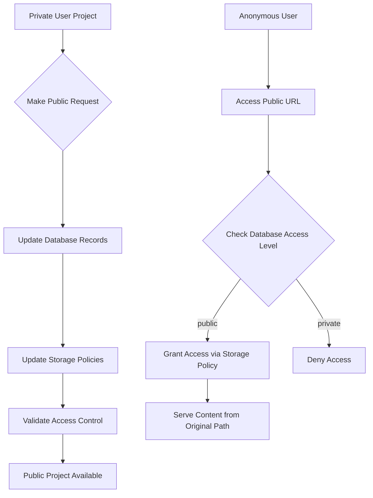
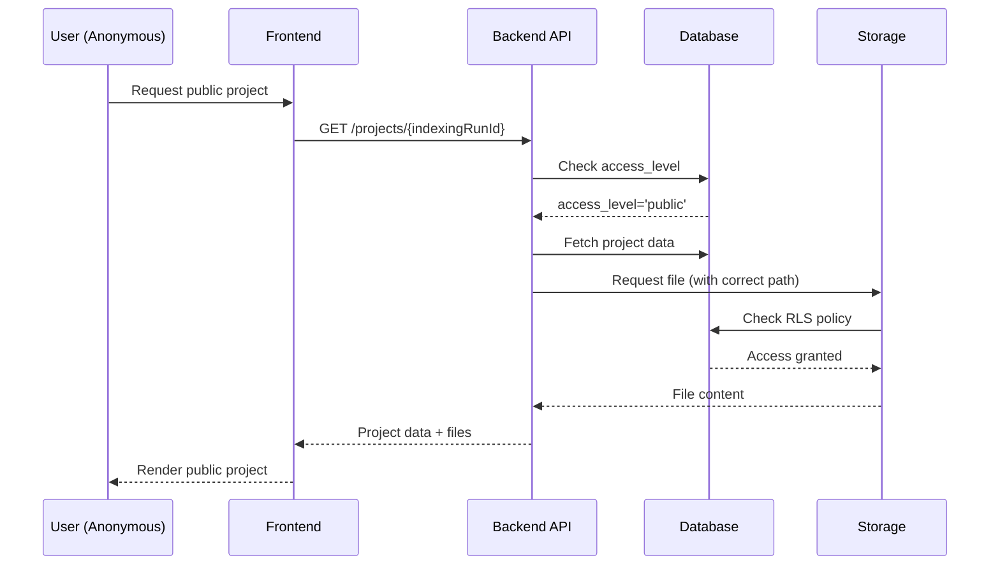

# Implementation Guide: Make Public Feature

## Quick Reference
- **Location**: Future implementation - API endpoint and frontend components
- **Entry Point**: To be implemented at `src/api/projects/{project_id}/make-public`
- **Configuration**: Database policies in Supabase, storage RLS policies
- **Tests**: Integration tests needed for access control transitions

## Overview

This document provides a comprehensive guide for implementing a "Make Public" feature that allows authenticated users to convert their private projects to publicly accessible ones. The guide is based on manual debugging and conversion processes performed during development.

## Background Problem

Users create projects in authenticated mode with the following characteristics:
- `upload_type='user_project'` 
- `access_level='private'`
- Files stored in `users/{user_id}/projects/{project_id}/...` storage paths
- Only accessible to the project owner

However, users need the ability to share their projects publicly without:
- Re-uploading documents
- Moving files in storage
- Losing project history or metadata

## Architecture Overview



## Manual Conversion Process Analysis

During debugging, we identified the exact database changes required for conversion:

### Database Updates Required

```sql
-- Core indexing run conversion
UPDATE indexing_runs 
SET upload_type='email', access_level='public' 
WHERE id='{indexing_run_id}';

-- Document records conversion  
UPDATE documents 
SET upload_type='email', access_level='public' 
WHERE indexing_run_id='{indexing_run_id}';

-- Wiki generation runs conversion
UPDATE wiki_generation_runs 
SET upload_type='email', access_level='public' 
WHERE indexing_run_id='{indexing_run_id}';

-- Wiki pages conversion
UPDATE project_wikis 
SET upload_type='email', access_level='public' 
WHERE indexing_run_id='{indexing_run_id}';

-- Remove project association to avoid confusion
-- (Optional - may want to preserve for audit trail)
UPDATE indexing_runs 
SET project_id=NULL 
WHERE id='{indexing_run_id}';
```

### Critical Database Schema Considerations

1. **Access Level vs Upload Type**: These fields work together
   - `upload_type`: Controls storage path and initial access pattern
   - `access_level`: Controls current visibility (can be changed)

2. **Project ID Preservation**: Keep `project_id` for audit trail but handle NULL cases

3. **Cascading Updates**: All related records must be updated consistently

## Storage Access Architecture

### Current Storage Path Structure

```
# Private projects
users/{user_id}/projects/{project_id}/documents/{doc_id}.pdf
users/{user_id}/projects/{project_id}/wiki/{wiki_run_id}/...

# Public projects (email uploads)
email-uploads/{indexing_run_id}/documents/{doc_id}.pdf
email-uploads/{indexing_run_id}/wiki/{wiki_run_id}/...
```

### Storage RLS Policy Implementation

The storage policies needed to handle converted projects:

```sql
-- Policy to allow public access to converted projects
CREATE POLICY "Public access to converted projects"
ON storage.objects
FOR SELECT
TO public
USING (
  -- Original public uploads
  (bucket_id = 'pdfs' AND (storage.foldername(name))[1] = 'email-uploads')
  OR
  -- Converted projects - check database for public access
  (bucket_id = 'pdfs' 
   AND (storage.foldername(name))[1] = 'users'
   AND EXISTS (
     SELECT 1 FROM public.indexing_runs ir
     WHERE ir.access_level = 'public'
     AND ir.project_id = ((storage.foldername(name))[3])::uuid
   ))
);
```

### Backend Storage Service Issues

**Problem**: Backend was constructing wrong storage paths for converted projects.

**Root Cause**: Service assumed `upload_type='email'` meant files were in `email-uploads/` path, but converted projects remain in `users/` paths.

**Solution**: Detect converted projects and extract correct path information:

```python
# In storage service
def get_document_storage_path(self, document: Document) -> str:
    if document.upload_type == 'email':
        if document.project_id:  # Converted project
            # Extract actual storage path from existing file location
            return f"users/{document.user_id}/projects/{document.project_id}/documents/{document.id}.pdf"
        else:  # Original email upload
            return f"email-uploads/{document.indexing_run_id}/documents/{document.id}.pdf"
    else:  # user_project
        return f"users/{document.user_id}/projects/{document.project_id}/documents/{document.id}.pdf"
```

## Access Control Flow



## Implementation Recommendations

### 1. API Endpoint Design

```python
# POST /api/projects/{project_id}/make-public
@router.post("/{project_id}/make-public")
async def make_project_public(
    project_id: UUID,
    current_user: User = Depends(get_current_user),
    db: AsyncSession = Depends(get_database)
):
    """Convert a private project to public access."""
    
    # Validate ownership
    project = await verify_project_ownership(project_id, current_user.id, db)
    
    # Get all indexing runs for project
    indexing_runs = await get_project_indexing_runs(project_id, db)
    
    # Update all related records in transaction
    async with db.begin():
        for run in indexing_runs:
            await convert_indexing_run_to_public(run.id, db)
    
    return {"status": "success", "message": "Project converted to public access"}


async def convert_indexing_run_to_public(run_id: UUID, db: AsyncSession):
    """Convert all records related to an indexing run to public access."""
    
    # Update indexing run
    await db.execute(
        update(IndexingRun)
        .where(IndexingRun.id == run_id)
        .values(upload_type='email', access_level='public')
    )
    
    # Update documents
    await db.execute(
        update(Document)
        .where(Document.indexing_run_id == run_id)
        .values(upload_type='email', access_level='public')
    )
    
    # Update wiki runs
    await db.execute(
        update(WikiGenerationRun)
        .where(WikiGenerationRun.indexing_run_id == run_id)
        .values(upload_type='email', access_level='public')
    )
    
    # Update wiki pages
    await db.execute(
        update(ProjectWiki)
        .where(ProjectWiki.indexing_run_id == run_id)
        .values(upload_type='email', access_level='public')
    )
```

### 2. Frontend Implementation

```typescript
// Component for project settings
interface MakePublicButtonProps {
  projectId: string;
  onSuccess: () => void;
}

export function MakePublicButton({ projectId, onSuccess }: MakePublicButtonProps) {
  const [isLoading, setIsLoading] = useState(false);
  
  const handleMakePublic = async () => {
    setIsLoading(true);
    try {
      await fetch(`/api/projects/${projectId}/make-public`, {
        method: 'POST',
        headers: { 'Content-Type': 'application/json' }
      });
      
      onSuccess();
      toast.success('Project is now publicly accessible');
    } catch (error) {
      toast.error('Failed to make project public');
    } finally {
      setIsLoading(false);
    }
  };
  
  return (
    <Button 
      onClick={handleMakePublic}
      disabled={isLoading}
      variant="outline"
    >
      {isLoading ? 'Converting...' : 'Make Public'}
    </Button>
  );
}
```

### 3. Database Schema Enhancements

Consider adding fields to track conversion history:

```sql
-- Add to indexing_runs table
ALTER TABLE indexing_runs 
ADD COLUMN converted_to_public_at TIMESTAMP WITH TIME ZONE,
ADD COLUMN converted_by_user_id UUID REFERENCES auth.users(id);

-- Index for performance
CREATE INDEX idx_indexing_runs_access_level ON indexing_runs(access_level);
CREATE INDEX idx_documents_access_level ON documents(access_level);
```

### 4. URL Structure Handling

After conversion, projects should be accessible via public URL format:
- **Before**: `/dashboard/projects/{projectSlug}/{runId}` (private)
- **After**: `/projects/{indexingRunId}` (public)

Ensure both URLs work during transition period for backward compatibility.

## Validation and Testing Requirements

### 1. Access Control Tests

```python
async def test_make_public_conversion():
    """Test complete conversion from private to public access."""
    
    # Create private project
    project = await create_test_project(user_id=user.id)
    
    # Convert to public
    response = await client.post(f"/api/projects/{project.id}/make-public")
    assert response.status_code == 200
    
    # Verify anonymous access works
    anonymous_client = TestClient(app)  # No auth
    response = await anonymous_client.get(f"/projects/{project.indexing_run_id}")
    assert response.status_code == 200
    
    # Verify file access works
    doc_response = await anonymous_client.get(f"/api/documents/{doc.id}/pdf")
    assert doc_response.status_code == 200
```

### 2. Storage Policy Tests

```python
async def test_storage_access_after_conversion():
    """Test storage access for converted projects."""
    
    # Test file access through different paths
    # Test RLS policy enforcement
    # Test both authenticated and anonymous access
```

## Performance Considerations

### 1. Bulk Operations

When converting projects with many documents:
- Use database transactions
- Consider batch operations for large projects
- Add progress tracking for UI feedback

### 2. Storage Policy Performance

- Ensure database queries in RLS policies are indexed
- Consider caching project access levels
- Monitor policy execution time

## Security Considerations

### 1. Authorization

- Verify project ownership before conversion
- Log all conversion activities
- Consider irreversible conversion warnings

### 2. Data Privacy

- Warn users about making sensitive documents public
- Consider adding confirmation steps
- Preserve audit trail of access level changes

## Troubleshooting Guide

### Common Issues

1. **Storage Access Denied After Conversion**
   - Check RLS policies are properly updated
   - Verify database records were updated consistently
   - Test with direct storage policy queries

2. **Wrong Storage Paths**
   - Verify backend path construction logic
   - Check for project_id preservation
   - Test converted vs original public projects

3. **Inconsistent Access Levels**
   - Ensure all related tables are updated in transaction
   - Check for missing cascade updates
   - Verify wiki and document records match

### Debugging Commands

```sql
-- Check conversion status
SELECT ir.id, ir.upload_type, ir.access_level, ir.project_id,
       d.upload_type as doc_upload_type, d.access_level as doc_access_level
FROM indexing_runs ir
LEFT JOIN documents d ON d.indexing_run_id = ir.id
WHERE ir.id = '{indexing_run_id}';

-- Test storage policy
SELECT bucket_id, name, 
       (storage.foldername(name))[1] as folder1,
       (storage.foldername(name))[3] as project_id_part
FROM storage.objects 
WHERE name LIKE '%{project_id}%';
```

## Related Documentation

- `/public-docs/docs_authentication_system.md` - User authentication and access control
- `/public-docs/docs_project_management.md` - Project lifecycle and management
- `/public-docs/docs_storage_architecture.md` - File storage and access patterns
- `/public-docs/docs_database_schema.md` - Database structure and relationships

## Future Enhancements

1. **Reverse Conversion**: Make public projects private again
2. **Granular Permissions**: Share specific documents or wiki pages only
3. **Time-Limited Sharing**: Temporary public access
4. **Access Analytics**: Track public project usage
5. **Collaboration Features**: Shared editing for public projects