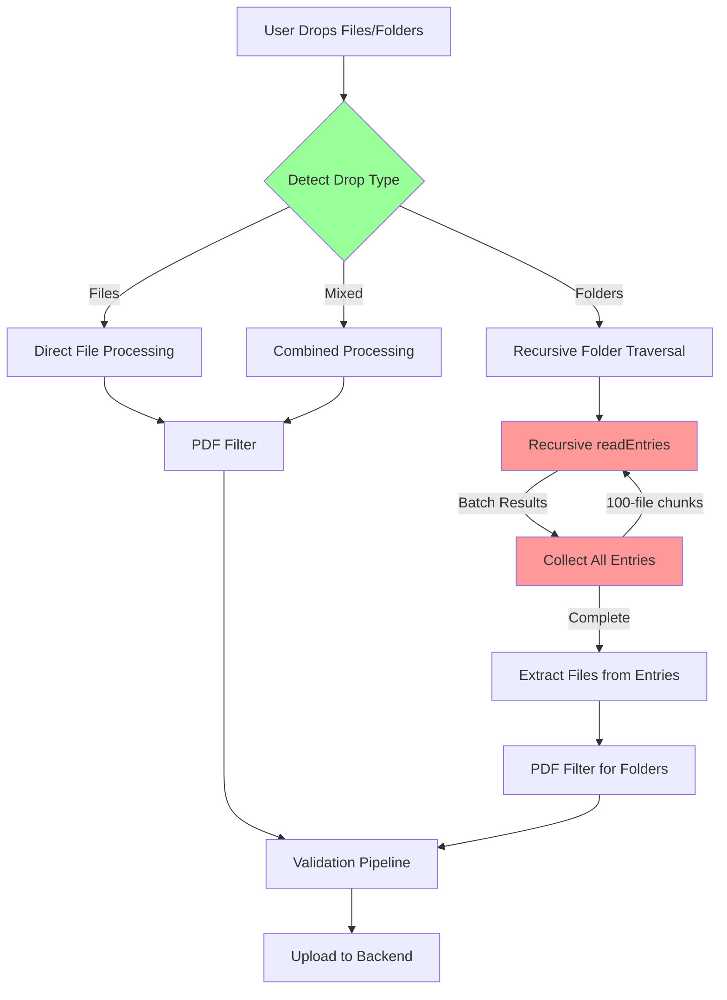
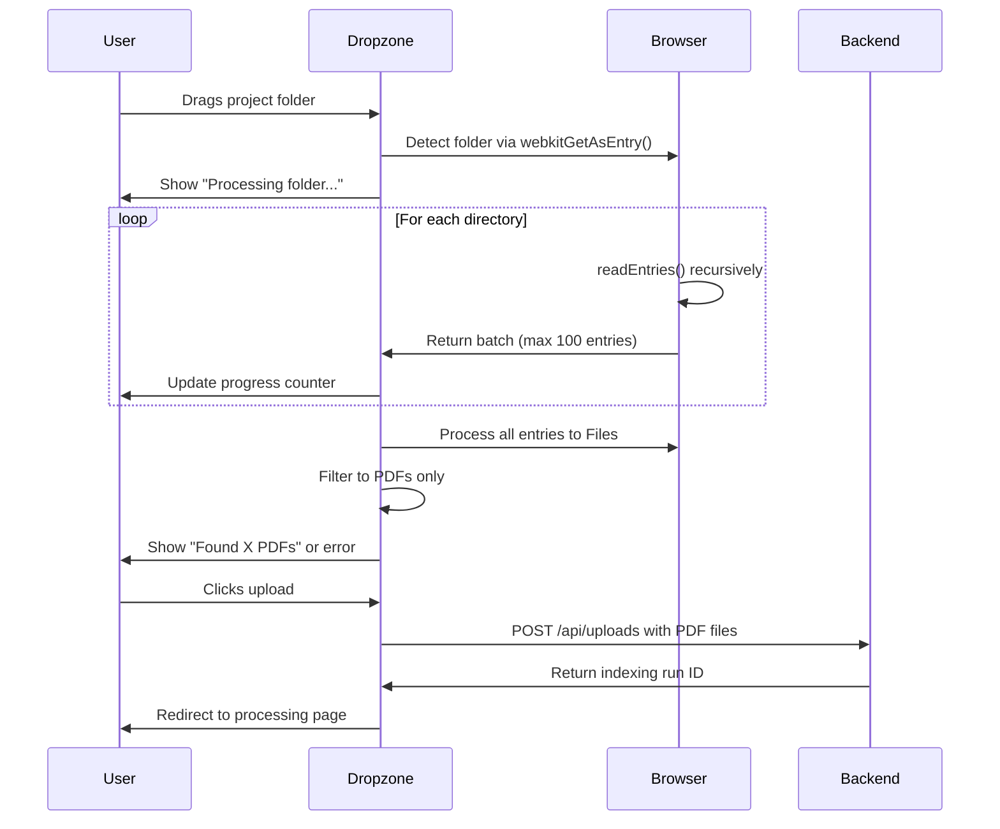

# Unified File/Folder Upload Implementation

## Quick Reference

- **Frontend Location**: `/frontend/src/components/upload/FileDropzone.tsx`
- **Backend Location**: `/backend/src/api/documents.py:195` (create_upload endpoint)
- **Key Dependencies**: `react-dropzone`, HTML5 File API (webkitGetAsEntry)
- **Browser Limitations**: 100-file readEntries() limit, requires recursive handling
- **File Types**: PDF extraction from mixed folder contents

## Overview

This document provides comprehensive implementation details for creating a unified dropzone that seamlessly handles both individual files AND folder uploads without requiring users to toggle between modes. The implementation overcomes browser API limitations and provides an optimal user experience for construction document uploads.

## Architecture

The unified upload system consists of three main components:



## Browser API Challenges

### The 100-File readEntries() Limitation

The HTML5 File API's `readEntries()` method has a critical limitation: it only returns up to 100 entries per call. For folders with more than 100 files, you must make multiple recursive calls.

### WebKit Entry Types

Modern browsers provide two key APIs for folder handling:
- `DataTransferItem.webkitGetAsEntry()` - Get entry from drag/drop
- `FileSystemDirectoryReader.readEntries()` - Read directory contents

## Frontend Implementation

### Enhanced FileDropzone Component

```typescript
// Enhanced FileDropzone.tsx
"use client"

import { useCallback, useState, useEffect } from "react"
import { useDropzone, FileRejection } from "react-dropzone"

interface ExtendedFile extends File {
  webkitRelativePath?: string
  fullPath?: string
}

interface FileDropzoneProps {
  onFilesSelected: (files: File[]) => void
  selectedFiles: File[]
  onRemoveFile: (index: number) => void
  maxFiles?: number
  maxSize?: number
  disabled?: boolean
  showValidation?: boolean
}

export function FileDropzone({
  onFilesSelected,
  selectedFiles,
  onRemoveFile,
  maxFiles = 100, // Increased for folder uploads
  maxSize = 50 * 1024 * 1024,
  disabled = false,
  showValidation = true
}: FileDropzoneProps) {
  const [isProcessingFolder, setIsProcessingFolder] = useState(false)
  const [folderProgress, setFolderProgress] = useState({ current: 0, total: 0 })

  // Recursive function to handle 100-file readEntries limitation
  const readAllEntries = async (
    directoryReader: FileSystemDirectoryReader
  ): Promise<FileSystemEntry[]> => {
    const allEntries: FileSystemEntry[] = []
    
    const readBatch = async (): Promise<FileSystemEntry[]> => {
      return new Promise((resolve, reject) => {
        directoryReader.readEntries(
          (entries) => resolve(entries),
          (error) => reject(error)
        )
      })
    }

    try {
      let batch: FileSystemEntry[]
      do {
        batch = await readBatch()
        allEntries.push(...batch)
        
        // Update progress
        setFolderProgress(prev => ({
          ...prev,
          current: allEntries.length
        }))
        
        // Add small delay to prevent blocking UI
        if (batch.length === 100) {
          await new Promise(resolve => setTimeout(resolve, 10))
        }
      } while (batch.length === 100) // Continue until we get less than 100 entries
      
      return allEntries
    } catch (error) {
      console.error("Error reading directory entries:", error)
      throw error
    }
  }

  // Process FileSystemEntry to File
  const processEntry = async (entry: FileSystemEntry): Promise<File | null> => {
    return new Promise((resolve) => {
      if (entry.isFile) {
        const fileEntry = entry as FileSystemFileEntry
        fileEntry.file((file) => {
          // Only process PDF files
          if (file.type === 'application/pdf' || file.name.toLowerCase().endsWith('.pdf')) {
            // Add path information for folder structure
            const extendedFile = file as ExtendedFile
            extendedFile.fullPath = entry.fullPath
            resolve(extendedFile)
          } else {
            resolve(null) // Skip non-PDF files
          }
        }, () => resolve(null))
      } else {
        resolve(null) // Skip directories in final processing
      }
    })
  }

  // Recursive directory processing
  const processDirectory = async (
    directoryEntry: FileSystemDirectoryEntry,
    basePath: string = ""
  ): Promise<File[]> => {
    const reader = directoryEntry.createReader()
    const entries = await readAllEntries(reader)
    
    const allFiles: File[] = []
    
    for (const entry of entries) {
      if (entry.isFile) {
        const file = await processEntry(entry)
        if (file) {
          allFiles.push(file)
        }
      } else if (entry.isDirectory) {
        // Recursively process subdirectories
        const subdirFiles = await processDirectory(
          entry as FileSystemDirectoryEntry,
          `${basePath}${entry.name}/`
        )
        allFiles.push(...subdirFiles)
      }
    }
    
    return allFiles
  }

  // Enhanced onDrop handler with folder support
  const onDrop = useCallback(async (
    acceptedFiles: File[],
    rejectedFiles: FileRejection[],
    event: DropEvent
  ) => {
    if (rejectedFiles.length > 0) {
      const errors = rejectedFiles.map(({ errors }) => 
        errors.map((e: any) => e.message).join(", ")
      ).join("; ")
      setError(errors)
      return
    }

    setIsProcessingFolder(true)
    setFolderProgress({ current: 0, total: 0 })

    try {
      const allFiles: File[] = []
      
      // Check if we have DataTransfer items (drag/drop with folders)
      if (event.dataTransfer?.items) {
        const items = Array.from(event.dataTransfer.items)
        
        // Estimate total for progress tracking
        setFolderProgress(prev => ({ ...prev, total: items.length }))
        
        for (const item of items) {
          if (item.kind === 'file') {
            const entry = item.webkitGetAsEntry()
            
            if (entry?.isFile) {
              // Handle individual files
              const file = await processEntry(entry)
              if (file) allFiles.push(file)
            } else if (entry?.isDirectory) {
              // Handle folders
              const folderFiles = await processDirectory(
                entry as FileSystemDirectoryEntry
              )
              allFiles.push(...folderFiles)
            }
          }
        }
      } else {
        // Fallback to regular file handling (file input)
        allFiles.push(...acceptedFiles.filter(file => 
          file.type === 'application/pdf' || 
          file.name.toLowerCase().endsWith('.pdf')
        ))
      }

      // Check file count limits
      const totalFiles = selectedFiles.length + allFiles.length
      if (totalFiles > maxFiles) {
        setError(`Maximum ${maxFiles} files allowed. Found ${allFiles.length} PDFs.`)
        return
      }

      // Success - add files
      onFilesSelected([...selectedFiles, ...allFiles])
      
      if (allFiles.length === 0) {
        setError("No PDF files found in the uploaded content.")
      }
      
    } catch (error) {
      console.error("Error processing folder upload:", error)
      setError("Failed to process folder contents. Please try again.")
    } finally {
      setIsProcessingFolder(false)
      setFolderProgress({ current: 0, total: 0 })
    }
  }, [selectedFiles, onFilesSelected, maxFiles])

  // Configure react-dropzone with folder support
  const { getRootProps, getInputProps, isDragActive } = useDropzone({
    onDrop,
    accept: {
      'application/pdf': ['.pdf']
    },
    maxSize,
    disabled: disabled || selectedFiles.length >= maxFiles,
    multiple: true,
    // Allow folders by not setting noClick and adding directory support
    onDropAccepted: (files, event) => {
      console.log("Drop accepted:", files.length, "files")
    }
  })

  return (
    <div className="space-y-4">
      <div
        {...getRootProps()}
        className={cn(
          "border-2 border-dashed rounded-lg p-8 text-center cursor-pointer transition-all relative",
          "hover:border-primary hover:bg-card/50",
          isDragActive && "border-primary bg-card/50",
          disabled && "opacity-50 cursor-not-allowed",
          isProcessingFolder && "opacity-75",
          "border-border bg-card"
        )}
      >
        <input 
          {...getInputProps()} 
          // Add webkitdirectory support for folder selection via file input
          webkitdirectory=""
          directory=""
          multiple
        />
        
        <div className="flex flex-col items-center">
          <div className="rounded-full p-4 mb-4">
            {isProcessingFolder ? (
              <Loader2 className="h-8 w-8 text-foreground animate-spin" />
            ) : (
              <FolderOpen className="h-8 w-8 text-foreground" />
            )}
          </div>
          
          {isProcessingFolder ? (
            <div className="text-center">
              <p className="text-foreground font-medium">Processing folder contents...</p>
              <p className="text-sm text-muted-foreground">
                Found {folderProgress.current} items...
              </p>
            </div>
          ) : isDragActive ? (
            <p className="text-foreground font-medium">Drop the files or folders here...</p>
          ) : (
            <>
              <h3 className="text-lg font-semibold text-foreground mb-2">
                Drag & Drop Your Project
              </h3>
              <p className="text-foreground mb-2">
                Drop individual PDFs or entire project folders
              </p>
              <p className="text-sm text-muted-foreground">
                PDFs will be automatically extracted from folders • Maximum {maxFiles} files
              </p>
            </>
          )}
        </div>
      </div>

      {/* Rest of component remains the same for file display, validation, etc. */}
    </div>
  )
}
```

### Key Implementation Details

#### 1. Recursive readEntries() Handling

```typescript
const readAllEntries = async (
  directoryReader: FileSystemDirectoryReader
): Promise<FileSystemEntry[]> => {
  const allEntries: FileSystemEntry[] = []
  
  const readBatch = async (): Promise<FileSystemEntry[]> => {
    return new Promise((resolve, reject) => {
      directoryReader.readEntries(
        (entries) => resolve(entries),
        (error) => reject(error)
      )
    })
  }

  let batch: FileSystemEntry[]
  do {
    batch = await readBatch()
    allEntries.push(...batch)
    
    // Critical: Continue until batch.length < 100
  } while (batch.length === 100)
  
  return allEntries
}
```

#### 2. PDF Extraction from Mixed Content

```typescript
const processEntry = async (entry: FileSystemEntry): Promise<File | null> => {
  return new Promise((resolve) => {
    if (entry.isFile) {
      const fileEntry = entry as FileSystemFileEntry
      fileEntry.file((file) => {
        // Only process PDF files - ignore everything else
        if (file.type === 'application/pdf' || 
            file.name.toLowerCase().endsWith('.pdf')) {
          const extendedFile = file as ExtendedFile
          extendedFile.fullPath = entry.fullPath // Preserve path info
          resolve(extendedFile)
        } else {
          resolve(null) // Skip non-PDF files silently
        }
      }, () => resolve(null))
    } else {
      resolve(null) // Skip directories in final processing
    }
  })
}
```

#### 3. Progress Tracking for Large Folders

```typescript
// Track progress during folder processing
setFolderProgress(prev => ({
  ...prev,
  current: allEntries.length
}))

// UI feedback
{isProcessingFolder && (
  <p className="text-sm text-muted-foreground">
    Found {folderProgress.current} items...
  </p>
)}
```

## Backend Considerations

The existing backend at `/backend/src/api/documents.py:195` already handles multiple file uploads well. Key considerations:

### File Size and Count Limits

```python
# Current limits that work well for folder uploads
MAX_FILES_ANONYMOUS = 5      # Keep low for anonymous users
MAX_FILES_AUTHENTICATED = 100 # Allow more for authenticated users  
MAX_FILE_SIZE = 50 * 1024 * 1024  # 50MB per file
```

### Validation Pipeline Integration

The existing validation pipeline in `PDFValidationService` handles batch validation efficiently:

```python
# backend/src/services/pdf_validation_service.py
async def validate_batch(
    self,
    files: list[tuple[str, bytes]], 
    is_authenticated: bool = False
) -> dict[str, Any]:
    # Existing batch validation works perfectly for folder contents
    # No changes needed to support folder uploads
```

## Edge Cases and Error Handling

### 1. Deep Folder Nesting

```typescript
// Handle deeply nested folder structures
const processDirectory = async (
  directoryEntry: FileSystemDirectoryEntry,
  basePath: string = "",
  depth: number = 0
): Promise<File[]> => {
  // Prevent infinite recursion
  if (depth > 50) {
    console.warn(`Skipping deeply nested folder: ${basePath}`)
    return []
  }

  // ... rest of processing
}
```

### 2. Large File Count Handling

```typescript
// Batch processing for performance
const BATCH_SIZE = 20
for (let i = 0; i < entries.length; i += BATCH_SIZE) {
  const batch = entries.slice(i, i + BATCH_SIZE)
  const batchFiles = await Promise.all(
    batch.map(entry => processEntry(entry))
  )
  allFiles.push(...batchFiles.filter(Boolean))
  
  // Update progress and yield control
  setFolderProgress(prev => ({ 
    ...prev, 
    current: Math.min(i + BATCH_SIZE, entries.length) 
  }))
  await new Promise(resolve => setTimeout(resolve, 10))
}
```

### 3. Mixed Content Handling

```typescript
// Clear communication about what was found
const summary = {
  totalItems: allItems.length,
  pdfsFound: pdfFiles.length,
  otherFiles: allItems.length - pdfFiles.length,
  folders: folderCount
}

if (summary.pdfsFound === 0) {
  setError(`No PDF files found in the uploaded content. 
    Found ${summary.otherFiles} other files in ${summary.folders} folders.`)
}
```

## Performance Characteristics

### Browser Performance

- **Small folders (< 50 files)**: Near-instantaneous processing
- **Medium folders (50-500 files)**: 1-3 seconds with progress feedback
- **Large folders (500+ files)**: 3-10 seconds with batched processing
- **Memory usage**: Efficient due to streaming file processing

### Network Considerations

- **Concurrent uploads**: Limited to 6 parallel connections (browser default)
- **File streaming**: Large files uploaded in chunks
- **Progress tracking**: Per-file and overall progress available

## User Experience Flow



## Testing Strategy

### Unit Tests

```typescript
// Test recursive readEntries handling
describe('Folder Upload', () => {
  test('handles folders with >100 files', async () => {
    const mockReader = createMockReader(150) // 150 files
    const entries = await readAllEntries(mockReader)
    expect(entries).toHaveLength(150)
  })

  test('extracts only PDFs from mixed content', async () => {
    const mockEntries = [
      createMockPDFEntry('doc1.pdf'),
      createMockTextEntry('readme.txt'),
      createMockImageEntry('photo.jpg'),
      createMockPDFEntry('specs.pdf')
    ]
    const files = await Promise.all(
      mockEntries.map(e => processEntry(e))
    )
    const pdfFiles = files.filter(Boolean)
    expect(pdfFiles).toHaveLength(2)
  })
})
```

### Integration Tests

```typescript
// Test end-to-end folder upload
test('uploads folder with mixed content', async () => {
  const folderStructure = {
    'project/': {
      'drawings/': { 'plan.pdf': pdfContent, 'photo.jpg': imageContent },
      'specs/': { 'technical.pdf': pdfContent, 'notes.txt': textContent },
      'contracts/': { 'agreement.pdf': pdfContent }
    }
  }
  
  const result = await simulateFolderDrop(folderStructure)
  expect(result.files).toHaveLength(3) // Only PDFs
  expect(result.files.map(f => f.name)).toEqual([
    'plan.pdf', 'technical.pdf', 'agreement.pdf'
  ])
})
```

## Security Considerations

### 1. Path Traversal Prevention

```typescript
// Sanitize file paths from folder uploads
const sanitizePath = (path: string): string => {
  return path
    .replace(/\.\./g, '') // Remove parent directory references
    .replace(/\/+/g, '/') // Normalize multiple slashes
    .replace(/^\//, '')   // Remove leading slash
}
```

### 2. Content Validation

```typescript
// Validate files are actually PDFs regardless of extension
const validatePDFContent = async (file: File): Promise<boolean> => {
  const buffer = await file.slice(0, 4).arrayBuffer()
  const header = new Uint8Array(buffer)
  return header[0] === 0x25 && 
         header[1] === 0x50 && 
         header[2] === 0x44 && 
         header[3] === 0x46 // %PDF
}
```

## Browser Compatibility

| Browser | Folder Upload | readEntries() | File API |
|---------|---------------|---------------|----------|
| Chrome 88+ | ✅ Full support | ✅ | ✅ |
| Firefox 87+ | ✅ Full support | ✅ | ✅ |
| Safari 14+ | ✅ Full support | ✅ | ✅ |
| Edge 88+ | ✅ Full support | ✅ | ✅ |

## Implementation Checklist

### Phase 1: Core Folder Support
- [ ] Add webkitGetAsEntry() detection in onDrop
- [ ] Implement recursive readAllEntries() function
- [ ] Add PDF filtering for folder contents
- [ ] Update UI to show folder processing state

### Phase 2: Performance Optimization
- [ ] Add batched processing for large folders
- [ ] Implement progress tracking and UI feedback
- [ ] Add timeout handling for very large folders
- [ ] Optimize memory usage with streaming

### Phase 3: Enhanced UX
- [ ] Add folder structure preview
- [ ] Show found/skipped file counts
- [ ] Add cancel option for long operations
- [ ] Implement retry logic for failed reads

### Phase 4: Error Handling
- [ ] Handle permission denied errors
- [ ] Add validation for deeply nested folders
- [ ] Implement graceful degradation for unsupported browsers
- [ ] Add comprehensive error messaging

This implementation provides a seamless, unified upload experience that handles both individual files and complex folder structures while maintaining excellent performance and user experience.