# ConstructionRAG System Architecture Overview

## Table of Contents
1. [System Overview](#system-overview)
2. [High-Level Architecture](#high-level-architecture)
3. [Backend Architecture](#backend-architecture)
4. [Pipeline Architecture](#pipeline-architecture)
5. [Data Flow](#data-flow)
6. [Security & Access Control](#security--access-control)
7. [Storage Architecture](#storage-architecture)
8. [Frontend Architecture](#frontend-architecture)
9. [Deployment Architecture](#deployment-architecture)
10. [Integration Points](#integration-points)

## System Overview

ConstructionRAG is an AI-powered construction document processing and Q&A system that combines document indexing, semantic search, and intelligent question answering. The system processes construction documents (PDFs) through multiple AI-powered pipelines to create searchable knowledge bases and generate comprehensive wikis.

### Key Components
- **Document Processing Pipeline**: Multi-stage AI processing for PDF documents
- **Vector Database**: Supabase with pgvector for semantic search
- **Query Pipeline**: Intelligent question answering with context retrieval
- **Wiki Generation**: Automated wiki creation from processed documents
- **Web Interface**: Streamlit-based frontend for user interaction

## High-Level Architecture

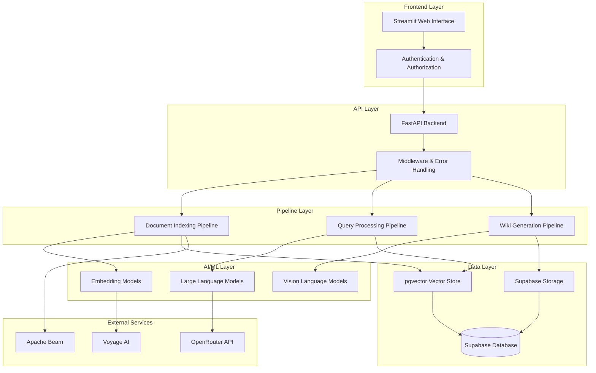

## Backend Architecture

### FastAPI Application Structure

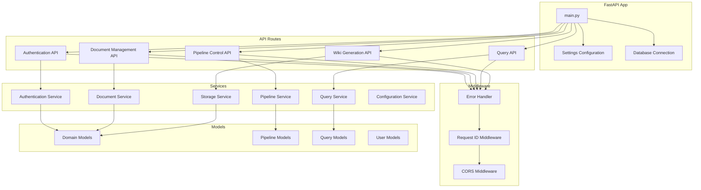

## Pipeline Architecture

### Document Indexing Pipeline

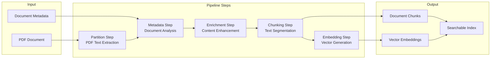

### Query Processing Pipeline

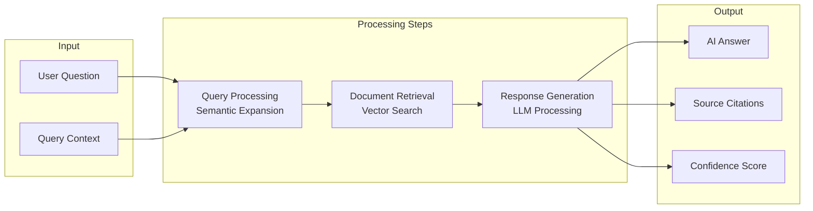

### Wiki Generation Pipeline

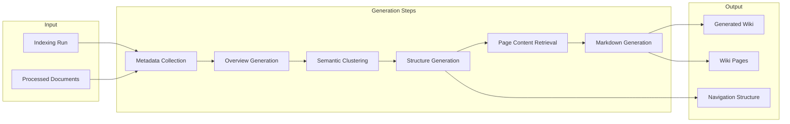

## Data Flow

### Document Processing Flow

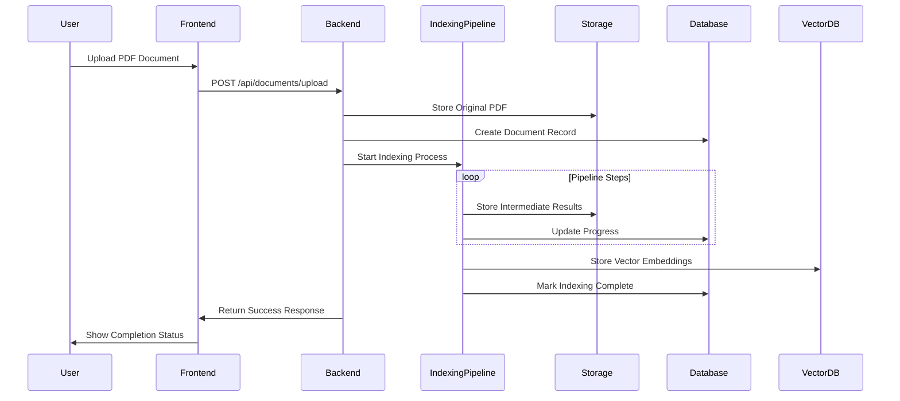

### Query Processing Flow

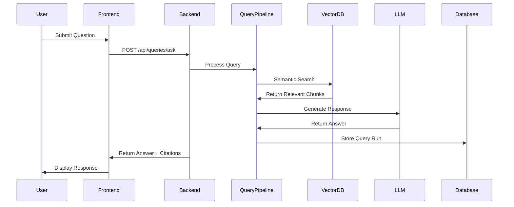

## Security & Access Control

### Authentication & Authorization Flow

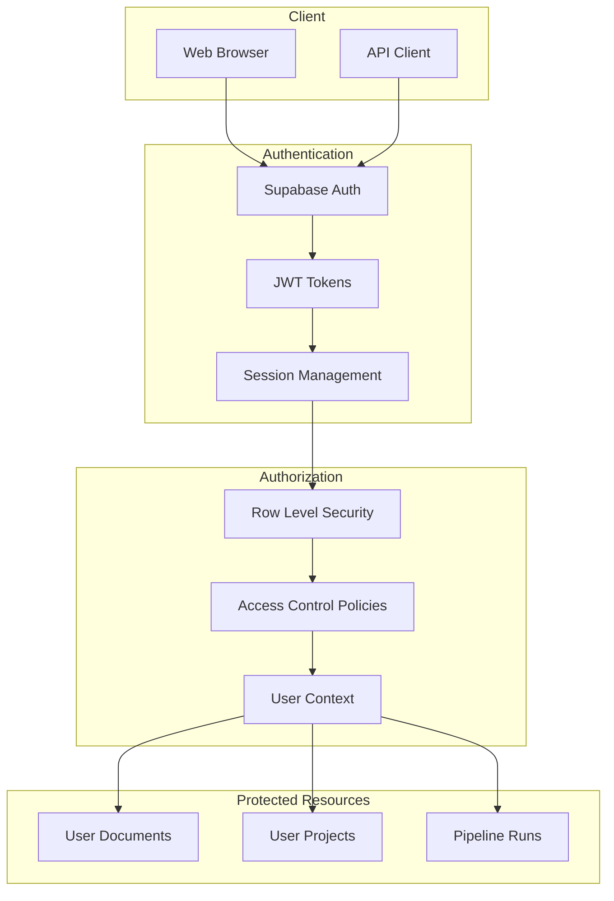

### Access Control Matrix

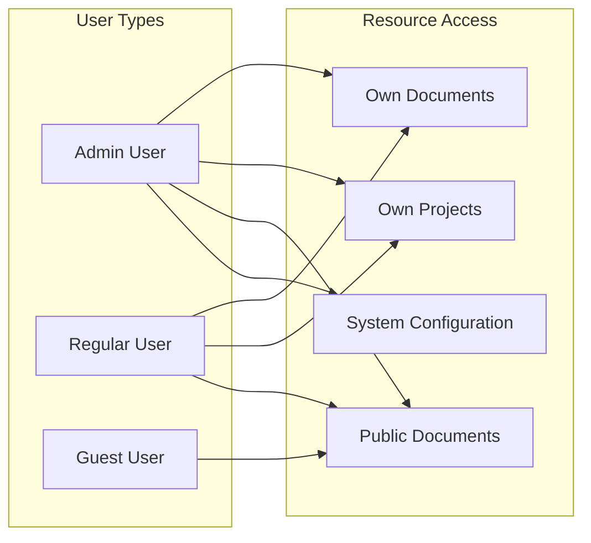

## Storage Architecture

### Supabase Storage Structure

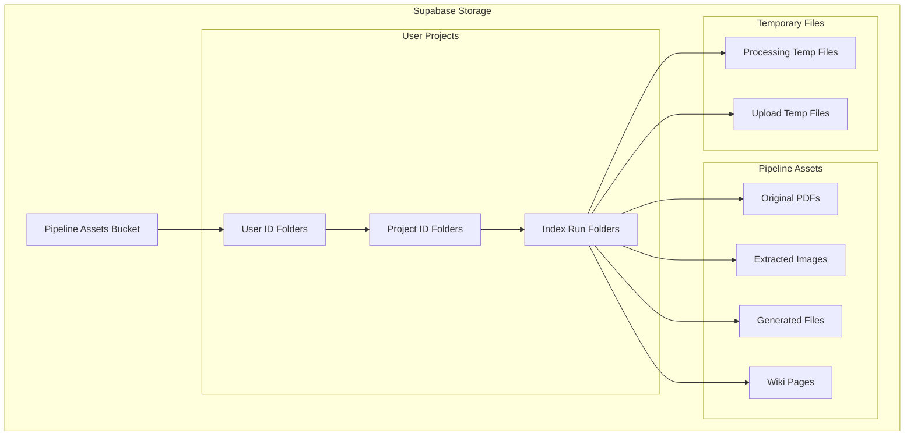

### Database Schema Overview

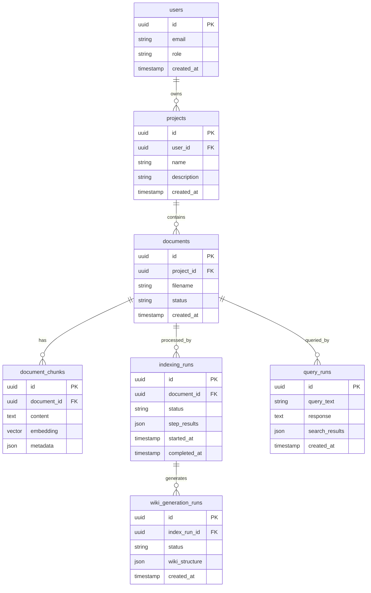

## Frontend Architecture

### Streamlit Application Structure

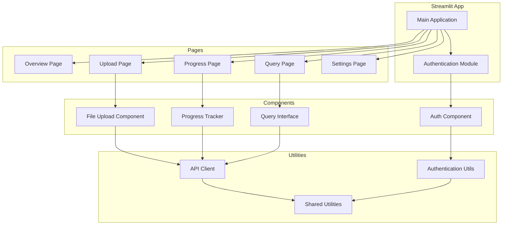

## Deployment Architecture

### System Deployment

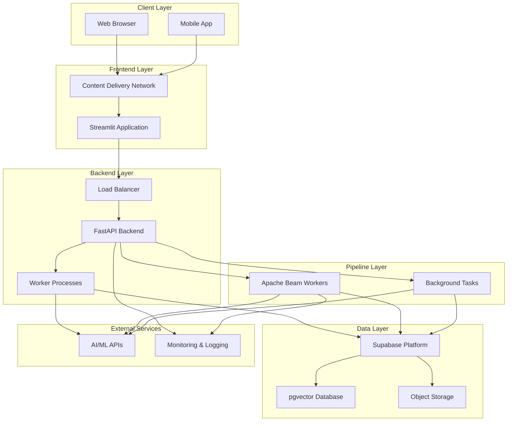

## Integration Points

### External API Integrations

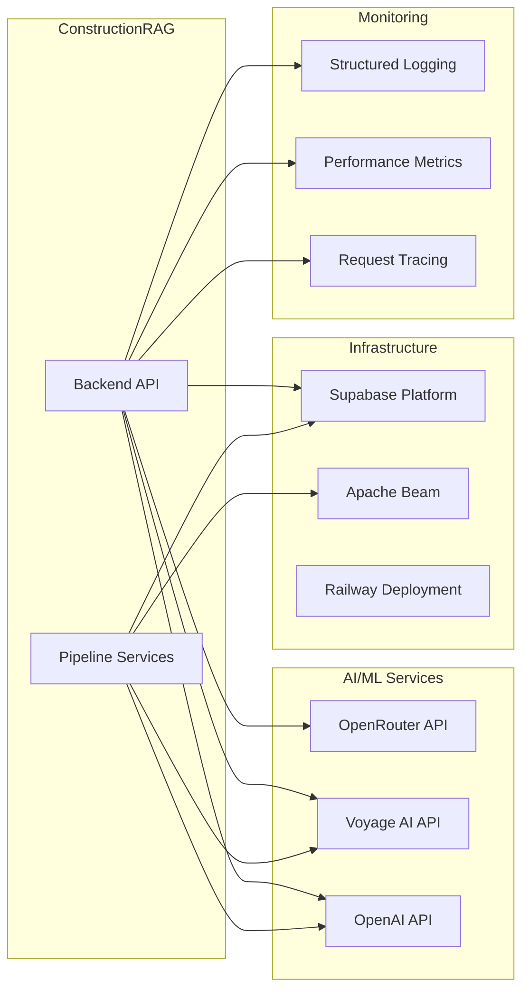

### Configuration Management

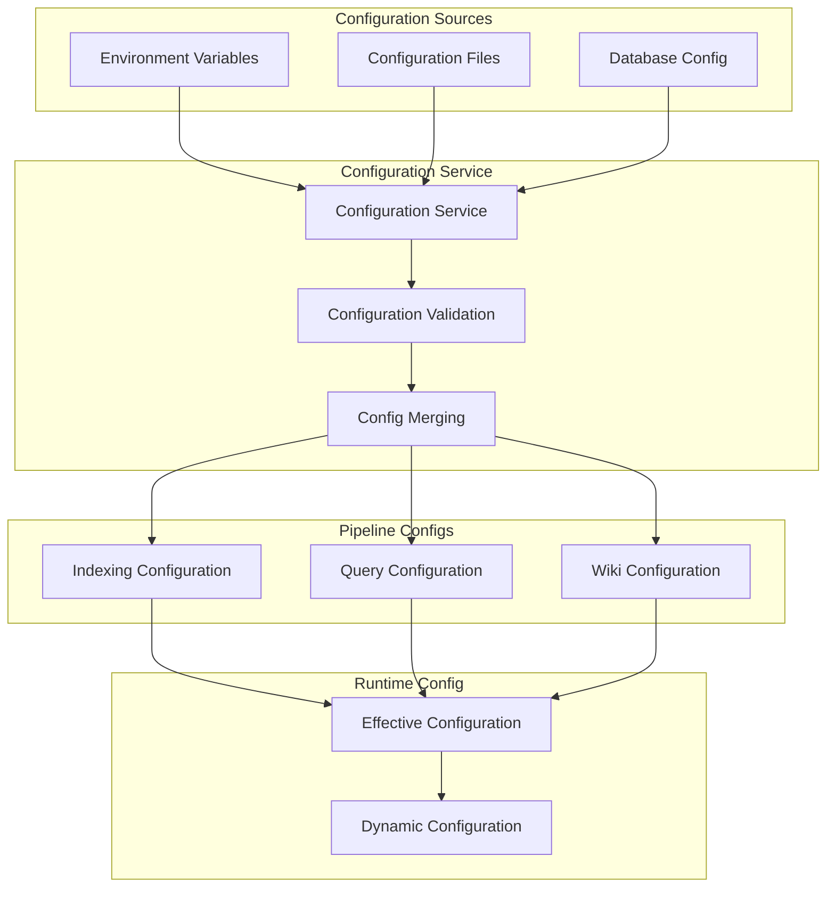

## Key Technical Decisions

### Architecture Patterns
- **Pipeline Pattern**: Modular, configurable processing steps
- **Orchestrator Pattern**: Centralized pipeline coordination
- **Service Layer**: Business logic separation from API layer
- **Repository Pattern**: Data access abstraction
- **Factory Pattern**: Dynamic pipeline step creation

### Technology Choices
- **Backend**: FastAPI for high-performance async API
- **Database**: Supabase with pgvector for vector operations
- **Storage**: Supabase Storage for file management
- **AI/ML**: OpenRouter for LLM access, Voyage AI for embeddings
- **Frontend**: Streamlit for rapid prototyping and deployment
- **Processing**: Apache Beam for scalable data processing
- **Authentication**: Supabase Auth with JWT tokens

### Scalability Considerations
- **Async Processing**: Background tasks for long-running operations
- **Vector Database**: Efficient similarity search with pgvector
- **Configurable Pipelines**: Dynamic pipeline composition
- **Storage Optimization**: Hierarchical storage structure
- **Caching Strategy**: Intelligent result caching

This architecture provides a robust foundation for AI-powered document processing while maintaining flexibility for future enhancements and scaling requirements.
