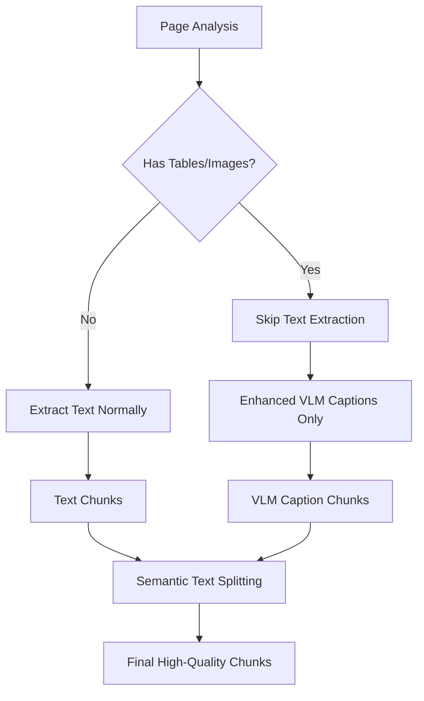

# Implementation Guide: Skip Text Extraction & Enhance VLM Prompts

## Overview
This guide provides specific code changes to skip fragmented text extraction on pages with tables/images while enhancing VLM prompts to capture all textual content. This optimization eliminates low-quality chunks and ensures high-quality VLM captions are properly processed.

## Problem Statement
Currently, the pipeline extracts both fragmented text AND VLM captions from pages with visual content, creating:
- Low-quality text chunks from fragmented OCR
- Redundant content (text + VLM captions of the same content)
- Poor semantic chunking due to fragmented text

## Solution Architecture



## Implementation Changes

### 1. Skip Text Extraction in PyMuPDF Path

**File:** `backend/src/pipeline/indexing/steps/partition.py`

**Location:** `UnifiedPartitionerV2.stage2_fast_text_extraction()` method (around line 1456)

**Current Logic:**
```python
def stage2_fast_text_extraction(self, filepath):
    """Stage 2: PyMuPDF text extraction (replacing unstructured)"""
    logger.info("Stage 2: PyMuPDF text extraction...")

    doc = fitz.open(filepath)
    text_elements = []
    raw_elements = []

    for page_num in range(len(doc)):
        page = doc[page_num]
        page_index = page_num + 1  # 1-indexed

        # Get text blocks with detailed metadata
        try:
            text_dict = page.get_text("dict")
        except Exception as text_error:
            logger.warning(f"Could not extract text dict from page {page_index}: {text_error}")
            text_dict = {"blocks": []}
```

**Enhanced Logic:**
```python
def stage2_fast_text_extraction(self, filepath):
    """Stage 2: PyMuPDF text extraction with visual page skipping"""
    logger.info("Stage 2: PyMuPDF text extraction...")

    doc = fitz.open(filepath)
    text_elements = []
    raw_elements = []
    
    # Get page analysis from stage1 results (passed as instance variable)
    page_analysis = getattr(self, '_stage1_results', {}).get('page_analysis', {})

    for page_num in range(len(doc)):
        page = doc[page_num]
        page_index = page_num + 1  # 1-indexed

        # CHECK: Skip text extraction if page has visual content that needs VLM processing
        page_info = page_analysis.get(page_index, {})
        if page_info.get('needs_extraction', False):
            logger.info(f"🔄 SKIPPING text extraction on page {page_index} - will be handled by VLM captions")
            print(f"🔄 BEAM: SKIPPING text extraction on page {page_index} - has visual content")
            continue

        # Get text blocks with detailed metadata (existing logic continues...)
        try:
            text_dict = page.get_text("dict")
        except Exception as text_error:
            logger.warning(f"Could not extract text dict from page {page_index}: {text_error}")
            text_dict = {"blocks": []}
```

**Required Modification to `stage1_pymupdf_analysis()`:**
Store stage1 results in instance variable for stage2 access:

```python
def stage1_pymupdf_analysis(self, filepath):
    # ... existing logic ...
    
    results = {
        "page_analysis": page_analysis,
        "table_locations": table_locations,
        "image_locations": image_locations,
        "document_metadata": document_metadata,
    }
    
    # Store for stage2 access
    self._stage1_results = results
    
    return results
```

### 2. Skip Text Extraction in Unstructured Path

**File:** `backend/src/pipeline/indexing/steps/partition.py`

**Location:** `_normalize_unstructured_output()` method (around line 232)

**Current Logic:**
```python
# Process each element from Unstructured OCR
for element in elements:
    # Create normalized element matching current schema
    # Handle None page numbers from Unstructured by assigning to page 1
    page_number = getattr(element.metadata, "page_number", None)
    if page_number is None:
        page_number = 1
```

**Enhanced Logic:**
```python
# Get page analysis for filtering
page_analysis = {}
# Try to extract from stage1 if available
doc = fitz.open(filepath)
# Quick page analysis to identify visual pages
for page_num in range(len(doc)):
    page = doc[page_num]
    page_index = page_num + 1
    images = page.get_images()
    try:
        table_finder = page.find_tables()
        tables = list(table_finder)
    except:
        tables = []
    
    # Determine if page has significant visual content
    meaningful_images = self._count_meaningful_images(doc, page, images)
    needs_vlm_extraction = meaningful_images >= 2 or len(tables) > 0
    page_analysis[page_index] = {'needs_extraction': needs_vlm_extraction}
doc.close()

# Process each element from Unstructured OCR
for element in elements:
    # Create normalized element matching current schema
    page_number = getattr(element.metadata, "page_number", None)
    if page_number is None:
        page_number = 1

    # CHECK: Skip text elements from pages that will be handled by VLM
    if (element.category not in ["Table"] and 
        page_analysis.get(page_number, {}).get('needs_extraction', False)):
        logger.info(f"🔄 SKIPPING Unstructured text element on page {page_number} - will be handled by VLM")
        continue
```

### 3. Enhance VLM Table Image Prompt

**File:** `backend/src/pipeline/indexing/steps/enrichment.py`

**Location:** `ConstructionVLMCaptioner.caption_table_image_async()` method (around line 65)

**Current Prompt:**
```python
prompt = f"""You are analyzing a table image extracted from page {page_num} of a construction/technical document ({source_file}).{focus_hint}

Please provide a comprehensive description that captures:

1. **All Visible Text**: Read and transcribe ALL text visible in the table, including headers, data, footnotes.
2. **Table Structure**: Number of rows, columns, organization
3. **Data Relationships**: How the data is organized and what it represents

IMPORTANT: Please provide your detailed description in {self.caption_language}."""
```

**Enhanced Prompt:**
```python
prompt = f"""You are analyzing a table image extracted from page {page_num} of a construction/technical document ({source_file}).{focus_hint}

Please provide a comprehensive description that captures ALL content on this section of the page:

1. **All Visible Text in Table**: Read and transcribe ALL text visible in the table, including headers, data, footnotes, cell contents.
2. **Table Structure**: Number of rows, columns, organization, table borders and layout
3. **Data Relationships**: How the data is organized and what it represents
4. **Surrounding Text**: Any text labels, captions, references, or annotations around the table
5. **Technical Details**: Any measurements, specifications, material references, or technical codes visible

Focus on being extremely thorough - capture every piece of text and technical information visible in this image, as this will be the only source of this content.

IMPORTANT: Please provide your detailed description in {self.caption_language}."""
```

### 4. Enhance VLM Full-Page Image Prompt

**File:** `backend/src/pipeline/indexing/steps/enrichment.py`

**Location:** `ConstructionVLMCaptioner.caption_full_page_image_async()` method (around line 111)

**Current Prompt:**
```python
prompt = f"""You are analyzing a full-page image from page {page_num} of a construction/technical document ({source_file}). This page has {complexity} visual complexity. It may contain diagrams, technical drawings, tables, and text, but you should focus on the area that has the image associated.

Please provide an detailed description that captures:
1. All the text associated with the image. Any annotation, measurement, label, note, legend, or technical detail.
2. The technical drawing details - what type of drawing, what elements are shown, dimensions, materials, etc.
3. The spatial relationships - how different parts relate or connect.
4. Any pointers or annotations - what specific elements are being highlighted or called out.
5. Any building materials, construction techniques, or technical standards mentioned.

{context_section}

IMPORTANT: Please provide your comprehensive description in {self.caption_language}."""
```

**Enhanced Prompt:**
```python
prompt = f"""You are analyzing a full-page image from page {page_num} of a construction/technical document ({source_file}). This page has {complexity} visual complexity and contains visual content that requires comprehensive text extraction.

This image is the PRIMARY SOURCE for all text content on this page. Please provide an extremely detailed description that captures:

1. **ALL Text Content**: Extract and transcribe ALL visible text including:
   - Headers, titles, and section headings
   - Body text, paragraphs, and descriptions  
   - Table content, data, and headers
   - Labels, annotations, and callouts
   - Measurements, dimensions, and specifications
   - Material references and technical codes
   - Footnotes, legends, and captions

2. **Technical Drawing Details**: What type of drawing, elements shown, dimensions, materials, construction details

3. **Spatial Relationships**: How different parts relate, connect, or reference each other

4. **Visual Context**: How text relates to diagrams, what the visual elements represent

5. **Construction-Specific Information**: Building materials, techniques, standards, compliance codes

Read this page as if you are digitizing all text content - be extremely thorough as this VLM caption will replace any OCR text extraction.

{context_section}

IMPORTANT: Please provide your comprehensive description in {self.caption_language}."""
```

### 5. Verify Semantic Text Splitting

**File:** `backend/src/pipeline/indexing/steps/chunking.py`

**Location:** `IntelligentChunker.extract_text_content()` method (around line 113)

**Current Logic (already correct):**
```python
def extract_text_content(self, el: dict, extracted_meta: dict = None) -> str:
    """Extract text content from element, prioritizing VLM captions for tables/images"""

    # Check if this element has VLM enrichment metadata
    enrichment_meta = el.get("enrichment_metadata")
    if enrichment_meta and self.prioritize_vlm_captions:
        # For tables, use VLM image caption if available
        if el.get("element_type") == "table" or el.get("category") == "Table":
            # Use image caption for tables (HTML captions removed)
            if enrichment_meta.get("table_image_caption"):
                return enrichment_meta["table_image_caption"]

        # For full-page images, use VLM caption
        elif (
            el.get("element_type") == "full_page_image"
            or el.get("content_type") == "full_page_with_images"
        ):
            if enrichment_meta.get("full_page_image_caption"):
                return enrichment_meta["full_page_image_caption"]
```

**Verification:** This logic is already correct and will properly extract VLM captions for semantic text splitting.

**Location:** `apply_semantic_text_splitting_to_chunks()` method (around line 516)

**Current Logic (already correct):**
```python
def apply_semantic_text_splitting_to_chunks(self, chunks: List[Dict[str, Any]]) -> tuple[List[Dict[str, Any]], Dict[str, Any]]:
    """Apply semantic text splitting to composed chunks that exceed max_chunk_size"""
    if self.strategy != "semantic" or RecursiveCharacterTextSplitter is None:
        logger.info("Semantic splitting disabled or langchain not available")
        return chunks, {"semantic_splitting_enabled": False}
        
    logger.info(f"Applying semantic text splitting to chunks larger than {self.max_chunk_size} characters...")
    
    # Initialize text splitter
    text_splitter = RecursiveCharacterTextSplitter(
        chunk_size=self.chunk_size,
        chunk_overlap=self.overlap,
        separators=self.separators,
        length_function=len,
        is_separator_regex=False,
    )
```

**Verification:** This logic is correct and will properly split VLM captions using semantic boundaries.

## Implementation Checklist

- [ ] **PyMuPDF Path**: Add page analysis check in `stage2_fast_text_extraction()` to skip text extraction on visual pages
- [ ] **PyMuPDF Path**: Store stage1 results in instance variable for stage2 access
- [ ] **Unstructured Path**: Add page analysis and text element filtering in `_normalize_unstructured_output()`  
- [ ] **Table VLM Prompt**: Enhance prompt to capture surrounding text and be more comprehensive
- [ ] **Full-Page VLM Prompt**: Enhance prompt to emphasize complete text extraction responsibility
- [ ] **Semantic Splitting**: Verify VLM captions are properly processed (already working)

## Expected Outcome

After implementation:

1. **Pages with tables/images** → No fragmented text chunks → Only high-quality VLM captions → Properly split into semantic chunks
2. **Pure text pages** → Continue working exactly as before  
3. **No config changes required** → Pipeline behavior automatically optimized
4. **No data format changes** → Existing downstream processing unchanged

## Testing Strategy

1. **Before/After Comparison**: Process same document and compare chunk quality
2. **Visual Page Validation**: Ensure pages with `needs_extraction=True` have no OCR text elements
3. **VLM Caption Quality**: Verify enhanced prompts capture comprehensive text content
4. **Semantic Splitting**: Confirm VLM captions are properly split into chunks
5. **Pure Text Pages**: Ensure text-only pages continue working normally

## Monitoring

Add logging to track the optimization:
- Pages skipped for text extraction
- VLM caption lengths (should be longer and more comprehensive)
- Chunk quality metrics before/after changes
- Processing time impact (should be minimal)