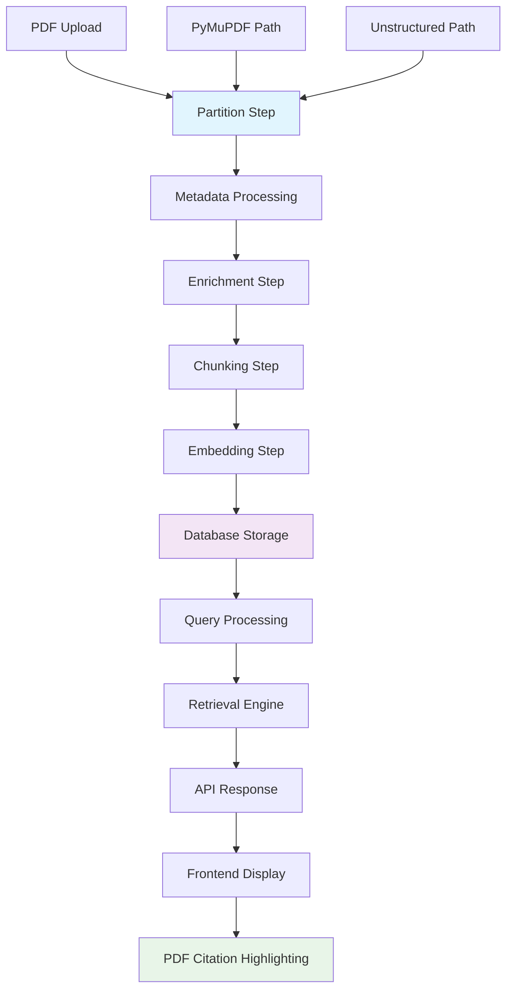
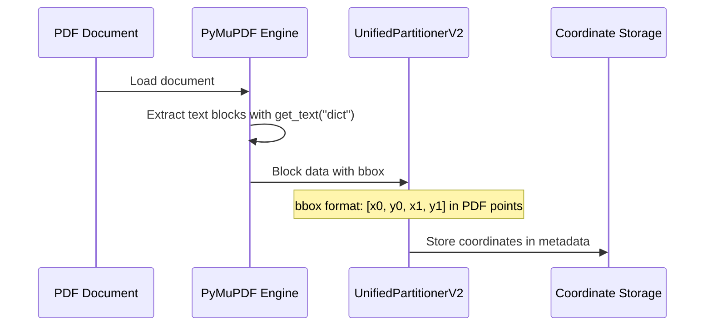
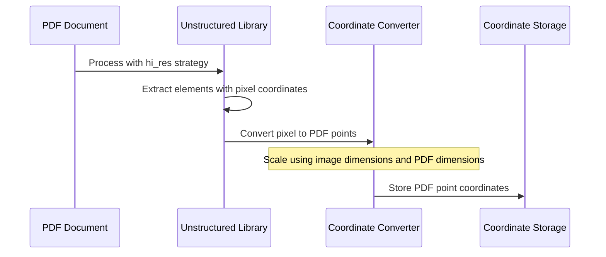
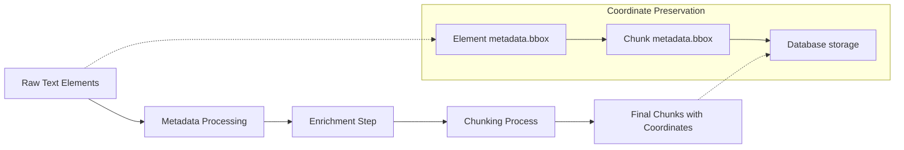
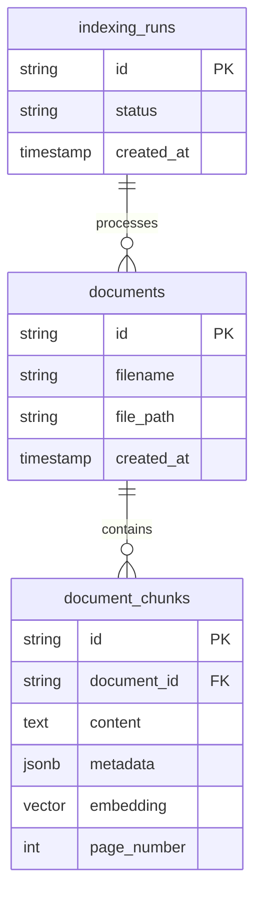
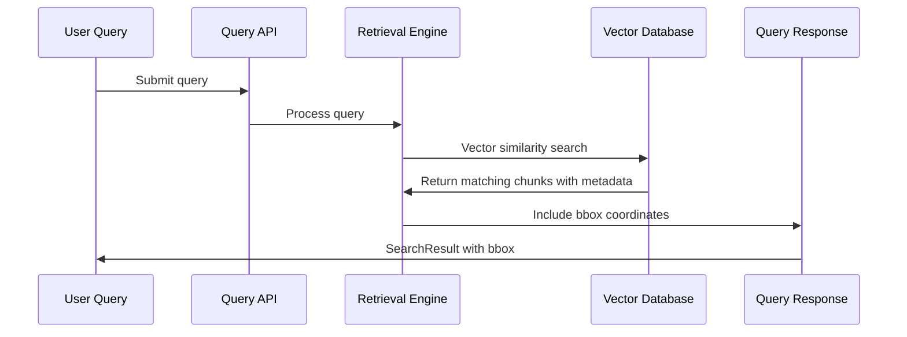
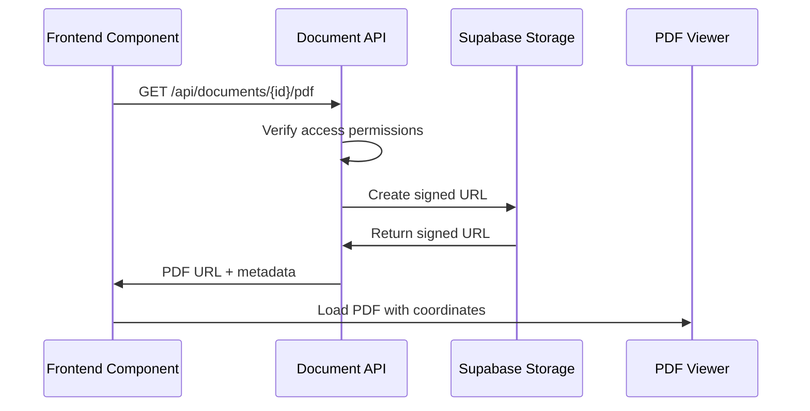
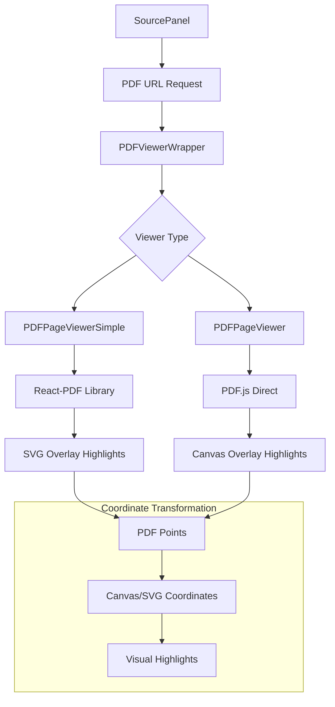
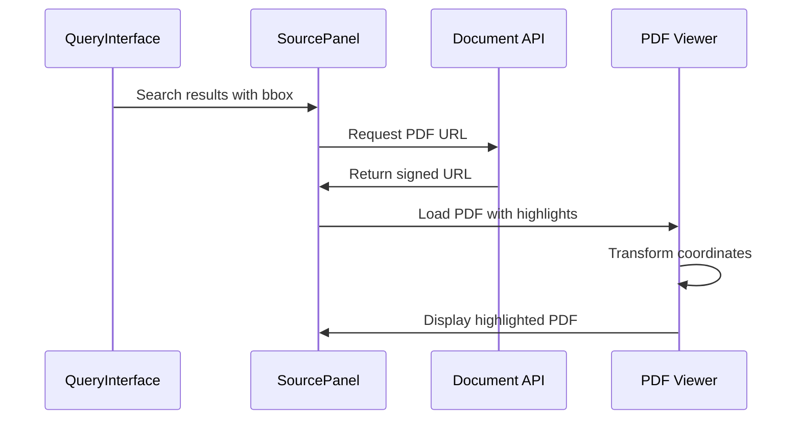
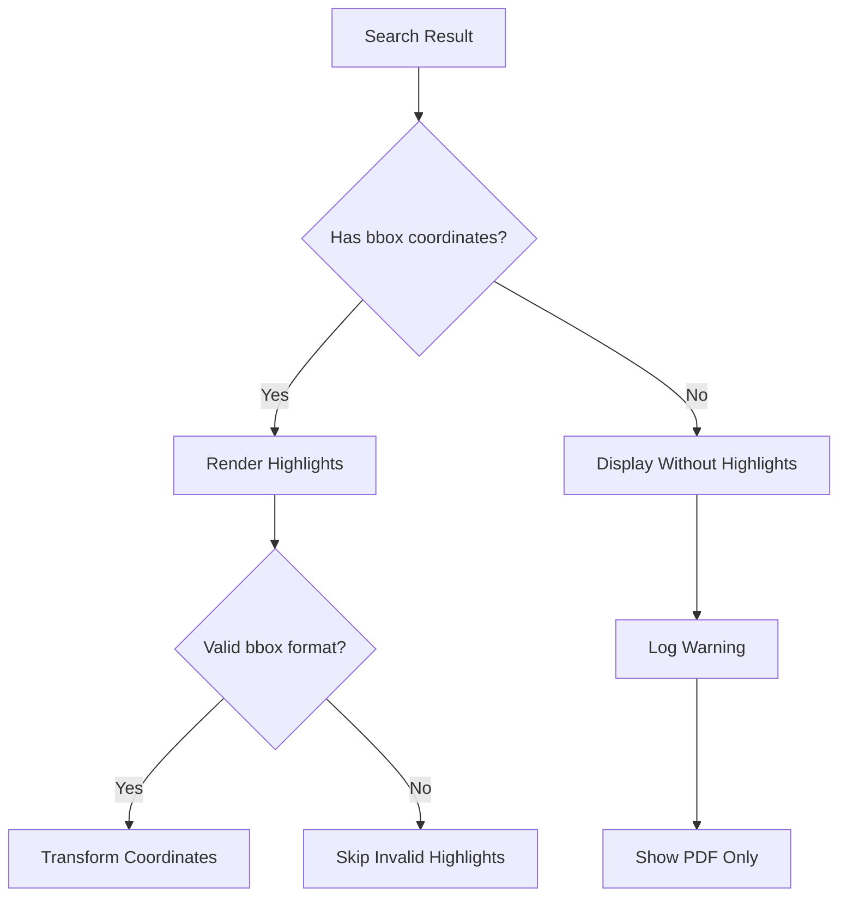

# Source Citation Viewer System

## Overview

The Source Citation Viewer System in ConstructionRAG enables precise highlighting of source content within PDF documents by extracting, storing, and visualizing bounding box coordinates throughout the entire pipeline. This system provides users with exact visual citations that link AI-generated responses back to specific locations in the original construction documents.

## System Architecture

The citation system follows a complete pipeline from document processing to frontend visualization:



## Component Data Flow

### 1. Bounding Box Coordinate Extraction

The system supports two extraction pathways during the partition step:

#### PyMuPDF Extraction Path


**PyMuPDF Coordinate Extraction (Lines 1469-1517 in partition.py):**
- Uses `page.get_text("dict")` to extract text blocks with precise coordinates
- Each text block contains `bbox` coordinates in PDF coordinate system (points)
- Coordinates stored in element metadata as `[x0, y0, x1, y1]` format
- PDF coordinate system: origin at bottom-left, measured in points (1/72 inch)

#### Unstructured Extraction Path


**Unstructured Coordinate Conversion (Lines 239-296 in partition.py):**
- Extracts coordinates in pixel format from OCR processing
- Converts pixel coordinates to PDF points using scaling factors
- Scale calculation: `scale_x = pdf_width / image_width`
- Final coordinates normalized to PDF coordinate system

### 2. Coordinate Flow Through Pipeline



**Data Structure at Each Stage:**

**Stage 1 - Raw Element (Post-Partition):**
```json
{
  "id": "text_page1_block0",
  "category": "NarrativeText", 
  "page": 1,
  "text": "Construction specifications require...",
  "metadata": {
    "page_number": 1,
    "bbox": [72.0, 720.0, 540.0, 740.0],
    "font_size": 12,
    "extraction_method": "pymupdf_text_dict"
  }
}
```

**Stage 2 - Post-Chunking:**
```json
{
  "chunk_id": "chunk_abc123",
  "content": "Construction specifications require premium materials...",
  "metadata": {
    "source_document_id": "doc_456",
    "page_number": 1,
    "bbox": [72.0, 720.0, 540.0, 740.0],
    "chunk_index": 0
  }
}
```

### 3. Database Storage Schema

The system stores bounding box coordinates in the document chunks table:



**Metadata Storage Format:**
```json
{
  "page_number": 1,
  "bbox": [72.0, 720.0, 540.0, 740.0],
  "source_filename": "project_specs.pdf",
  "chunk_index": 0,
  "extraction_method": "pymupdf_text_dict"
}
```

### 4. Query and Retrieval Flow



**SearchResult Model (Lines 19-30 in querying/models.py):**
```typescript
interface SearchResult {
  content: string;
  metadata: {
    page_number?: number;
    bbox?: number[];
    source_filename?: string;
  };
  similarity_score: number;
  source_filename: string;
  page_number?: number;
  document_id?: string;
  bbox?: number[]; // Direct bbox field for easy access
  chunk_id?: string;
}
```

### 5. API Response Structure

The API preserves coordinate information through the query pipeline:

**Query Response (Lines 67-76 in querying/models.py):**
```json
{
  "response": "The construction specifications require...",
  "search_results": [
    {
      "content": "Premium materials must meet ASTM standards...",
      "similarity_score": 0.89,
      "source_filename": "project_specs.pdf",
      "page_number": 1,
      "document_id": "doc_456",
      "bbox": [72.0, 720.0, 540.0, 740.0],
      "chunk_id": "chunk_abc123",
      "metadata": {
        "page_number": 1,
        "bbox": [72.0, 720.0, 540.0, 740.0],
        "extraction_method": "pymupdf_text_dict"
      }
    }
  ]
}
```

### 6. Frontend PDF Access Flow



**Document API Endpoint (Lines 585-770 in documents.py):**
- Generates signed URLs for PDF access
- Supports both authenticated and anonymous access
- Handles different storage paths based on upload type
- Returns temporary URLs valid for 1 hour

### 7. Frontend PDF Rendering Architecture

The frontend uses multiple PDF viewing technologies with coordinate highlighting:



#### PDFPageViewerSimple Component

**Technology:** React-PDF library with SVG highlighting overlay

**Coordinate Transformation (Lines 145-159 in PDFPageViewerSimple.tsx):**
```typescript
// Transform PDF coordinates to scaled coordinates
const [x0, y0, x1, y1] = highlight.bbox;
const scaledX = x0 * scale;
const scaledY = y0 * scale; 
const scaledWidth = (x1 - x0) * scale;
const scaledHeight = (y1 - y0) * scale;

// Render as SVG rectangle
<rect
  x={scaledX}
  y={scaledY}
  width={scaledWidth}
  height={scaledHeight}
  fill="rgba(251, 146, 60, 0.3)"
/>
```

#### PDFPageViewer Component

**Technology:** PDF.js with Canvas-based highlighting

**Coordinate Transformation (Lines 36-48 in PDFPageViewer.tsx):**
```typescript
const transformBboxToCanvas = (
  bbox: number[], 
  pageHeight: number, 
  scale: number
): [number, number, number, number] => {
  const [x0, y0, x1, y1] = bbox;
  // PDF coordinate system has origin at bottom-left, canvas at top-left
  const canvasY0 = (pageHeight - y1) * scale;
  const canvasY1 = (pageHeight - y0) * scale; 
  const canvasX0 = x0 * scale;
  const canvasX1 = x1 * scale;
  
  return [canvasX0, canvasY0, canvasX1, canvasY1];
};
```

### 8. Source Panel Integration

The SourcePanel component orchestrates the complete citation viewing experience:



**Key Features:**
- Automatic PDF loading when source is selected
- Coordinate extraction from multiple possible locations (`bbox` or `metadata.bbox`)
- Integration with both simple and full PDF viewers
- Real-time highlight rendering with visual feedback

## Edge Cases and Error Handling

### 1. Missing Coordinates



**Fallback Strategy:**
- Display PDF without highlights if coordinates missing
- Log coordinate issues for debugging
- Graceful degradation of user experience

### 2. Coordinate System Mismatches

**Common Issues:**
- DPI scaling differences between extraction and display
- Coordinate system origin differences (top-left vs bottom-left)
- Page rotation and transformation effects

**Resolution Approach:**
- Normalize all coordinates to PDF point system during extraction
- Apply consistent transformation rules in frontend
- Validate coordinate ranges before rendering

### 3. PDF Loading Failures

**Error Handling Flow:**
```typescript
// SourcePanel error handling (Lines 93-98)
try {
  const response = await fetch(pdfUrl);
  if (!response.ok) {
    throw new Error(`Failed to get PDF URL: ${response.status}`);
  }
  const data = await response.json();
  setPdfUrl(data.url);
} catch (error) {
  setPdfError(error.message);
}
```

## Performance Considerations

### 1. Coordinate Storage Optimization

- Store coordinates as JSON in metadata field
- Index page_number for efficient filtering
- Use vector similarity with metadata filtering

### 2. Frontend Rendering Performance

- Lazy load PDF viewers with dynamic imports
- Implement canvas recycling for coordinate highlighting
- Optimize coordinate transformation calculations

### 3. PDF URL Caching

- Use signed URLs with appropriate expiration
- Implement client-side caching for repeated access
- Background refresh for expired URLs

## Configuration and Customization

### 1. Highlight Styling

```typescript
// Customizable highlight appearance
const highlightStyle = {
  fill: 'rgba(251, 146, 60, 0.3)', // Orange with transparency
  stroke: 'rgba(251, 146, 60, 0.5)',
  strokeWidth: '1'
};
```

### 2. Coordinate Extraction Settings

```python
# Configuration in pipeline_config.json
{
  "partition": {
    "include_coordinates": true,
    "coordinate_precision": "high",
    "bbox_padding": 0 
  }
}
```

### 3. Viewer Selection

The system automatically selects appropriate PDF viewers based on browser compatibility and feature requirements.

## Future Enhancements

### 1. Multi-highlight Support
- Support overlapping highlights from multiple queries
- Color-coded highlights by relevance score
- Interactive highlight selection and filtering

### 2. Coordinate Precision Improvements
- Sub-word level coordinate extraction
- Table cell-level highlighting for structured data
- Image region highlighting within documents

### 3. Advanced Visualization
- Zoom-to-highlight functionality
- Highlight clustering for dense citation areas
- Export highlighted PDFs with annotations

## Related Documentation

- [Pipeline Architecture Overview](../architecture/pipeline_overview.md)
- [Database Schema Reference](../api/database_schema.md) 
- [Frontend Component Library](../guides/frontend_components.md)